# UML Deep Dive: Class Diagrams and Sequence Diagrams

> **Who this is for:** Anyone who has been designing classes and systems (perhaps through OOP, SOLID, and design patterns) and now wants a standardized visual language to communicate those designs to teammates, interviewers, and their own future self.

---

## Table of Contents

1. [Why UML Exists](#1-why-uml-exists)
2. [The 14 UML Diagram Types: A Complete Map](#2-the-14-uml-diagram-types)
3. [Class Diagrams: Anatomy of a Class Box](#3-class-diagrams-anatomy)
4. [Abstract Classes vs. Interfaces: Are They the Same Thing?](#4-abstract-classes-vs-interfaces)
5. [Class Diagrams: Relationships Between Classes](#5-class-diagrams-relationships)
6. [Class Diagrams: Advanced Concepts](#6-class-diagrams-advanced)
7. [Sequence Diagrams: Why We Need a Second Diagram](#7-sequence-diagrams-why)
8. [Sequence Diagrams: Anatomy and Core Concepts](#8-sequence-diagrams-anatomy)
9. [Sequence Diagrams: Control Flow (alt, opt, loop, par)](#9-sequence-diagrams-control-flow)
   - [9.5 More Sequence Diagram Examples](#95-more-sequence-diagram-examples)
10. [Putting It All Together: A Simple E-Commerce System](#10-putting-it-together)
    - [10.1 The Complete Class Diagram](#101-the-complete-class-diagram)
    - [10.2 The Complete Sequence Diagram](#102-the-complete-sequence-diagram)
11. [Summary and Key Takeaways](#11-summary)
12. [Practice Questions with Solutions](#12-practice-questions)

---

## 1. Why UML Exists

When a design exists only in someone's head, or scattered across a codebase, it is expensive to communicate. Explaining a system in prose forces the listener to reconstruct a graph of classes and relationships from a linear sequence of sentences, and details get lost or misinterpreted along the way. Two people reading the same paragraph of design prose regularly walk away with two different mental models of the same system, particularly around exactly how strong a relationship between two entities is.

Reading raw code has the opposite problem. Code is precise and complete, but it is also verbose. Understanding that a system has six classes and five relationships between them by reading four hundred lines of Python, spread across multiple files, imports, and boilerplate, is slow. Code answers "how is this built," not "what is the shape of this."

**UML (Unified Modeling Language)** solves this by providing a small, standardized set of symbols for structure and behavior. A class diagram or a sequence diagram, once drawn, is read the same way by any engineer who has learned the notation, regardless of which programming language they use day to day. This is why UML is used constantly in system design interviews, architecture reviews, and onboarding documentation: it compresses a design into a form that can be scanned and verified quickly, and it exposes ambiguity (such as whether one object owns another's lifecycle) that prose tends to hide.

It is worth being direct about what UML is not. It is not a substitute for code, and it is not meant to document every class of a large system in exhaustive detail; that kind of documentation goes stale the moment the code changes and nobody updates the diagram. UML earns its value in design discussions, reviews, and communication, where a diagram is drawn, discussed, and then discarded or kept only as a high-level reference, not as a live specification.

| Approach | Strength | Weakness |
|---|---|---|
| Prose / documentation | Explains reasoning behind decisions | Ambiguous about precise structure and relationship strength |
| Reading the code directly | Ground truth, always accurate | Slow to build a mental model, too much low-level detail |
| Informal whiteboard boxes and arrows | Fast for brainstorming | No shared vocabulary; an arrow can mean different things to different people |
| UML diagrams | Standardized, precise, language-agnostic | Can go stale if treated as permanent documentation instead of a communication tool |

---

## 2. The 14 UML Diagram Types

UML 2.x defines fourteen diagram types, split into two families: **structural diagrams**, which describe what a system looks like at a fixed point in time, and **behavioral diagrams**, which describe how a system behaves as it runs.

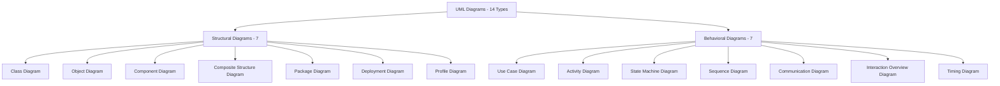

This deep dive focuses on **Class Diagrams** and **Sequence Diagrams**, because they are by far the most commonly used diagram in each family: class diagrams because most system designs are ultimately expressed as classes, and sequence diagrams because "walk me through what happens when a user does X" is the single most common question in a design discussion. The remaining twelve diagram types are summarized below so you know what each one is for and can recognize it when you see it.

Note: Mermaid, the diagramming syntax used throughout this material, has native, purpose-built syntax only for a subset of these types (class, state machine, and sequence diagrams). For the remaining types, the diagrams below are approximated using Mermaid's generic flowchart syntax to give you a visual sense of the layout; in professional UML tooling (e.g., PlantUML, Enterprise Architect, Visual Paradigm) each of these has its own dedicated notation.

### 2.1 Structural Diagrams

**Class Diagram.** Shows classes, their attributes and methods, and the relationships between them. Covered in full depth from Section 3 onward.

**Object Diagram.** A snapshot of actual object instances and the links between them at one moment in time, rather than the general class-level rules. Useful for illustrating a specific, concrete scenario that would otherwise be confusing at the class level (for example, a many-to-many relationship is easier to sanity-check by looking at three real objects and their actual links).

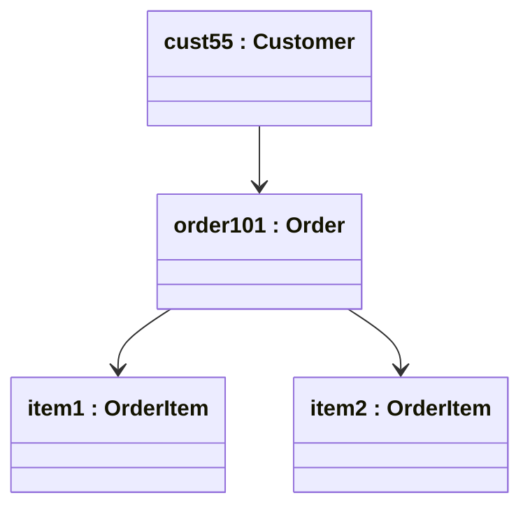

**Component Diagram.** Shows how a system is divided into larger, independently deployable or replaceable components (such as an "Auth Service" or a "Payment Gateway Client") and the interfaces they expose to or require from each other. Used one level above class diagrams, when the discussion is about system architecture rather than individual classes.

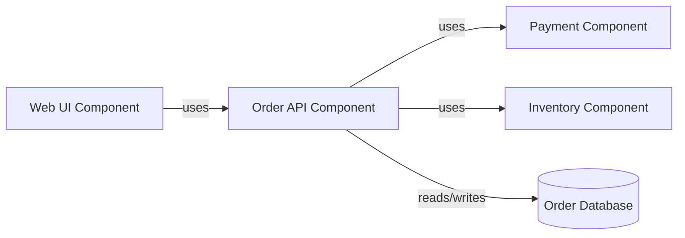

**Composite Structure Diagram.** Shows the internal structure of a single class or component: the parts it is made of and how those parts are wired together internally. Used when a single class is complex enough that its internal collaborators need their own diagram, separate from the system-wide class diagram.

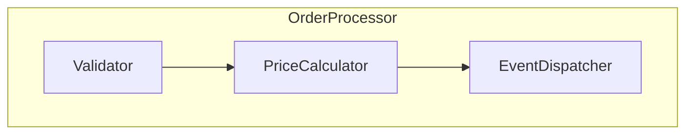

**Package Diagram.** Groups classes into higher-level packages or modules and shows the dependencies between those packages. Used to check for problems like circular dependencies between modules before they show up as import errors.

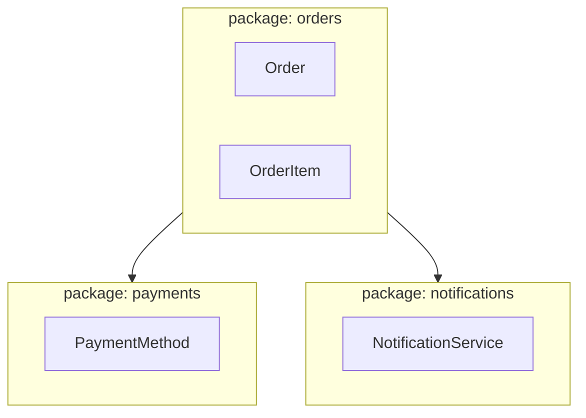

**Deployment Diagram.** Shows the physical or virtual infrastructure a system runs on: servers, containers, devices, and the network connections between them, along with which software artifacts run where. Used by infrastructure and DevOps-adjacent discussions rather than by application-level design work.

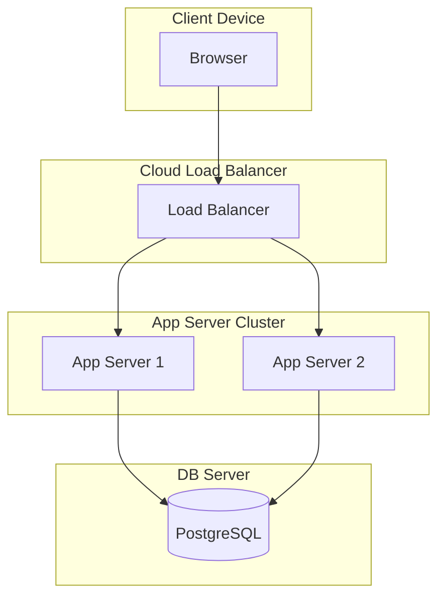

**Profile Diagram.** Defines custom stereotypes, tagged values, and constraints that extend UML itself for a specific domain (for example, a company might define a `<<microservice>>` stereotype with its own custom rules). This is the least commonly used of the fourteen diagrams in everyday engineering work and is mentioned here for completeness rather than demonstrated in depth.

### 2.2 Behavioral Diagrams

**Use Case Diagram.** Shows the actors (users or external systems) interacting with a system and the goals (use cases) they can accomplish, without describing how those goals are achieved internally. Used early in requirements gathering, before any class or method has been designed.

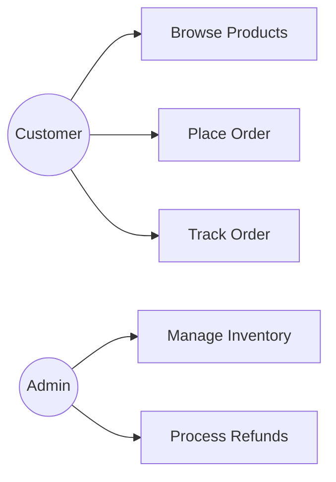

**Activity Diagram.** Similar to a flowchart: shows the flow of control or data through a process, including decision points, parallel branches, and start/end points. Used to model a business process or algorithm at a level above any single class, often before deciding which classes will implement each step.

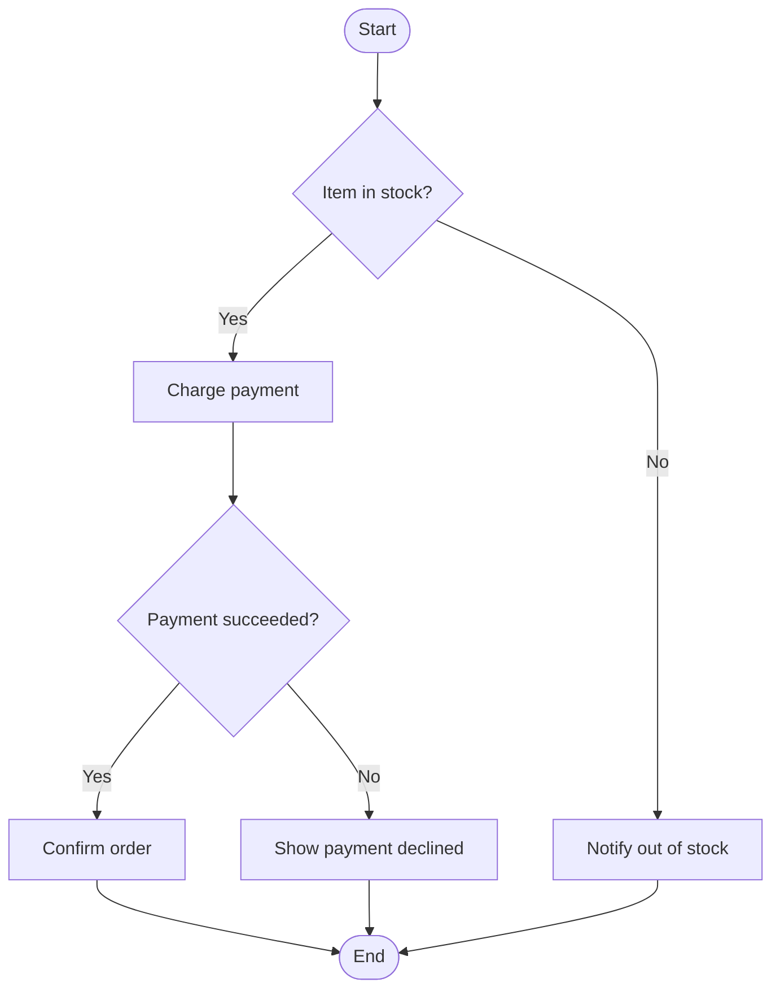

**State Machine Diagram.** Shows the distinct states a single object can be in, and the events that trigger transitions between those states. This is the diagram version of the State design pattern, and it has native Mermaid support.

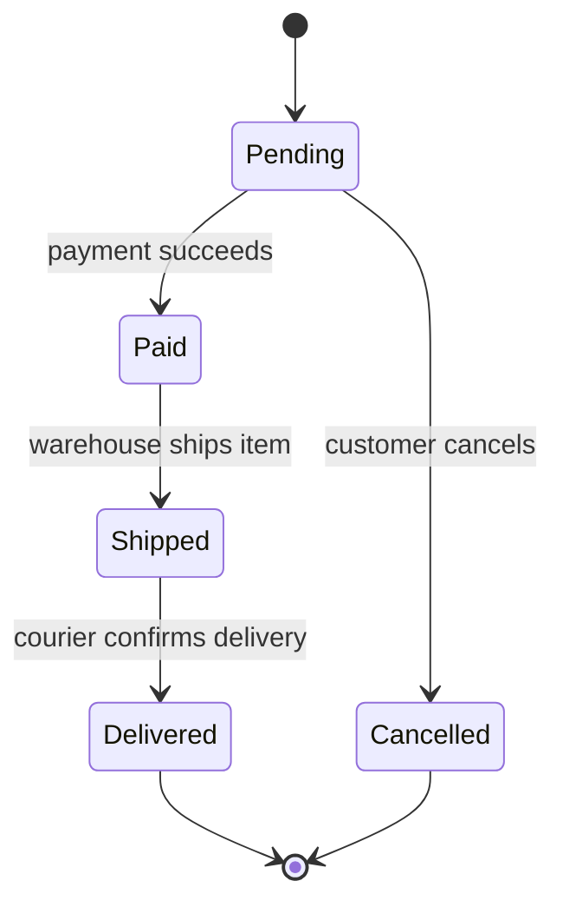

**Sequence Diagram.** Shows a set of objects and the ordered messages passed between them for one specific scenario, with time flowing from top to bottom. Covered in full depth from Section 7 onward.

**Communication Diagram (formerly Collaboration Diagram).** Shows the same information as a sequence diagram (which objects send which messages to accomplish a scenario) but arranges the objects freely in space and numbers the messages to indicate order, instead of using vertical lifelines and top-to-bottom time. Used when the emphasis is on the network of relationships between objects rather than the precise timing.

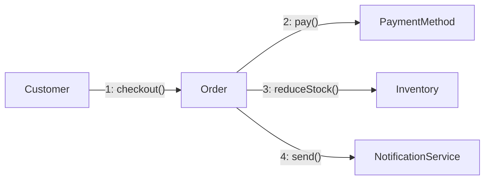

**Interaction Overview Diagram.** A high-level flowchart where each node is itself a small sequence or communication diagram, used to show how several different scenarios connect to and branch from one another. Used for complex workflows made up of many smaller interactions, rarely needed outside large enterprise systems.

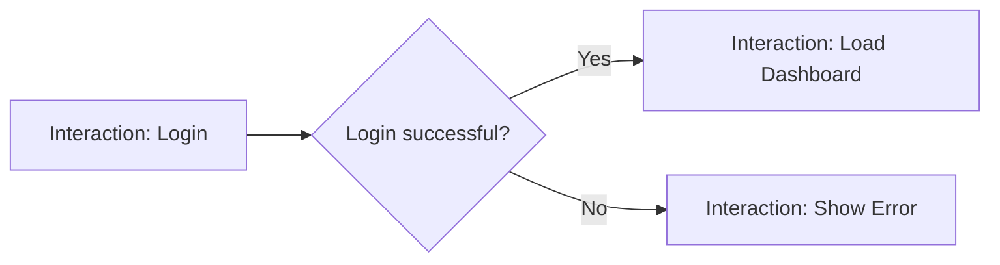

**Timing Diagram.** Shows how the state or value of one or more objects changes across a precise timeline, typically used in embedded systems and hardware-adjacent software where exact timing between state changes matters (for example, verifying that a sensor's state changes within a required number of milliseconds of a trigger event). Rarely used in typical backend or web application design.

With the map of all fourteen types established, the rest of this material goes deep on the two diagrams used in the overwhelming majority of day-to-day design work.

---

## 3. Class Diagrams: Anatomy

### The Class Box

A class in UML is drawn as a box with up to three compartments:

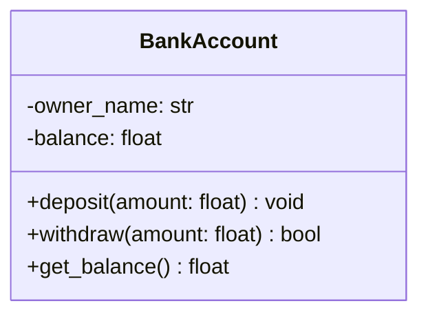

The top compartment holds the class name. The middle compartment holds attributes, written as `visibility name: type`. The bottom compartment holds methods, written as `visibility name(params): return_type`.

### Visibility Symbols

| Symbol | Meaning | Python equivalent |
|---|---|---|
| `+` | Public: accessible from anywhere | `self.balance` |
| `-` | Private: accessible only within the class | `self.__balance` |
| `#` | Protected: accessible within the class and subclasses | `self._balance` |
| `~` | Package/internal: accessible within the same module | Convention only in Python |

Visibility on a diagram is a design decision, not decoration. Marking `balance` as `-` tells every reader that external code should not touch it directly and must go through `deposit()` or `withdraw()` instead. This is UML expressing encapsulation visually, the same idea covered in OOP fundamentals.

The Python this diagram maps to:

```python
class BankAccount:
    def __init__(self, owner_name: str, balance: float = 0.0):
        self.__owner_name = owner_name      # -owner_name
        self.__balance = balance            # -balance

    def deposit(self, amount: float) -> None:
        self.__balance += amount

    def withdraw(self, amount: float) -> bool:
        if amount > self.__balance:
            return False
        self.__balance -= amount
        return True

    def get_balance(self) -> float:
        return self.__balance
```

The diagram and the code say the same thing in two notations. The diagram is a compressed, faster-to-scan summary of the code's structure, useful precisely because it omits implementation detail.

---

## 4. Abstract Classes vs. Interfaces

A common point of confusion: are an abstract class and an interface the same thing? They are related but distinct, and the difference matters for how you design a system.

### The Core Difference

An **abstract class** is a class that cannot be instantiated directly and is meant to be subclassed. It can contain a mix of:
- Fully implemented methods (with a body, ready to be inherited and used as-is).
- Abstract methods (declared but with no implementation, forcing subclasses to provide one).
- State (instance attributes shared by all subclasses).

An **interface** is a pure contract. It declares a set of methods that implementing classes must provide, but it supplies no implementation and no state at all. It answers only the question "what must this class be able to do," never "how does it do it" or "what data does it carry."

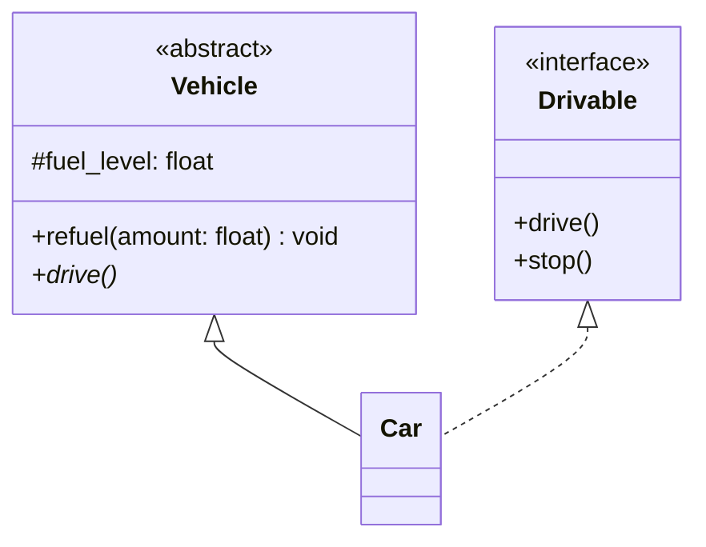

In this diagram, `Vehicle` is an abstract class: it has real state (`fuel_level`) and a fully implemented method (`refuel`), alongside one abstract method (`drive`) that subclasses must fill in. `Car` inherits from `Vehicle` using a solid line, meaning it receives that shared state and implementation for free. `Drivable` is an interface: it defines no state and no implementation at all, only a promise that any implementing class has `drive()` and `stop()` methods. `Car` realizes `Drivable` using a dashed line, meaning it agrees to the contract but writes its own implementation from scratch.

### Why the Distinction Exists

The distinction exists because it separates two different design questions. "What common code and data can be shared and reused" is answered by an abstract class. "What behavior must be guaranteed, regardless of how it is implemented, possibly across completely unrelated classes" is answered by an interface.

A concrete illustration: `Duck` and `Airplane` share almost no implementation or state, and forcing them into the same abstract class hierarchy would be artificial. But both can independently implement a `Flyable` interface, because both can be asked to `fly()`, even though a duck flaps wings and a plane uses engines. Interfaces let unrelated classes agree to a shared contract without being forced into a shared inheritance tree.

Most object-oriented languages also enforce a practical rule that reinforces this distinction: a class can inherit from only **one** abstract (or concrete) class, but it can implement **many** interfaces. This is because inheriting implementation and state from multiple parents creates ambiguity (if two parent classes both define a method or field with the same name, which one wins), while agreeing to multiple contracts creates no such ambiguity, since a contract carries no implementation to conflict.

### How This Maps to Python

Python does not have a dedicated `interface` keyword, but the same distinction is expressed in two common ways:

```python
from abc import ABC, abstractmethod

# Abstract class: has real state and a partially implemented method
class Vehicle(ABC):
    def __init__(self, fuel_level: float):
        self.fuel_level = fuel_level          # shared state

    def refuel(self, amount: float) -> None:  # shared, fully implemented
        self.fuel_level += amount

    @abstractmethod
    def drive(self) -> None: ...              # must be overridden


# Interface-style class: no state, every method abstract
class Drivable(ABC):
    @abstractmethod
    def drive(self) -> None: ...

    @abstractmethod
    def stop(self) -> None: ...


class Car(Vehicle, Drivable):
    def drive(self) -> None:
        print("Car is driving")

    def stop(self) -> None:
        print("Car has stopped")
```

Python also offers `typing.Protocol` as a more direct interface mechanism: a class does not even need to explicitly inherit from a `Protocol` to satisfy it, it only needs to have matching method signatures (this is called structural typing, sometimes summarized as "if it walks like a duck and quacks like a duck").

```python
from typing import Protocol

class Flyable(Protocol):
    def fly(self) -> None: ...

class Duck:
    def fly(self) -> None:
        print("Duck flaps wings")

class Airplane:
    def fly(self) -> None:
        print("Airplane engines engage")

# Both Duck and Airplane satisfy the Flyable protocol without inheriting from it.
def take_off(flyer: Flyable) -> None:
    flyer.fly()
```

### Quick Reference

| Aspect | Abstract Class | Interface |
|---|---|---|
| Can hold state (attributes) | Yes | No |
| Can provide method implementations | Some methods can be implemented | No, all methods are abstract |
| A class can inherit/implement how many | One (in most languages, including Python's class hierarchy for shared implementation) | Many |
| Answers the question | "What can be shared across a family of related classes?" | "What must this class be able to do, regardless of what it is?" |
| UML relationship used | Inheritance (solid line, hollow triangle) | Realization (dashed line, hollow triangle) |

---

## 5. Class Diagrams: Relationships

This section covers the relationships that connect classes on a diagram, ordered from weakest to strongest coupling. Each one is shown with more than one example so the notation is recognizable across different contexts, not just one memorized case.

### 5.1 Dependency: Briefly Uses, No Stored Reference

A dependency exists when one class uses another only momentarily, typically as a method parameter or a local variable, without holding a permanent reference to it as a field. It is drawn as a dashed line with an open arrowhead.

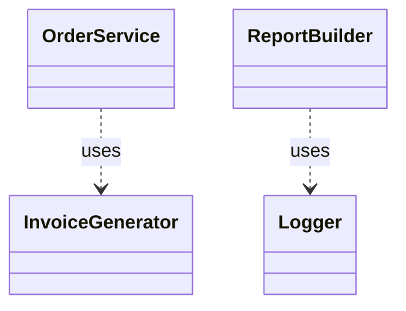

```python
class InvoiceGenerator:
    def generate(self, order) -> str:
        return f"Invoice for order total: {order.total}"

class OrderService:
    def checkout(self, order, generator: InvoiceGenerator) -> str:
        # InvoiceGenerator is used only inside this method. OrderService
        # does not store it as a field, so this is a dependency, not an association.
        return generator.generate(order)
```

The test to distinguish a dependency from an association: does the class hold onto the other one as a field that lives as long as the object itself? If not, and it is only used within a single method's parameters or body, it is a dependency.

### 5.2 Association: Holds a Reference

An association exists when one class holds a reference to another as a field, meaning the relationship persists across the lifetime of the object, not just for the duration of one method call.

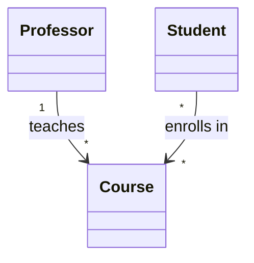

Multiplicity (the `1`, `*`, `0..1`, and so on) specifies how many instances participate on each end:

| Symbol | Meaning |
|---|---|
| `1` | Exactly one |
| `0..1` | Zero or one (optional) |
| `*` or `0..*` | Zero or more |
| `1..*` | One or more |
| `3..5` | Between 3 and 5 |

```python
class Course:
    def __init__(self, title: str):
        self.title = title

class Professor:
    def __init__(self, name: str):
        self.name = name
        self.courses: list[Course] = []   # 1 Professor --> * Course

    def teach(self, course: Course) -> None:
        self.courses.append(course)
```

If both classes need to navigate to each other (a `Course` also needs to look up its `Professor`), the association becomes bidirectional, drawn as a plain line without an arrowhead or with arrowheads on both ends. Bidirectional associations mean both classes must be kept in sync whenever the relationship changes, which is a common source of bugs, so a one-way association is preferred by default, upgraded to bidirectional only when both sides genuinely need to navigate to the other.

### 5.3 Aggregation: Has-a, Part Can Outlive the Whole

Aggregation is a whole-part relationship where the part can exist independently of the whole. It is drawn with a hollow diamond at the "whole" end.

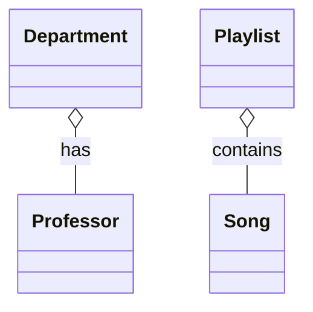

A `Department` has `Professor`s, but if the `Department` is dissolved, the professors do not cease to exist; they can transfer elsewhere. A `Playlist` contains `Song`s, but deleting the playlist does not delete the underlying songs, which may belong to other playlists too.

```python
class Professor:
    def __init__(self, name: str):
        self.name = name

class Department:
    def __init__(self, name: str, professors: list[Professor]):
        self.name = name
        self.professors = professors   # aggregation: professors passed in, can exist without this Department
```

The tell in code: `Professor` objects are created outside `Department` and simply handed to it. `Department` does not control their creation or destruction.

### 5.4 Composition: Has-a, Part Cannot Outlive the Whole

Composition is a stricter whole-part relationship where the part's lifecycle is entirely owned by the whole. It is drawn with a filled diamond.

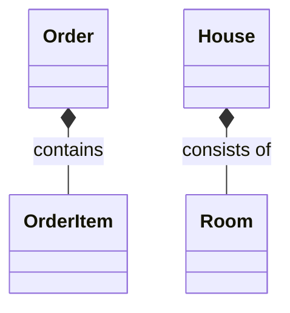

An `Order` contains `OrderItem`s; deleting the `Order` deletes its items with it, since an `OrderItem` has no independent meaning outside the order it belongs to. A `House` consists of `Room`s that only make sense as part of that specific house.

```python
class OrderItem:
    def __init__(self, product_name: str, quantity: int, price: float):
        self.product_name = product_name
        self.quantity = quantity
        self.price = price

class Order:
    def __init__(self):
        self.items: list[OrderItem] = []   # composition: created and owned entirely by Order

    def add_item(self, product_name: str, quantity: int, price: float) -> None:
        # OrderItem is created here, inside Order, and has no life outside an Order.
        self.items.append(OrderItem(product_name, quantity, price))
```

The test to distinguish aggregation from composition: if the whole is destroyed, does the part still make sense on its own? If yes, it is aggregation (hollow diamond). If no, it is composition (filled diamond).

### 5.5 Inheritance (Generalization): Is-a, Shares Contract and Implementation

Inheritance means a subclass is a specialized version of a superclass, receiving both its data and its method implementations. It is drawn with a solid line and a hollow triangle arrowhead pointing to the parent.

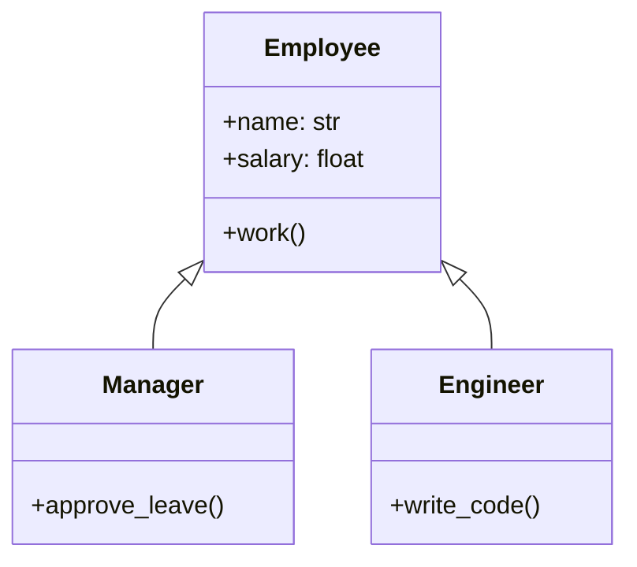

```python
class Employee:
    def __init__(self, name: str, salary: float):
        self.name = name
        self.salary = salary

    def work(self) -> str:
        return f"{self.name} is working."

class Manager(Employee):          # Employee <|-- Manager
    def approve_leave(self) -> str:
        return f"{self.name} approved leave."

class Engineer(Employee):         # Employee <|-- Engineer
    def write_code(self) -> str:
        return f"{self.name} is writing code."
```

### 5.6 Realization: Implements an Interface's Contract Only

Realization means a class implements an interface or abstract contract without inheriting any shared implementation. It is drawn with a dashed line and a hollow triangle arrowhead, distinguishing it visually from inheritance's solid line.

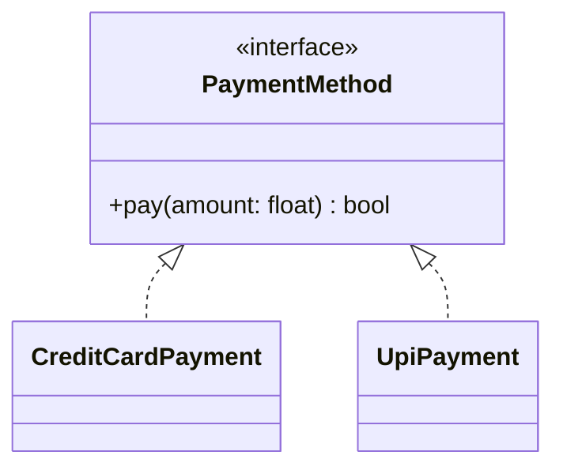

```python
from abc import ABC, abstractmethod

class PaymentMethod(ABC):
    @abstractmethod
    def pay(self, amount: float) -> bool: ...

class CreditCardPayment(PaymentMethod):    # PaymentMethod <|.. CreditCardPayment
    def pay(self, amount: float) -> bool:
        print(f"Charging {amount} to credit card")
        return True

class UpiPayment(PaymentMethod):           # PaymentMethod <|.. UpiPayment
    def pay(self, amount: float) -> bool:
        print(f"Charging {amount} via UPI")
        return True
```

Section 4 above covers this distinction between inheritance and realization, and between abstract classes and interfaces, in full detail.

### 5.7 Relationship Strength: The Full Spectrum

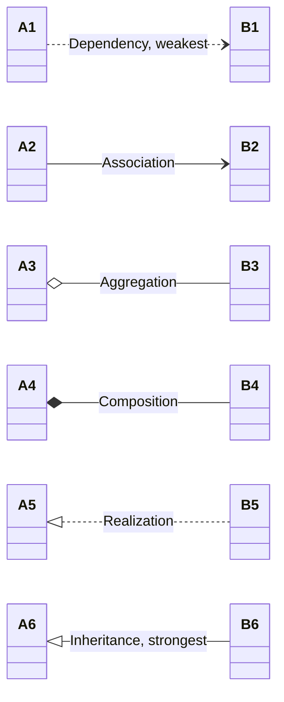

| Relationship | Line style | Lifecycle coupling |
|---|---|---|
| Dependency | Dashed, open arrow | None |
| Association | Solid, open arrow | None |
| Aggregation | Solid, hollow diamond | Part can outlive whole |
| Composition | Solid, filled diamond | Part dies with whole |
| Realization | Dashed, hollow triangle | Shares contract only |
| Inheritance | Solid, hollow triangle | Shares contract and implementation |

---

## 6. Class Diagrams: Advanced Concepts

### Multiplicity in Both Directions

Real associations often have multiplicity on both ends:

```mermaid
classDiagram
    Student "many" -- "many" Course : enrolls in
```

A `Student` can enroll in many `Course`s, and a `Course` can have many `Student`s: a many-to-many relationship. In a relational database, this requires a join or association table, since a many-to-many relationship cannot be modeled with a single foreign key on either side.

```python
class Student:
    def __init__(self, name: str):
        self.name = name
        self.courses: list["Course"] = []

class Course:
    def __init__(self, title: str):
        self.title = title
        self.students: list[Student] = []

def enroll(student: Student, course: Course) -> None:
    student.courses.append(course)
    course.students.append(student)
```

### Generic / Template Classes

```mermaid
classDiagram
    class Stack~T~ {
        -items: List~T~
        +push(item: T) void
        +pop() T
    }
```

```python
from typing import Generic, TypeVar

T = TypeVar("T")

class Stack(Generic[T]):
    def __init__(self):
        self._items: list[T] = []

    def push(self, item: T) -> None:
        self._items.append(item)

    def pop(self) -> T:
        return self._items.pop()
```

### Static Members

Strict UML notation underlines static (class-level) attributes and methods. Mermaid does not render underlining, so a `$` suffix is used instead as a convention:

```mermaid
classDiagram
    class IdGenerator {
        -counter$: int
        +next_id()$ int
    }
```

```python
class IdGenerator:
    counter: int = 0            # class-level (static) attribute

    @staticmethod
    def next_id() -> int:
        IdGenerator.counter += 1
        return IdGenerator.counter
```

### Enumerations

```mermaid
classDiagram
    class OrderStatus {
        <<enumeration>>
        PENDING
        CONFIRMED
        SHIPPED
        DELIVERED
        CANCELLED
    }
```

```python
from enum import Enum

class OrderStatus(Enum):
    PENDING = "pending"
    CONFIRMED = "confirmed"
    SHIPPED = "shipped"
    DELIVERED = "delivered"
    CANCELLED = "cancelled"
```

---

## 7. Sequence Diagrams: Why We Need a Second Diagram

A class diagram describes what exists and how classes relate structurally at a fixed point in time. It deliberately leaves out order and timing. Looking at the `Order`, `OrderItem`, and `PaymentMethod` classes from earlier, the class diagram alone cannot answer whether inventory is checked before or after the customer is charged, what happens if `pay()` returns `False`, or the exact sequence of calls that occurs when a "place order" button is clicked.

A **sequence diagram** fills this gap. It picks one specific scenario, such as "customer places an order," and shows the objects involved as vertical lifelines, with time flowing from top to bottom, and arrows indicating exactly which object calls which method, in what order.

---

## 8. Sequence Diagrams: Anatomy and Core Concepts

Before going through each concept in detail, here is a one-glance summary of the components that make up a sequence diagram. Each one is expanded with a diagram and explanation in the rest of this section and the next.

| Component | Description |
|---|---|
| Actor | A human or external system that initiates or receives interaction with the system, drawn as a stick figure. Used at the edges of a diagram, not for internal objects. |
| Participant | An object, class, or service involved in the scenario, drawn as a labeled box at the top (and sometimes bottom) of the diagram. |
| Lifeline | The vertical line beneath a participant or actor, representing that entity's existence through the duration of the scenario, with time flowing top to bottom. |
| Message | An arrow between two lifelines representing a method call, a request, or a piece of communication, labeled with the method name or content being sent. Can be synchronous (solid, filled arrowhead, sender waits) or asynchronous (solid, open arrowhead, sender does not wait); see the Message Types section below. |
| Activation bar | A thin rectangle on a lifeline showing the span of time during which that participant is actively executing (processing a call it has received). |
| Return message | A dashed arrow, drawn from a participant back to its caller, representing the value or result handed back once processing finishes. |
| Conditional flow | An `alt` (or `opt`) fragment, a labeled box drawn around part of the diagram, showing that different messages occur depending on a condition, equivalent to `if/else` or `if` in code. |
| Loop | A `loop` fragment, a labeled box showing that the messages inside it repeat, equivalent to a `for` or `while` loop in code. |
| Object creation | A message pointing at a lifeline that begins partway down the diagram instead of at the top, showing that the object did not exist before this point in the scenario. |
| Object destruction | The point, marked with an `X` in strict UML (or a shortened lifeline in Mermaid), where a participant's lifeline ends and the object is discarded. |

### Lifelines and Activation Bars

```mermaid
sequenceDiagram
    participant C as Customer
    participant O as OrderService

    C->>O: placeOrder(items)
    activate O
    O-->>C: orderConfirmation
    deactivate O
```

A lifeline is the vertical line beneath each participant box, representing that object's existence through time, with the top of the diagram being the start of the scenario and downward motion representing time passing. An activation bar is the thin rectangle drawn on a lifeline while that object is actively executing, created and removed with `activate`/`deactivate` (or Mermaid's shorthand of `+`/`-` on the message arrow).

**A note on notation:** in strict UML notation, a lifeline is drawn as a dashed vertical line. Mermaid, the tool used to render every diagram in this material, draws lifelines as solid vertical lines instead, and does not currently offer a setting to change this. This is a rendering choice made by the Mermaid library, not an error in any of the diagrams here. If you draw a sequence diagram by hand, in PlantUML, or in a dedicated UML tool, use a dashed line for the lifeline; when reading Mermaid-rendered diagrams (including every one in this document), a solid vertical line under a participant box should be read as that participant's lifeline.

| Element | Strict UML | Mermaid's rendering |
|---|---|---|
| Lifeline | Dashed vertical line | Solid vertical line |
| Activation bar | Thin solid rectangle on the lifeline | Thin solid rectangle on the lifeline (matches) |
| Object destruction | An `X` at the bottom of the lifeline | A shortened lifeline ending where `destroy` is called |

### Message Types

The most important distinction among message types is **synchronous versus asynchronous**, because it changes the arrowhead used and it carries real meaning about how the call behaves at runtime.

A **synchronous message** is a call where the sender blocks and waits until the receiver finishes processing before the sender does anything else. This is the default, ordinary function or method call: `result = obj.method()` does not move to the next line of code until `method()` has fully returned. It is drawn as a **solid line with a solid, filled arrowhead**.

An **asynchronous message** is a call where the sender fires the message and immediately continues its own work, without waiting for the receiver to process it or respond. This corresponds to publishing an event to a queue, triggering a background job, or `asyncio.create_task(obj.method())` in Python, where control returns to the caller right away. It is drawn as a **solid line with an open (unfilled) arrowhead**, visually thinner and less "solid-looking" than a synchronous call's arrowhead, which is the visual cue that the sender is not going to sit and wait.

A **return message** is the reply that eventually comes back from a synchronous call, once the receiver has finished. It is drawn as a **dashed line with a filled arrowhead**, distinguishing it from the solid line of the original request. Asynchronous calls typically do not have a matching return message at all in the same diagram, since the whole point is that the sender does not wait for one; if a reply does eventually happen, it is drawn as its own separate asynchronous message later on, not as a "return" tied to the original call.

```mermaid
sequenceDiagram
    participant A as ClientCode
    participant B as InventoryService
    participant Q as EventQueue

    A->>B: checkStock(productId)
    B-->>A: stockCount

    A-)Q: publishStockCheckedEvent(productId)
    A->>A: logRequest()
```

| Arrow syntax | Line and arrowhead | Meaning | Python equivalent |
|---|---|---|---|
| `->>` | Solid line, filled (solid) arrowhead | Synchronous call: the sender waits for this to complete before continuing | `result = obj.method()` |
| `-->>` | Dashed line, filled (solid) arrowhead | Return message: the reply to a synchronous call, sent once processing finishes | The value produced by a `return` statement |
| `-)` | Solid line, open (unfilled) arrowhead | Asynchronous call: the sender does not wait, and continues immediately | `asyncio.create_task(obj.method())`, or publishing a message to a queue |
| `A->>A` | Solid line, filled arrowhead, same participant on both ends | Self-message: an object calling its own method | `self.some_other_method()` inside a class |

In the diagram above, `checkStock(productId)` is synchronous because `ClientCode` genuinely needs the `stockCount` value before it can proceed, so it makes sense for it to wait. `publishStockCheckedEvent(productId)` is asynchronous because `ClientCode` has no reason to wait around for whatever downstream system consumes that event; it fires the message and moves straight on to `logRequest()`.

**The question to ask when choosing between the two for your own diagrams:** does the sender need something back before it can continue, or is the sender just informing another part of the system and moving on regardless of what happens next? The former is synchronous; the latter is asynchronous. Choosing correctly matters beyond the diagram too, since it usually reflects a real architectural decision, such as whether an operation is a blocking network call or a message published to a queue.

**Where synchronous and asynchronous messages appear across this material's examples:**

| Example | Message types used | Why |
|---|---|---|
| Section 8, Lifelines and Activation Bars | Synchronous only | `placeOrder` needs a confirmation before the customer's interaction is complete |
| Section 8, Object Creation and Destruction | Synchronous only | Each step (`addItem`, `finalize`) depends on the previous one having completed |
| Section 9, `alt`/`opt`/`loop`/`par` | Synchronous only | Kept simple deliberately, so the fragment being taught is the only new concept in each diagram |
| Section 10.2, the e-commerce checkout | Synchronous only | Every step, checking stock, charging payment, reducing stock, genuinely needs to happen in order, with each step's result determining the next one |
| Section 9.5, Example 1 (login) | Synchronous only | The login attempt cannot proceed or respond to the user until the database lookup returns |
| Section 9.5, Example 2 (password reset) | Both | Generating a token and confirming the request back to the user is synchronous, since the user is waiting on screen; queuing and later delivering the email is asynchronous, since the user should not be kept waiting for an email to actually send |
| Section 9.5, Example 3 (ATM withdrawal) | Synchronous only | Every step (balance check, cash check, debit, dispense) must complete before the next one can safely happen |

Notice that most real system flows lean synchronous when a decision downstream depends on the result of the current step, and asynchronous when a step is closer to "notify and move on." The password reset example (Section 9.5) is the clearest illustration of both appearing side by side in one diagram, precisely because it contains one of each kind of step.

### Object Creation and Destruction

```mermaid
sequenceDiagram
    participant S as OrderService
    create participant O as Order

    S->>O: new Order()
    S->>O: addItem(product, qty)
    S->>O: finalize()
    O-->>S: total
    destroy O
    S->>O: discard()
```

Two Mermaid keywords do the actual work here, and both are easy to miss: `create participant O as Order` (instead of a plain `participant O as Order` in the header) is what makes `Order`'s lifeline start partway down the diagram, at the `new Order()` message, rather than at the top alongside `OrderService`. Simply naming a participant in an arrow is not enough to shorten its lifeline; without the `create` keyword, Mermaid draws every participant's lifeline at full height from the very top, regardless of when a "creation" message is drawn pointing at it. Likewise, `destroy O`, placed on the line immediately before `Order`'s final message, is what causes Mermaid to end `Order`'s lifeline right after that message, so it stops short instead of running to the bottom of the diagram like `OrderService`'s does. The `destroy` statement is placed before the last message involving that object, not after, since it marks that the object's upcoming message is its last.

Notice that `total` (a normal return value) and `discard()` (the act of destruction) are kept as two separate messages here, rather than combining them into one arrow. This is a deliberate change from an earlier version of this example, and it is worth calling out why: `total` is ordinary business logic, a value `Order` had reason to hand back regardless of what happens to it afterward, while `discard()` is a lifecycle event, `OrderService` deciding it no longer needs this `Order` object. Folding both meanings onto a single arrow blurs that distinction for a reader, and in practice it can also trigger rendering issues in some Mermaid versions, since the arrow is being asked to represent a return value and a lifeline termination at the same time. Giving destruction its own dedicated message keeps both the diagram's meaning and its rendering clean. The exact visual marker Mermaid draws at the point of destruction (a small `X`, or simply a shortened lifeline with no further activity) varies slightly by renderer and theme; what to look for reliably is that the object's lifeline visibly stops at that point rather than continuing to the bottom of the diagram.

| Step | From | To | Message | What it means |
|---|---|---|---|---|
| 1 | OrderService | Order | `new Order()` | A new `Order` object is created; its lifeline begins here |
| 2 | OrderService | Order | `addItem(product, qty)` | An item is added to the newly created order |
| 3 | OrderService | Order | `finalize()` | The order is marked complete, no more items can be added |
| 4 | Order | OrderService | `total` (return) | An ordinary business return value, unrelated to the object's lifecycle |
| 5 | (n/a) | Order | `destroy` | Marks that `Order`'s next message is its last |
| 6 | OrderService | Order | `discard()` | The message at which `Order`'s lifeline actually ends |

---

## 9. Sequence Diagrams: Control Flow

Real scenarios branch, repeat, and sometimes run in parallel. UML sequence diagrams use combined fragments to express this.

### `alt`: Alternative Paths

```mermaid
sequenceDiagram
    participant C as Customer
    participant P as PaymentService

    C->>P: pay(amount)
    alt payment succeeds
        P-->>C: paymentConfirmed
    else payment fails
        P-->>C: paymentDeclined
    end
```

| Step | From | To | Message | What it means |
|---|---|---|---|---|
| 1 | Customer | PaymentService | `pay(amount)` | Customer requests a payment |
| 2a | PaymentService | Customer | `paymentConfirmed` | Runs only if the payment succeeds |
| 2b | PaymentService | Customer | `paymentDeclined` | Runs only if the payment fails; mutually exclusive with 2a |

### `opt`: Optional Step, No Else Branch

```mermaid
sequenceDiagram
    participant O as OrderService
    participant N as NotificationService

    O->>O: finalizeOrder()
    opt customer opted into SMS updates
        O->>N: sendSms(orderId)
    end
```

| Step | From | To | Message | What it means |
|---|---|---|---|---|
| 1 | OrderService | OrderService | `finalizeOrder()` | Self-message, the order is finalized |
| 2 | OrderService | NotificationService | `sendSms(orderId)` | Runs only if the condition in the `opt` box is true; skipped entirely otherwise, with no alternative path |

### `loop`: Repetition

```mermaid
sequenceDiagram
    participant O as OrderService
    participant Inv as InventoryService

    loop for each item in cart
        O->>Inv: reserve(item)
        Inv-->>O: reserved
    end
```

| Step | From | To | Message | What it means |
|---|---|---|---|---|
| 1 | OrderService | InventoryService | `reserve(item)` | Repeated once for every item in the cart |
| 2 | InventoryService | OrderService | `reserved` | Confirmation returned for each reservation, one pair of messages per iteration |

### `par`: Parallel or Concurrent Steps

```mermaid
sequenceDiagram
    participant O as OrderService
    participant E as EmailService
    participant S as SmsService

    par send email
        O->>E: sendConfirmationEmail()
    and send sms
        O->>S: sendConfirmationSms()
    end
```

| Step | From | To | Message | What it means |
|---|---|---|---|---|
| 1a | OrderService | EmailService | `sendConfirmationEmail()` | Runs concurrently with 1b, neither waits for the other |
| 1b | OrderService | SmsService | `sendConfirmationSms()` | Runs concurrently with 1a |

These four fragments correspond directly to `if/else`, `if`, `for`, and concurrent execution in code. Learning to draw them means any control flow a method contains, not only its happy path, can be modeled visually.

---

## 9.5 More Sequence Diagram Examples

The examples above each isolate a single concept. Real scenarios usually combine several of them at once. The three examples below walk through different kinds of systems, each combining multiple message types and control-flow fragments, to build fluency in reading and drawing more realistic diagrams.

### Example 1: User Login with Failed Attempts

A user submits a username and password. The system checks the credentials against the database. If they are correct, a session token is created and returned. If they are incorrect, an error is returned, and after three consecutive failures the account is locked.

```mermaid
sequenceDiagram
    actor U as User
    participant Auth as AuthService
    participant DB as UserDatabase

    U->>+Auth: login(username, password)
    Auth->>+DB: findUser(username)
    DB-->>-Auth: userRecord

    alt credentials valid
        Auth->>Auth: generateSessionToken()
        Auth-->>U: loginSuccess(token)
    else credentials invalid
        Auth->>Auth: incrementFailedAttempts()
        alt failedAttempts >= 3
            Auth->>DB: lockAccount(username)
            Auth-->>U: accountLocked
        else failedAttempts < 3
            Auth-->>U: invalidCredentials
        end
    end
    deactivate Auth
```

| Step | From | To | Message | What it means |
|---|---|---|---|---|
| 1 | User | AuthService | `login(username, password)` | Login attempt begins; `AuthService` activation starts |
| 2 | AuthService | UserDatabase | `findUser(username)` | Look up the stored record for this username |
| 3 | UserDatabase | AuthService | `userRecord` (return) | The stored record, including the correct password hash, is returned |
| 4a | AuthService | AuthService | `generateSessionToken()` | Self-message, runs only if credentials are valid |
| 5a | AuthService | User | `loginSuccess(token)` | Runs only in the valid-credentials branch |
| 4b | AuthService | AuthService | `incrementFailedAttempts()` | Runs only if credentials are invalid |
| 5b | AuthService | UserDatabase | `lockAccount(username)` | Runs only in the nested branch where failed attempts have reached 3 |
| 6b | AuthService | User | `accountLocked` or `invalidCredentials` | Whichever nested branch applies determines the exact message returned |

This example shows a nested `alt` inside another `alt`, the same pattern used later in the e-commerce diagram: the outer branch decides between success and failure, and the inner branch further decides what kind of failure response to send.

### Example 2: Asynchronous Password Reset

A user requests a password reset. The system does not make the user wait for an email to be sent; it queues the email job and immediately confirms the request was received. The email itself is sent by a separate worker process sometime later.

```mermaid
sequenceDiagram
    actor U as User
    participant API as ResetPasswordAPI
    participant Q as EmailQueue
    participant W as EmailWorker

    U->>+API: requestPasswordReset(email)
    API->>API: generateResetToken()
    API-)Q: enqueueEmailJob(email, token)
    API-->>-U: "Reset link sent, check your inbox"

    Note over Q,W: Some time later, independent of the user's request
    Q-)W: deliverJob(email, token)
    W->>W: sendEmail(email, token)
```

| Step | From | To | Message | What it means |
|---|---|---|---|---|
| 1 | User | ResetPasswordAPI | `requestPasswordReset(email)` | User initiates the password reset flow |
| 2 | ResetPasswordAPI | ResetPasswordAPI | `generateResetToken()` | Self-message, a one-time token is generated |
| 3 | ResetPasswordAPI | EmailQueue | `enqueueEmailJob(email, token)` | An asynchronous message (open arrowhead), the API does not wait for this to complete |
| 4 | ResetPasswordAPI | User | Confirmation text (return) | The user gets an immediate response, well before any email is actually sent |
| 5 | EmailQueue | EmailWorker | `deliverJob(email, token)` | Happens independently, at a later and unpredictable time |
| 6 | EmailWorker | EmailWorker | `sendEmail(email, token)` | Self-message, the actual email is sent by the worker, not by the original API call |

The `-)` arrow style marks an asynchronous message, drawn with an open arrowhead instead of a filled one, signaling that the sender does not block waiting for the receiver. This is the diagram-level equivalent of publishing a job to a queue in code, rather than calling a function directly and waiting for its result. Notice also that the API's activation bar closes right after step 4; the API's own work is done at that point, even though the email has not been sent yet.

### Example 3: ATM Cash Withdrawal

A customer requests a withdrawal at an ATM. The ATM checks the account balance. If funds are sufficient, it also checks whether the machine physically has enough cash on hand before dispensing it.

```mermaid
sequenceDiagram
    actor C as Customer
    participant ATM as ATMMachine
    participant Bank as BankServer

    C->>+ATM: withdraw(amount)
    ATM->>+Bank: checkBalance(accountId)
    Bank-->>-ATM: balance

    alt balance >= amount
        ATM->>ATM: checkCashAvailable(amount)
        alt cash available in machine
            ATM->>+Bank: debitAccount(accountId, amount)
            Bank-->>-ATM: debitConfirmed
            ATM->>ATM: dispenseCash(amount)
            ATM-->>C: cash and receipt
        else cash not available in machine
            ATM-->>C: "Unable to dispense, try a smaller amount"
        end
    else balance < amount
        ATM-->>C: "Insufficient funds"
    end
    deactivate ATM
```

| Step | From | To | Message | What it means |
|---|---|---|---|---|
| 1 | Customer | ATMMachine | `withdraw(amount)` | Customer requests a withdrawal |
| 2 | ATMMachine | BankServer | `checkBalance(accountId)` | ATM asks the bank for the current balance |
| 3 | BankServer | ATMMachine | `balance` (return) | Balance is returned to the ATM |
| 4 | ATMMachine | ATMMachine | `checkCashAvailable(amount)` | Self-message, runs only if the balance check passed |
| 5 | ATMMachine | BankServer | `debitAccount(accountId, amount)` | Runs only if both the balance and physical cash checks passed |
| 6 | BankServer | ATMMachine | `debitConfirmed` | Confirms the account has been debited |
| 7 | ATMMachine | ATMMachine | `dispenseCash(amount)` | Self-message, physical cash is released |
| 8 | ATMMachine | Customer | Cash and receipt, or an error message | The exact outcome depends on which of the three branches was taken |

This example demonstrates two independent decision points modeled as a nested `alt`: the outer check is a business rule (does the account have enough money), and the inner check is a physical constraint (does the machine have enough cash). Separating them into nested fragments, rather than one large combined condition, keeps each decision traceable to a single, specific reason for failure.

---

## 10. Putting It All Together: A Simple E-Commerce System

The following combines the concepts above into one small e-commerce system: a `Customer` places an `Order` made of `OrderItem`s, each referencing a `Product`. The order is charged through a `PaymentMethod`, and once paid, `Inventory` is updated and a `Notification` is sent. This is intentionally minimal so the concepts working together remain visible, rather than buried under production-scale complexity.

### 10.1 The Complete Class Diagram

```mermaid
classDiagram
    class Customer {
        -customer_id: str
        -name: str
        -email: str
        +place_order(items: List) Order
    }

    class Order {
        -order_id: str
        -status: OrderStatus
        +add_item(product: Product, qty: int) void
        +calculate_total() float
        +checkout(payment: PaymentMethod) bool
    }

    class OrderItem {
        -quantity: int
        -unit_price: float
        +subtotal() float
    }

    class Product {
        -product_id: str
        -name: str
        -price: float
    }

    class OrderStatus {
        <<enumeration>>
        PENDING
        PAID
        SHIPPED
        CANCELLED
    }

    class PaymentMethod {
        <<interface>>
        +pay(amount: float) bool
    }

    class CreditCardPayment {
        +pay(amount: float) bool
    }

    class UpiPayment {
        +pay(amount: float) bool
    }

    class Inventory {
        +check_stock(product: Product) bool
        +reduce_stock(product: Product, qty: int) void
    }

    class NotificationService {
        +send(customer: Customer, message: str) void
    }

    Customer "1" --> "*" Order : places
    Order "1" *-- "1..*" OrderItem : contains
    OrderItem "*" --> "1" Product : refers to
    Order --> OrderStatus : has
    Order ..> PaymentMethod : uses
    PaymentMethod <|.. CreditCardPayment
    PaymentMethod <|.. UpiPayment
    Order ..> Inventory : uses
    Order ..> NotificationService : uses
```

Reading this diagram: a `Customer` places one or more `Order`s, an association with 1-to-many multiplicity. An `Order` is composed of `OrderItem`s, drawn with a filled diamond, because an `OrderItem` has no meaning without its `Order` and is deleted along with it. Each `OrderItem` refers to a `Product` through a plain association, since the same `Product` is referenced by many orders over time and is not owned by any single one of them. `Order` has an `OrderStatus` enum. `Order` uses a `PaymentMethod` only during checkout, passed in and used rather than stored, which is why it is drawn as a dependency with a dashed arrow. `CreditCardPayment` and `UpiPayment` each realize the `PaymentMethod` interface, letting `Order.checkout()` accept any payment method without knowing which concrete one it received. `Order` also has brief dependencies on `Inventory` and `NotificationService`, used during checkout and not held onto afterward.

Corresponding Python skeleton, trimmed for clarity:

```python
from abc import ABC, abstractmethod
from enum import Enum
from typing import List


class OrderStatus(Enum):
    PENDING = "pending"
    PAID = "paid"
    SHIPPED = "shipped"
    CANCELLED = "cancelled"


class Product:
    def __init__(self, product_id: str, name: str, price: float):
        self.product_id = product_id
        self.name = name
        self.price = price


class OrderItem:
    def __init__(self, product: Product, quantity: int):
        self.product = product              # Association: OrderItem --> Product
        self.quantity = quantity
        self.unit_price = product.price

    def subtotal(self) -> float:
        return self.unit_price * self.quantity


class PaymentMethod(ABC):                   # <<interface>>
    @abstractmethod
    def pay(self, amount: float) -> bool: ...


class CreditCardPayment(PaymentMethod):
    def pay(self, amount: float) -> bool:
        print(f"Charged {amount} to credit card")
        return True


class UpiPayment(PaymentMethod):
    def pay(self, amount: float) -> bool:
        print(f"Charged {amount} via UPI")
        return True


class Inventory:
    def check_stock(self, product: Product) -> bool:
        return True   # simplified

    def reduce_stock(self, product: Product, qty: int) -> None:
        print(f"Reduced stock for {product.name} by {qty}")


class NotificationService:
    def send(self, customer: "Customer", message: str) -> None:
        print(f"Notifying {customer.name}: {message}")


class Order:
    def __init__(self, order_id: str):
        self.order_id = order_id
        self.items: List[OrderItem] = []    # Composition: Order *-- OrderItem
        self.status = OrderStatus.PENDING

    def add_item(self, product: Product, qty: int) -> None:
        self.items.append(OrderItem(product, qty))

    def calculate_total(self) -> float:
        return sum(item.subtotal() for item in self.items)

    def checkout(
        self,
        payment: PaymentMethod,          # Dependency: used, not stored
        inventory: Inventory,
        notifier: NotificationService,
        customer: "Customer",
    ) -> bool:
        total = self.calculate_total()
        for item in self.items:
            if not inventory.check_stock(item.product):
                return False

        if not payment.pay(total):
            return False

        for item in self.items:
            inventory.reduce_stock(item.product, item.quantity)

        self.status = OrderStatus.PAID
        notifier.send(customer, f"Order {self.order_id} confirmed!")
        return True


class Customer:
    def __init__(self, customer_id: str, name: str, email: str):
        self.customer_id = customer_id
        self.name = name
        self.email = email
        self.orders: List[Order] = []       # Association: Customer --> Order

    def place_order(self, order: Order) -> None:
        self.orders.append(order)
```

### 10.2 The Complete Sequence Diagram

The behavioral view of one scenario from the class diagram above: a customer checks out an order.

```mermaid
sequenceDiagram
    actor Cust as Customer
    participant O as Order
    participant Inv as Inventory
    participant P as PaymentMethod
    participant N as NotificationService

    Cust->>+O: checkout(payment, inventory, notifier)
    O->>O: calculate_total()

    loop for each item in order
        O->>Inv: check_stock(product)
        Inv-->>O: inStock (bool)
    end

    alt all items in stock
        O->>+P: pay(total)
        alt payment succeeds
            P-->>O: true
            loop for each item in order
                O->>Inv: reduce_stock(product, qty)
            end
            O->>O: status = PAID
            O->>N: send(customer, "Order confirmed")
            N-->>Cust: order confirmation email or SMS
            O-->>Cust: checkoutSuccess
        else payment fails
            P-->>O: false
            O-->>Cust: checkoutFailed("payment declined")
        end
        deactivate P
    else an item is out of stock
        O-->>Cust: checkoutFailed("out of stock")
    end
    deactivate O
```

> **A note on this diagram's structure:** notice that `PaymentMethod` is activated once, with `+P` attached to the `pay(total)` message, and deactivated exactly once, right after the nested `alt` block ends, rather than once inside each of the two branches. This matters because Mermaid (and UML tooling generally) reads activation and deactivation as a simple, linear count for each participant across the entire diagram source, not as a runtime simulation of "only one branch actually happens." Placing a `deactivate P` inside both the "payment succeeds" branch and the "payment fails" branch would attempt to deactivate `PaymentMethod` twice for a single activation, which some renderers (including GitHub's) will reject with an error. Whenever a participant is activated before a branching fragment and stays relevant across more than one branch, close its activation once, after the fragment ends, rather than once per branch.

Reading this diagram: the `Customer` calls `checkout()` on `Order`, a synchronous call, so `Order`'s activation bar begins. `Order` checks stock for every item inside a `loop`, matching the `for item in self.items: inventory.check_stock(...)` line in the Python code above. An `alt` fragment branches on whether all items are in stock. Inside the "in stock" branch, a nested `alt` branches on whether `payment.pay()` succeeds, matching the `if not payment.pay(total): return False` line in the code. On success, stock is reduced in another `loop`, the order status changes through a self-message (since `Order` is updating its own field), and a message is sent through `NotificationService`. Every arrow in this diagram corresponds to a method call that exists in the Python `checkout()` method above: a sequence diagram is a method's control flow, drawn as a conversation between objects instead of as code.

The table below traces every step of the diagram in order, so the flow can be followed independently of the visual layout.

| Step | From | To | Message | Fragment context |
|---|---|---|---|---|
| 1 | Customer | Order | `checkout(payment, inventory, notifier)` | Entry point, `Order`'s activation begins |
| 2 | Order | Order | `calculate_total()` | Self-message, computed once before any branching |
| 3 | Order | Inventory | `check_stock(product)` | Inside `loop`, repeated once per item in the order |
| 4 | Inventory | Order | `inStock` (return) | Return value for each iteration of the stock-check loop |
| 5 | Order | PaymentMethod | `pay(total)` | Runs only inside the "all items in stock" branch of the outer `alt` |
| 6a | PaymentMethod | Order | `true` (return) | Runs only inside the "payment succeeds" branch of the inner `alt` |
| 7a | Order | Inventory | `reduce_stock(product, qty)` | Inside a `loop`, nested within the "payment succeeds" branch, repeated per item |
| 8a | Order | Order | `status = PAID` | Self-message, runs only after stock has been reduced |
| 9a | Order | NotificationService | `send(customer, "Order confirmed")` | Runs only in the success path |
| 10a | NotificationService | Customer | Order confirmation (return) | The customer receives the confirmation |
| 11a | Order | Customer | `checkoutSuccess` | Final response to the customer for the success path |
| 6b | PaymentMethod | Order | `false` (return) | Runs only inside the "payment fails" branch of the inner `alt` |
| 7b | Order | Customer | `checkoutFailed("payment declined")` | Final response to the customer for the payment-failure path |
| 6c | Order | Customer | `checkoutFailed("out of stock")` | Runs only inside the "an item is out of stock" branch of the outer `alt`, skipping payment entirely |

Only one of the three final rows (11a, 7b, or 6c) is ever reached in a single execution; which one depends on which branch of each `alt` fragment is taken.

---

## 11. Summary and Key Takeaways

- UML provides a standardized, language-agnostic way to communicate design, addressing the ambiguity of prose and the excessive detail of raw code.
- UML defines 14 diagram types across two families: **structural diagrams** (Class, Object, Component, Composite Structure, Package, Deployment, Profile) describe what a system looks like, and **behavioral diagrams** (Use Case, Activity, State Machine, Sequence, Communication, Interaction Overview, Timing) describe how it behaves over time.
- Class diagrams and sequence diagrams are the two most heavily used diagrams in day-to-day design work, which is why this material focuses on them in depth.
- Class diagram anatomy consists of name, attributes, and methods, with `+`/`-`/`#`/`~` visibility symbols mapping directly to Python's public, `__private`, and `_protected` conventions.
- An abstract class can hold state and provide some implemented methods, and a class can inherit from only one. An interface holds no state and provides no implementation at all, only a contract, and a class can implement many of them. This distinction is why inheritance uses a solid line and realization uses a dashed line.
- The seven relationships between classes, ordered from weakest to strongest coupling: **Dependency** (`..>`, briefly uses, no stored reference), **Association** (`-->`, holds a reference, with multiplicity), **Aggregation** (`o--`, has-a, part survives without the whole), **Composition** (`*--`, has-a, part dies with the whole), **Realization** (`<|..`, implements an interface's contract, no shared code), and **Inheritance** (`<|--`, is-a, shares contract and implementation).
- Multiplicity (`1`, `0..1`, `*`, `1..*`) states precisely how many objects participate on each end of a relationship.
- Sequence diagram anatomy consists of lifelines (objects over time), activation bars (when an object is executing), and four message types: synchronous call, return, asynchronous call, and self-message.
- Combined fragments (`alt`, `opt`, `loop`, `par`) are the visual equivalent of `if/else`, `if`, `for`, and concurrent execution, letting a sequence diagram model any control flow a method contains.
- A class diagram is the structural blueprint of a system's nouns; a sequence diagram is the behavioral record of its verbs for one specific scenario. Strong design communication uses both together.

---

## 12. Practice Questions

Attempt each question before checking the solution. Draw the diagram by hand or in Mermaid before reading further.

### Question 1 (Level 1: Relationship Identification)

For each pair below, name the correct UML relationship and explain the reasoning in one sentence:

a) A `Car` and its `Engine` (the engine is built specifically for that car and is scrapped with it).
b) A `Library` and its `Book`s (books continue to exist even if the library closes down and donates them elsewhere).
c) A `Driver` and a `Car` they are currently renting (the driver calls `car.start()` a few times during a trip; no field is stored).
d) A `Shape` abstract class and its `Circle`/`Square` subclasses, which inherit a `describe()` method.
e) A `Drawable` interface with only abstract methods, implemented by `Circle` and `Square`.

<details>
<summary><b>Solution</b></summary>

a) **Composition.** The `Engine`'s lifecycle is entirely bound to the `Car`; it cannot meaningfully outlive it in this scenario. Filled diamond on the `Car` end.

b) **Aggregation.** `Book`s can exist independently of any particular `Library`. Hollow diamond on the `Library` end.

c) **Dependency.** The `Driver` uses the `Car` only within the scope of a call or trip and does not hold a permanent reference to it. Dashed arrow.

d) **Inheritance (Generalization).** `Circle`/`Square` are specialized `Shape`s and inherit actual implementation (`describe()`). Solid line, hollow triangle.

e) **Realization.** `Circle`/`Square` implement the `Drawable` contract but share no implementation with it, since there is none to share; it is pure abstract methods. Dashed line, hollow triangle.

</details>

---

### Question 2 (Level 1: Multiplicity)

A `Playlist` can contain zero or more `Song`s, and the same `Song` can appear in many different `Playlist`s. Draw the association with correct multiplicity on both ends, and explain what real-world implementation detail this multiplicity implies.

<details>
<summary><b>Solution</b></summary>

```mermaid
classDiagram
    Playlist "0..*" -- "0..*" Song : contains
```

This is a many-to-many relationship. In a relational database, many-to-many relationships cannot be modeled with a simple foreign key on either table; they require a join or association table, for example `PlaylistSong(playlist_id, song_id, position)`. In Python, both classes typically hold a list referencing the other:

```python
class Song:
    def __init__(self, title: str):
        self.title = title

class Playlist:
    def __init__(self, name: str):
        self.name = name
        self.songs: list[Song] = []
```

</details>

---

### Question 3 (Level 2: Draw a Class Diagram)

Design a simple class diagram for a library book-lending system with these rules:

- A `Library` has many `Book`s.
- A `Member` can borrow multiple `Book`s, and a `Book` can be borrowed by different `Member`s over time, not simultaneously.
- Borrowing creates a `Loan` record that tracks the borrow date and due date, and has no meaning outside the borrowing event.
- `Book` has a `BookStatus` (`AVAILABLE`, `BORROWED`, `LOST`).

Identify at least one association, one aggregation or composition, and one enum.

<details>
<summary><b>Solution</b></summary>

```mermaid
classDiagram
    class Library {
        -name: str
        +add_book(book: Book) void
    }

    class Book {
        -isbn: str
        -title: str
        -status: BookStatus
    }

    class BookStatus {
        <<enumeration>>
        AVAILABLE
        BORROWED
        LOST
    }

    class Member {
        -member_id: str
        -name: str
        +borrow(book: Book) Loan
    }

    class Loan {
        -borrow_date: str
        -due_date: str
        +is_overdue() bool
    }

    Library "1" o-- "*" Book : has
    Book --> BookStatus : has
    Member "1" --> "*" Loan : creates
    Loan "*" --> "1" Book : refers to
```

`Library o-- Book` is aggregation: books can be transferred to another library or exist in a catalog independent of one specific `Library` instance. `Member --> Loan` is an association: a member creates loans over time, but a `Loan`'s existence is tied to the borrowing event rather than the `Member`'s own lifecycle (a case for composition here is also defensible with reasoning). `Loan --> Book` is a plain association: a `Loan` refers to a `Book` without owning it. `BookStatus` is an enumeration.

There is rarely one single correct answer in class design. What matters is being able to justify each relationship choice against the question of whether the part survives the whole.

</details>

---

### Question 4 (Level 2: Draw a Sequence Diagram)

Using the library system from Question 3, draw a sequence diagram for the scenario: a Member tries to borrow a Book. If the book is available, a Loan is created and the book's status changes to BORROWED. If the book is not available, the member is told it is unavailable.

<details>
<summary><b>Solution</b></summary>

```mermaid
sequenceDiagram
    actor M as Member
    participant B as Book
    participant L as Library

    M->>L: borrow(book)
    activate L
    L->>B: check status
    B-->>L: status

    alt status == AVAILABLE
        L->>L: create Loan
        L->>B: status = BORROWED
        L-->>M: loanConfirmation
    else status != AVAILABLE
        L-->>M: "Book unavailable"
    end
    deactivate L
```

The `alt` fragment mirrors an `if/else` in the eventual Python implementation, and the self-message `L->>L: create Loan` shows `Library` instantiating a new `Loan` object as part of its own method body.

</details>

---

### Question 5 (Level 3: Spot the Mistake)

A junior developer drew this diagram for a blogging platform:

```mermaid
classDiagram
    Author "1" *-- "*" BlogPost : writes
    BlogPost "*" *-- "*" Tag : has
```

Identify what is wrong with both relationships and propose the correct notation.

<details>
<summary><b>Solution</b></summary>

**Problem 1: `Author *-- BlogPost` (Composition).** This states that a `BlogPost` cannot exist without its `Author` and is destroyed the moment the `Author` is deleted. That is usually too strong; most blogging platforms preserve posts, perhaps reassigned to a "deleted user," even after an author's account is removed. This should generally be aggregation (`o--`) or a plain association (`-->`), not composition, unless the specific system genuinely cascades deletion of posts with the author, which is a business decision to confirm rather than a default choice.

**Problem 2: `BlogPost *-- Tag` (Composition) with `* -- *` multiplicity.** Composition represents exclusive ownership: one whole owns each part. Combining composition with a many-to-many multiplicity on the part side is a modeling error, because the same `Tag` (for example, "python") is almost certainly shared across many `BlogPost`s and cannot be exclusively owned by all of them at once. This should be a plain association (`-->`) with `* -- *` multiplicity.

**Corrected diagram:**

```mermaid
classDiagram
    Author "1" o-- "*" BlogPost : writes
    BlogPost "*" -- "*" Tag : has
```

The general lesson: composition should be reserved for genuine exclusive, lifecycle-bound parts, such as `Order`/`OrderItem`. When uncertain, default to association or aggregation, and upgrade to composition only when the "does the part survive the whole" test clearly supports it.

</details>

---

### Question 6 (Level 3: Design Discussion)

In the e-commerce example from Section 10, `Order.checkout()` takes `payment`, `inventory`, and `notifier` as parameters rather than storing them as fields on `Order`, making them dependencies rather than associations. A teammate suggests storing them as fields instead, for convenience. What is the correct response, referencing both UML and design principles?

<details>
<summary><b>Solution</b></summary>

Storing `payment`, `inventory`, and `notifier` as permanent fields on `Order` would upgrade three dependencies into three associations, and this is a design regression rather than an improvement, for three reasons:

1. Every `Order` object would be forced to carry references to services it needs only during checkout, bloating the object and creating a misleading class diagram, since a reader would assume `Order` needs `PaymentMethod` for its entire lifetime, including before and after checkout, which is not true.

2. It couples `Order`'s construction to the availability of these services, so a lightweight `Order` object could not be created in a test or a script without also providing a working `Inventory` and `NotificationService`, even when only testing `calculate_total()`.

3. This is precisely the Dependency Injection pattern, and it maps to the Dependency Inversion Principle from SOLID: pass in what a method needs, when it needs it, rather than baking dependencies into the object's permanent structure. The dashed dependency arrows in the diagram directly signal that this coupling is intentionally temporary and lightweight, a property worth protecting.

The short answer for the teammate: keeping them as parameters keeps `Order` a lightweight data-and-rules object; storing them as fields would make every `Order` permanently depend on services it only needs for a few seconds during checkout, so the current diagram correctly reflects the intended design.

</details>

---

*This content is part of **Codeverra**, a platform for learning coding, data science, DSA, and AI from scratch.
Explore more: https://codeverra.com*
