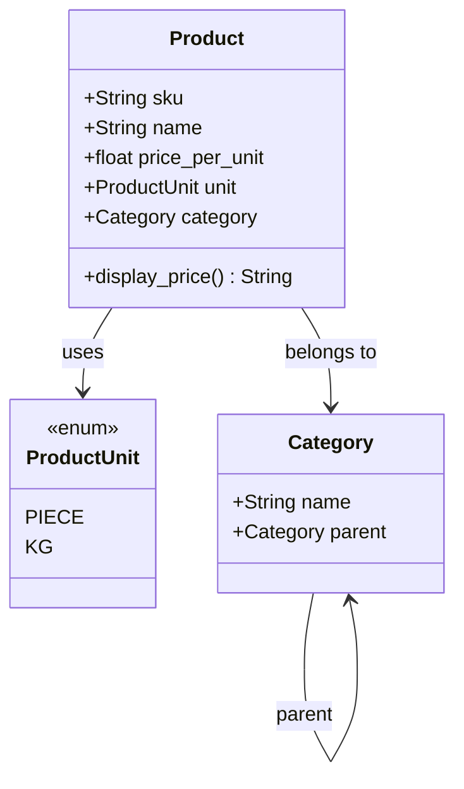
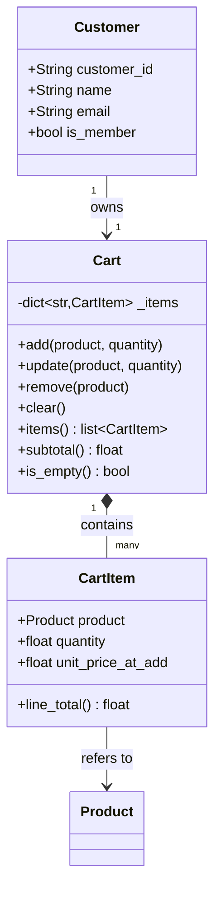
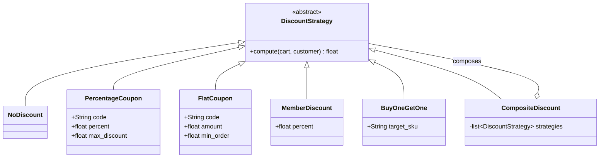
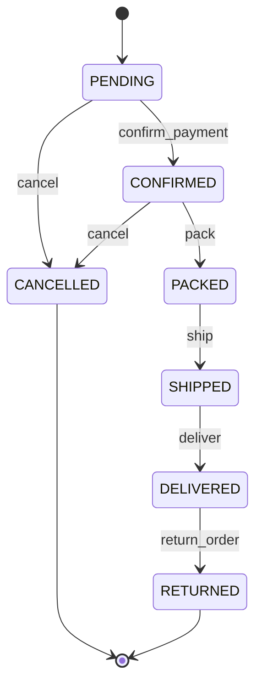
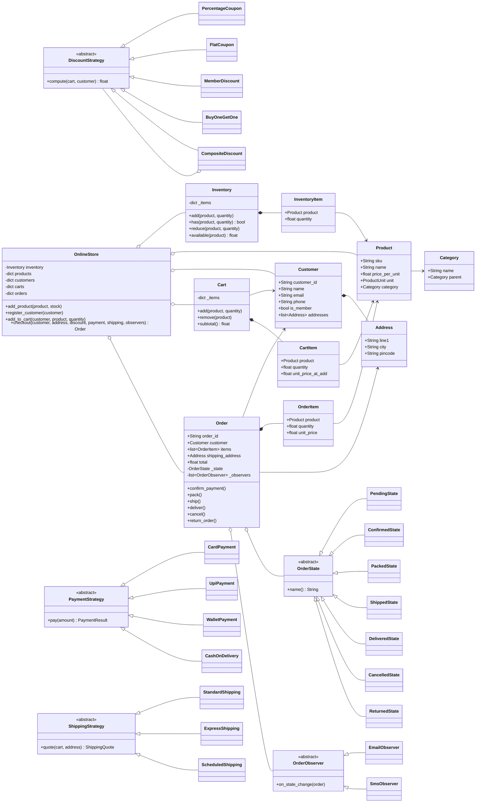
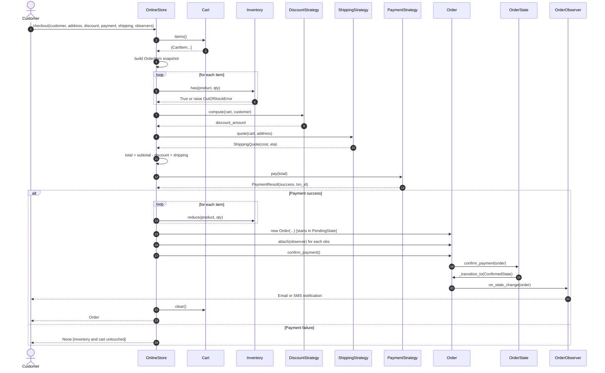
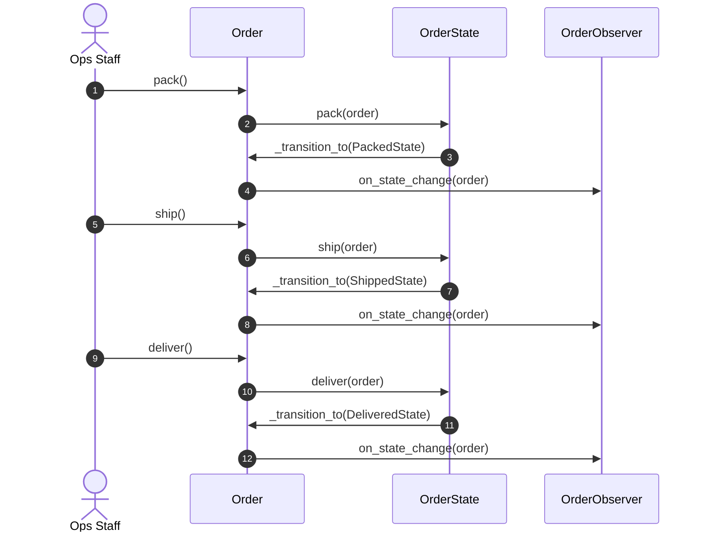
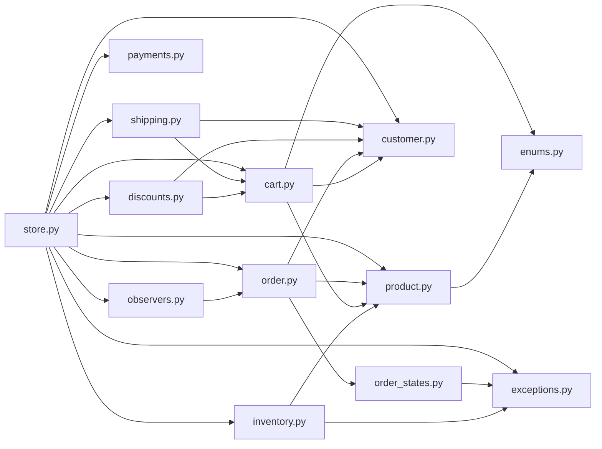

# LLD Deep Dive #4: Designing a Grocery / E-Commerce Management System

> **What this document is:** A step-by-step walkthrough of the reasoning process required to design an e-commerce LLD problem in an interview setting. The specific flavour is a grocery store, though the design generalises to any online retail system. Every design decision is derived from first principles, alternatives are evaluated at each fork, and the resulting system is one whose components can be explained, defended, and extended.
>
> **Why this problem is different:** The Parking Lot case study addressed containment hierarchies. The Elevator case study addressed state machines. The Library case study addressed policy-driven modelling. E-commerce combines all three approaches while adding payments, notifications, and cross-cutting concerns such as inventory. It is a system in the true sense of the term, not a single mechanism.
>
> **Time investment:** Substantial. Read the document across two sessions if necessary. When preparing for interviews, treat every "Option A / B / C" decision point as your own decision; pause and select an option before proceeding to the analysis.

---

## Table of Contents

1. [Why This Problem Matters](#1-why-this-problem-matters)
2. [Stage 1: Receiving the Problem](#2-stage-1-receiving-the-problem)
3. [Stage 2: Clarifying Requirements](#3-stage-2-clarifying-requirements)
4. [Stage 3: Identifying Entities and Filtering Rigorously](#4-stage-3-identifying-entities-and-filtering-rigorously)
5. [Stage 4: Modeling Products and the Catalog](#5-stage-4-modeling-products-and-the-catalog)
6. [Stage 5: Inventory and the Placement of Stock](#6-stage-5-inventory-and-the-placement-of-stock)
7. [Stage 6: The Shopping Cart](#7-stage-6-the-shopping-cart)
8. [Stage 7: Pricing, Discounts, and Promotions](#8-stage-7-pricing-discounts-and-promotions)
9. [Stage 8: The Order Lifecycle](#9-stage-8-the-order-lifecycle)
10. [Stage 9: Payment Processing](#10-stage-9-payment-processing)
11. [Stage 10: Shipping and Delivery](#11-stage-10-shipping-and-delivery)
12. [Stage 11: Notifications](#12-stage-11-notifications)
13. [Stage 12: The Top-Level Coordinator](#13-stage-12-the-top-level-coordinator)
14. [Stage 13: The Complete Class Diagram](#14-stage-13-the-complete-class-diagram)
15. [Stage 14: Sequence Diagram for the Checkout Flow](#15-stage-14-sequence-diagram-for-the-checkout-flow)
16. [Stage 15: Modular Code Structure](#16-stage-15-modular-code-structure)
17. [Stage 16: Validating the Design Through a Mental Walkthrough](#17-stage-16-validating-the-design-through-a-mental-walkthrough)
18. [Stage 17: Anticipating Follow-Up Questions](#18-stage-17-anticipating-follow-up-questions)
19. [Final Reflection: What This Problem Teaches](#19-final-reflection-what-this-problem-teaches)
20. [Practice Questions](#practice-questions)
21. [Summary and Key Takeaways](#summary-and-key-takeaways)

---

## 1. Why This Problem Matters

E-commerce ranks among the most frequently posed large-scope LLD problems because a single design exercises nearly every classical design pattern. The problem tests domain modelling through products, categories, and inventory, where the designer must determine which class owns which fact and where state resides. The cart introduces mutable, per-user, transient state that is small in scope but frequently designed incorrectly. Pricing, discounts, and promotions require variation without modification of the core, which makes them natural candidates for the Strategy and Decorator patterns.

The order lifecycle, comprising the sequence of statuses (placed, confirmed, packed, shipped, delivered, returned), is a textbook application of the State pattern. Payment methods and shipping methods each demand independent variation and consequently constitute separate Strategy families. Notifications for order updates delivered via email, SMS, or push channels represent the canonical use case for the Observer pattern. The interconnection of all these concerns tests whether responsibilities can remain cleanly separated across many collaborators.

A well-executed design of this problem demonstrates every core skill an LLD interviewer expects to see. A poorly executed design, typified by a single god class named `OrderService` that absorbs every responsibility, demonstrates the opposite.

The grocery variant introduces two constraints worth noting. First, weight-based products (for example, 1 kg of tomatoes) coexist with unit-based products (such as one packet of biscuits), which tests whether the `Product` and `CartItem` abstractions model quantities cleanly across both cases. Second, perishability and shelf-life considerations exist, though they are largely outside the scope of LLD; the topic serves as a useful clarifying question rather than a required design element.

**Definitions used throughout this document:**

- **Entity:** A domain concept with identity that persists across states, such as `Customer` or `Order`.
- **Value object:** A domain concept defined entirely by its attributes, without independent identity, such as `Address` or `Money`.
- **Strategy pattern:** A behavioural pattern in which a family of algorithms is defined behind a common interface, enabling the algorithm to vary independently of the clients that use it.
- **State pattern:** A behavioural pattern in which an object's behaviour changes when its internal state changes, achieved by delegating state-dependent behaviour to separate state classes.
- **Observer pattern:** A behavioural pattern in which one object (the subject) maintains a list of dependents (observers) and notifies them of state changes.
- **YAGNI:** "You Aren't Gonna Need It", a principle advising against implementing functionality until it is actually required.
- **DIP (Dependency Inversion Principle):** High-level modules should depend on abstractions rather than on concrete implementations.
- **OCP (Open/Closed Principle):** Software entities should be open for extension but closed for modification.

---

## 2. Stage 1: Receiving the Problem

The interviewer presents the following statement:

> "Design an online grocery store."

The statement provides no information regarding scale, team composition, or scope boundaries. Multiple interpretations are consistent with this prompt. The system could be a single-store site or a marketplace hosting many independent sellers. Inventory could be owned directly or aggregated from partners. Delivery could operate on a real-time model (as with Blinkit) or a next-day model (as with BigBasket). Payments could be handled internally or delegated to an external gateway. Access could be limited to a web interface or extended across web, mobile, and point-of-sale terminals.

Since none of these variables is known, none should be assumed. The correct first action, consistent across every LLD problem, is to pause and clarify the requirements before committing to any design decision.

---

## 3. Stage 2: Clarifying Requirements

A structured clarification round organises questions into three categories: functional requirements (what the system does), non-functional requirements (which qualities the system must exhibit), and out-of-scope items (which capabilities the system will explicitly not provide).

### Question 1: Single store or marketplace?

**Rationale for asking:** A marketplace architecture introduces `Seller` as a first-class entity, requires per-seller inventory tracking, split payment flows, and per-seller shipping calculations. A single-store architecture is substantially simpler.

**Assumed answer:** *"Single store; the platform owns the inventory."*

This answer eliminates the `Seller` entity and split-payment logic from the design scope.

### Question 2: What product types must be supported?

**Rationale for asking:** If every product is unit-priced, a single quantity shape suffices. If weight-priced groceries are also supported, quantity ceases to be strictly integral.

**Assumed answer:** *"Both unit-based items (biscuits, shampoo) and weight-based items (tomatoes, rice). Weight-priced items are billed per kilogram, and customers can order any quantity in grams."*

This answer directly shapes the `CartItem` and `Product` abstractions.

### Question 3: Does the system manage inventory and stock?

**Rationale for asking:** Some designs assume infinite stock; realistic designs do not. The answer also determines whether stock must be reserved at the point of adding to cart or only checked at the point of checkout.

**Assumed answer:** *"Yes, stock must be tracked. A simple check at checkout is sufficient; cart-level reservation is not required."*

This assumption eliminates an entire class of concurrency concerns from the current scope.

### Question 4: Which discounts and promotions must be supported?

**Rationale for asking:** Discounts constitute the most volatile part of any commercial system, since marketing teams routinely request new promotion types. Hardcoded discount logic is therefore a recognised anti-pattern.

**Assumed answer:** *"Coupon codes (10% off, ₹100 off), buy-one-get-one, and a member discount (5% for members)."*

Three distinct promotion types is a sufficient basis for demonstrating Strategy and Composite pattern composition.

### Question 5: Which payment methods must be supported?

**Rationale for asking:** Each payment method exhibits a distinct flow. Card and UPI payments require a payment gateway, while cash-on-delivery does not. Gateway integration itself is an implementation concern that would consume disproportionate time.

**Assumed answer:** *"Card, UPI, wallet, and cash-on-delivery. Gateway internals are out of scope; the design must model the flow rather than the plumbing."*

This scoping allows the design to focus on architectural seams rather than integration details.

### Question 6: Which shipping and delivery options must be supported?

**Rationale for asking:** Shipping constitutes another Strategy candidate. Each method exhibits distinct cost and estimated-time-of-arrival logic.

**Assumed answer:** *"Standard (next-day, free above ₹500), Express (same-day, ₹99), Scheduled (customer picks a delivery slot, ₹49)."*

Three options with divergent cost logic justify a Strategy-based design.

### Question 7: Are notifications required?

**Rationale for asking:** Notifications are inexpensive to add and provide a substantial signal of design quality. Omitting the question forecloses the opportunity to apply the Observer pattern.

**Assumed answer:** *"Email and SMS on the events order-placed, order-shipped, and order-delivered."*

Observer pattern is confirmed as necessary.

### Question 8: Must returns and refunds be modelled?

**Rationale for asking:** Return workflows are frequently as complex as ordering workflows and warrant explicit confirmation.

**Assumed answer:** *"Model return as an order state; the refund flow itself is out of scope."*

The scope permits extending `OrderStatus` with a `RETURNED` state while deferring refund logic.

### Question 9: What are the non-functional constraints regarding concurrency, persistence, and scale?

**Rationale for asking:** These non-functional concerns are best budgeted for once, then largely deferred, to avoid distraction from the primary design task.

**Assumed answer:** *"An in-memory, single-threaded design is acceptable. Concurrency and database persistence should be discussed at the end as extensions."*

The design can therefore focus on clean object composition and defer infrastructure concerns.

### Recap to the Interviewer

Before writing any code, the requirements should be restated for confirmation:

> *"To confirm the requirements: a single-store grocery site with owned inventory, supporting both unit-priced and weight-priced items, with stock checked at checkout, three promotion types (coupon, BOGO, member discount), four payment methods (card, UPI, wallet, COD) with gateway internals out of scope, three delivery options (standard, express, scheduled), email and SMS notifications on key events, returns modelled as an order state with refund flow out of scope. The design will be single-threaded and in-memory, treating concurrency, database persistence, and scale as extensions. Please confirm."*

Any omissions can be corrected at this point, and any over-scoping can be trimmed before implementation begins.

---

## 4. Stage 3: Identifying Entities and Filtering Rigorously

The next step involves extracting nouns from the requirements and filtering them, since not every noun corresponds to a class.

**Initial noun list:**

product, category, weight, unit, price, stock, inventory, warehouse, customer, address, cart, cart item, order, order item, order status, payment, payment method, coupon, discount, promotion, shipping, delivery method, notification, email, SMS, member, wallet.

Each noun is then evaluated against three criteria:

1. Does it possess **identity**, meaning that specific instances must be distinguished from one another?
2. Does it possess **behaviour or state** independent of being a mere value?
3. Is it a **domain concept** rather than infrastructure vocabulary?

| Noun | Identity? | Behaviour or state? | Verdict |
|---|---|---|---|
| product | Yes | Yes (has price, linked to stock) | **Class** |
| category | Yes | Weak (primarily a label) | **Class** (retained for tree structure) |
| weight / unit | No | No | **Enum** (`ProductUnit`) |
| price | No | No | **Field on Product** |
| stock | Yes (per product) | Yes (mutates) | **Class** (`InventoryItem`) |
| inventory | Yes (singular) | Yes (orchestrates) | **Class** (`Inventory` service) |
| warehouse | Contextual | Contextual | **Deferred** (out of scope) |
| customer | Yes | Yes (owns cart, orders, addresses) | **Class** |
| address | Yes | Value-like | **Class** (small dataclass) |
| cart | Yes (per customer) | Yes | **Class** |
| cart item | Yes | Small; carries quantity and product | **Class** (compact) |
| order | Yes | Yes (transitions through states) | **Class** |
| order item | Yes | Snapshot of price and quantity | **Class** |
| order status | No | Yes (behavioural) | **State pattern classes** |
| payment | Yes | Yes | **Class** |
| payment method | No identity | Yes (algorithmic variation) | **Strategy** |
| coupon / promotion | Yes | Yes | **Class combined with Strategy** |
| discount | No identity | Yes (algorithmic variation) | **Strategy** |
| shipping method | No identity | Yes (algorithmic variation) | **Strategy** |
| notification | Ephemeral | Small | **Class** (event object) |
| email / SMS | Delivery channels | Yes | **Class hierarchy (Observer)** |
| member | Type of customer | Not distinct | **Field on Customer** (`is_member: bool`) |
| wallet | Would be its own subsystem | Not required | **Deferred**; treated as a payment method only |

The disciplined rejections merit explicit attention. The `Warehouse` entity is omitted because no requirement calls for multi-warehouse operation. Wallet balance and transaction ledgers are not modelled because the requirements treat wallet purely as a payment method. Weight-versus-unit distinctions are represented as a property of `Product` rather than as a class hierarchy, since the behaviour is uniform across both cases.

The resulting skeleton consists of the following classes and enumerations:

```
Product, Category, InventoryItem, Inventory,
Customer, Address,
Cart, CartItem,
Order, OrderItem, OrderState (with concrete state subclasses),
Payment, PaymentStrategy (with concrete method subclasses),
Promotion / DiscountStrategy (with concrete promotion subclasses),
ShippingStrategy (with concrete method subclasses),
OrderObserver (with EmailObserver, SmsObserver subclasses),
OnlineStore (the top-level orchestrator)
```

Enumerations include `ProductUnit`; further enumerations may emerge as the design develops.

This is a substantial component list, but each component will be developed incrementally with a small, defensible scope.

---

## 5. Stage 4: Modeling Products and the Catalog

The design begins where every e-commerce design begins: defining what constitutes a product.

### Decision Point 1: Single class or class hierarchy?

**Option A: A single `Product` class containing fields for every attribute.**

```python
class Product:
    sku: str
    name: str
    price: float
    unit: str        # "piece" or "kg"
    stock: int
    perishable: bool
```

This option is simple but conflates concerns, since pricing, unit, and stock all reside on the same class.

**Option B: Inheritance, with `Product` as a base class and `UnitProduct` and `WeightProduct` as subclasses.**

Type-specific behaviour would reside on the type. This structure feels natural at first glance. The question, however, is what actually differs between the subclasses. The answer is only the unit of measure, which constitutes a thin justification for a full class hierarchy.

**Option C: Composition, with a single `Product` class parameterised by a unit enumeration and a per-unit price.**

```python
class Product:
    unit: ProductUnit  # PIECE or KG
    price_per_unit: float
```

This option is simple, avoids a hierarchy, and handles both cases uniformly.

### Decision

Option C is selected. Inheritance is only justified when subclasses exhibit substantially different behaviour, not merely different data. In this case, both unit and weight products flow through identical cart, order, and payment logic. The sole difference lies in the interpretation of quantity and the arithmetic used to total items, which can be handled with a small enum and consistent numerical operations.

An interviewer explanation would proceed as follows:

> *"I will use a single Product class parameterised by a unit enum with values PIECE and KG. A hierarchy would be tempting, but since the only real difference between subclasses is the interpretation of quantity while the rest of the behaviour is identical, an enum-based design is simpler and remains open to new units."*

### Decision Point 2: Where does stock reside?

Three placements are possible:

**Option A: Stock as a field on `Product`, accessed as `product.stock`.** This is the simplest option but mixes catalog data with inventory state. A change in stock would conceptually mutate the product itself, which conflicts with the intuition that a product's identity does not include its current stock level.

**Option B: A separate `InventoryItem` per product, managed by an `Inventory` service.** This option separates catalog data (read-heavy) from inventory state (write-heavy).

**Option C: Both, with stock cached on `Product` and the authoritative value in `Inventory`.** This constitutes a performance optimisation rather than a design decision.

Option B is selected on the basis of a domain-driven design principle: the catalog is a read model and the inventory is a write model, so the two should be separable to permit independent evolution and, in a future implementation, storage in different persistence stores.

### The Code

```python
from __future__ import annotations
from abc import ABC, abstractmethod
from dataclasses import dataclass, field
from datetime import datetime
from enum import Enum
from typing import Optional
import uuid


class ProductUnit(Enum):
    """
    Represents the unit in which a product is priced and counted.

    PIECE denotes items sold in whole units, such as packs of biscuits
    or bottles. Quantity is always integral.

    KG denotes items sold by weight, with price expressed per kilogram.
    Quantity is a float value; 0.25 corresponds to 250 grams.

    An enum is preferred over free-form strings for three reasons:
    type safety at call sites, IDE autocompletion support, and trivial
    extensibility to additional units such as LITRE or DOZEN.
    """
    PIECE = "piece"
    KG = "kg"


@dataclass
class Category:
    """
    Groups related products and supports nesting via the `parent` field.

    The class is intentionally minimal; additional fields are introduced
    only when a specific behaviour requires them.
    """
    name: str
    parent: Optional["Category"] = None


@dataclass
class Product:
    """
    Represents a single sellable item in the catalog.

    Identity is established by the `sku` field (Stock Keeping Unit),
    which is unique across the entire catalog.

    Attributes deliberately excluded from this class:

    - stock, since it resides in Inventory for separation of concerns.
    - description, images, and reviews, since these are out of scope
      and would be added when concrete requirements demand them.

    The practice of adding fields speculatively is the most common
    cause of domain model bloat.
    """
    sku: str
    name: str
    price_per_unit: float
    unit: ProductUnit
    category: Category

    def display_price(self) -> str:
        """Returns a formatted price string. Pure formatting with no domain logic."""
        return f"₹{self.price_per_unit:.2f} / {self.unit.value}"
```

### First Class Diagram: Catalog



The diagram remains small and focused, without leaks into other concerns. No class here has any awareness of carts, orders, or inventory.

---

## 6. Stage 5: Inventory and the Placement of Stock

The prior decision established that stock resides outside `Product`. The next task is to design the class that owns it.

### The Shape

An `InventoryItem` tracks the available quantity of one product. The `Inventory` class is a service that manages many `InventoryItem` instances.

The rationale for making `InventoryItem` a class rather than a simple `dict[sku, quantity]` mapping is twofold. First, real inventories accumulate behaviour over time: they track reorder thresholds ("reorder when quantity is at or below 10"), reserved quantities during checkout, and lot identifiers for perishable batch tracking. Even when these behaviours are not implemented initially, the class provides a stable location for them. Second, encapsulation is preserved. External callers should not manipulate stock through direct dictionary access such as `inventory[sku] -= 3`, but rather through methods such as `inventory.reduce(sku, 3)` that permit the service to validate the operation.

Fields are not added speculatively; the design remains minimal until requirements dictate otherwise.

### Decision Point: What operations does Inventory expose?

The minimum useful operation set is:

- `add(product, quantity)`: restocking or initial stocking.
- `has(product, quantity)`: non-mutating availability check.
- `reduce(product, quantity)`: deduction on order confirmation.
- `available(product)`: read-only quantity query for display purposes.

A `reserve` operation is intentionally excluded. Reservation is required when checkout takes significant time and stock levels can become stale, which is both a concurrency concern and a user-experience concern. The requirements permit checking stock at checkout only, so reservation is out of scope and will be noted as a possible extension.

### The Code

```python
class OutOfStockError(Exception):
    """Raised when a reduce operation would take stock below zero."""


@dataclass
class InventoryItem:
    """
    Stock record for a single Product.

    Maintained as a dedicated class so that future extensions such as
    reorder_threshold, reserved_quantity for stock holds during
    checkout, or lot_id for perishable batch tracking can be added
    without modifying every caller.
    """
    product: Product
    quantity: float   # float type accommodates partial quantities for KG products


class Inventory:
    """
    In-memory stock management service.

    Responsibilities:

    - Track available stock for every product.
    - Provide availability queries.
    - Mutate stock on restocking or consumption.

    Deliberately excluded responsibilities:

    - Knowledge of which products exist, which is the catalog's role.
    - Reservations across long-lived transactions, treated as an extension.
    - Multi-warehouse routing, also treated as an extension.
    """

    def __init__(self):
        # Keyed by SKU for O(1) lookup and to avoid retaining stale Product
        # references, since SKU is the stable identity.
        self._items: dict[str, InventoryItem] = {}

    def add(self, product: Product, quantity: float) -> None:
        """Add stock. Creates the record if it does not yet exist."""
        if quantity <= 0:
            raise ValueError("Quantity to add must be positive")
        if product.sku not in self._items:
            self._items[product.sku] = InventoryItem(product, 0.0)
        self._items[product.sku].quantity += quantity

    def available(self, product: Product) -> float:
        """Returns current available quantity; returns 0 for an unknown SKU."""
        item = self._items.get(product.sku)
        return item.quantity if item else 0.0

    def has(self, product: Product, quantity: float) -> bool:
        """Non-mutating availability check."""
        return self.available(product) >= quantity

    def reduce(self, product: Product, quantity: float) -> None:
        """
        Deducts stock. Raises OutOfStockError when quantity is insufficient.

        Rationale for raising rather than returning False: reducing more
        stock than exists constitutes a caller-side bug, since callers
        are expected to invoke `has` first. Loud failure is preferable
        to silent corruption.
        """
        if not self.has(product, quantity):
            raise OutOfStockError(
                f"Only {self.available(product)} {product.unit.value} "
                f"of {product.name} available; requested quantity was {quantity}"
            )
        self._items[product.sku].quantity -= quantity
```

### Observation on Dependency Direction

`Inventory` depends on `Product`, but `Product` has no awareness of `Inventory`. The dependency direction is correct. If, at a later stage, the catalog must be published without exposing stock information (for example, to an external search engine), `Product` remains independent and requires no modification.

---

## 7. Stage 6: The Shopping Cart

The cart is per-customer, ephemeral, and mutable. The following decisions govern its design.

### Decision Point 1: How is quantity represented in CartItem?

For unit-priced products, quantity is naturally an integer. For weight-priced products, quantity is a floating-point value such as 0.5 kilograms.

**Option A:** Two `CartItem` subclasses, one per unit type. This option is excessive, since the arithmetic operations are identical across both types.

**Option B:** A single `CartItem` class with `quantity: float`. This option is simple.

Option B is selected. Validation occurs at add-time to ensure that unit-based products receive integer quantities:

```python
if product.unit == ProductUnit.PIECE and quantity != int(quantity):
    raise ValueError("Piece-based products require whole-number quantities")
```

### Decision Point 2: What does the cart expose?

The cart's public interface consists of the following operations:

- `add(product, quantity)`: merges quantity with an existing line if the product is already present.
- `remove(product)`: removes the line entirely.
- `update(product, new_quantity)`: sets the line to an exact quantity.
- `clear()`: empties the cart.
- `subtotal()`: computes the sum of line totals.
- `items()`: returns a snapshot of the cart contents for pricing or checkout consumption.

### Decision Point 3: Does the cart check stock at add-time?

**Option A:** Yes. Immediately reject an "add 5 apples" operation when only 3 units are in stock. This option provides responsive feedback.

**Option B:** No. Carts function as wishlists, and validation occurs at checkout.

Option B was selected during requirements clarification ("checking at checkout is sufficient"). The cart therefore functions as a pure container without stock validation.

### The Code

```python
@dataclass
class CartItem:
    """
    Represents a single line in the cart.

    Adopts snapshot semantics: `unit_price_at_add` captures the price
    at the time the item was added, so that mid-shopping catalog price
    changes do not silently reprice the cart. This is a decision
    grounded in user trust; many production sites reprice at checkout
    instead, which represents a legitimate alternative to be
    articulated during interview discussion.
    """
    product: Product
    quantity: float
    unit_price_at_add: float

    def line_total(self) -> float:
        return self.quantity * self.unit_price_at_add


class Cart:
    """
    A customer's active shopping cart.

    Instances are one-per-customer. The cart resides in memory in this
    design; in a production system it would be persisted, for example
    in Redis or a database, to survive page reloads and session breaks.
    """

    def __init__(self, customer: "Customer"):
        self.customer = customer
        # Keyed by SKU so that add() correctly merges quantities.
        self._items: dict[str, CartItem] = {}

    def add(self, product: Product, quantity: float) -> None:
        if quantity <= 0:
            raise ValueError("Quantity must be positive")
        # Prevent fractional additions of unit-based products.
        if product.unit == ProductUnit.PIECE and quantity != int(quantity):
            raise ValueError("Piece-based products require whole-number quantities")

        if product.sku in self._items:
            # Merge with the existing line, preserving the original price snapshot.
            self._items[product.sku].quantity += quantity
        else:
            self._items[product.sku] = CartItem(
                product=product,
                quantity=quantity,
                unit_price_at_add=product.price_per_unit,
            )

    def update(self, product: Product, quantity: float) -> None:
        """Sets quantity to an exact value; a value of 0 removes the item."""
        if quantity == 0:
            self.remove(product)
            return
        if product.sku not in self._items:
            # Behaviour resembles add() when the item is not already present.
            self.add(product, quantity)
            return
        self._items[product.sku].quantity = quantity

    def remove(self, product: Product) -> None:
        self._items.pop(product.sku, None)   # silent no-op when the SKU is absent

    def clear(self) -> None:
        self._items.clear()

    def items(self) -> list[CartItem]:
        """Returns a snapshot copy; callers must not mutate internal state."""
        return list(self._items.values())

    def subtotal(self) -> float:
        """Sum of all line totals, before promotions and shipping."""
        return sum(item.line_total() for item in self._items.values())

    def is_empty(self) -> bool:
        return len(self._items) == 0
```

### Class Diagram: Cart Cluster



---

## 8. Stage 7: Pricing, Discounts, and Promotions

The requirements specify three promotion types: coupon codes, buy-one-get-one, and member discount. This variability is a clear signal for the Strategy pattern. The layering of multiple promotions on a single order (member discount combined with coupon) additionally motivates a Composite or Decorator arrangement over the Strategy foundation.

### Justification for Strategy

A hardcoded discount implementation would appear as follows:

```python
# Anti-pattern; do not implement
def total(cart, coupon, is_member):
    total = cart.subtotal()
    if coupon == "SAVE10":
        total *= 0.9
    if is_member:
        total *= 0.95
    if some_bogo_rule:
        ...
    return total
```

Every new promotion type requires editing this function, which risks breaking every existing promotion. Such code is untestable and unmaintainable. The Strategy pattern eliminates precisely this risk.

### The Interface

A discount takes the cart's context and returns the amount to subtract from the subtotal:

```python
class DiscountStrategy(ABC):
    @abstractmethod
    def compute(self, cart: Cart, customer: Customer) -> float:
        """Returns the ₹ discount to apply. The return value is never negative."""
```

Every promotion implements this interface. Layering promotions is achieved by composing invocations, which is where the Composite pattern (or a decorator arrangement) applies.

### Concrete Strategies

The design requires four concrete strategies:

1. **PercentageCoupon**: for example, "SAVE10" applies 10% off.
2. **FlatCoupon**: for example, "FLAT100" applies ₹100 off.
3. **MemberDiscount**: 5% off when `customer.is_member` is true.
4. **BuyOneGetOne**: for a specific product, every second unit is free.

### The Code

```python
class DiscountStrategy(ABC):
    """
    Interface for any pricing adjustment.

    Contract:

    - Returns the ₹ amount to subtract from the current total.
    - Never returns a value that would make the total negative;
      callers may enforce this floor.
    - Pure computation with no side effects and no input or output,
      making it trivially testable.
    """
    @abstractmethod
    def compute(self, cart: Cart, customer: Customer) -> float: ...


class NoDiscount(DiscountStrategy):
    """Null Object implementation that simplifies callers requiring
    a discount strategy in every path."""
    def compute(self, cart, customer) -> float:
        return 0.0


class PercentageCoupon(DiscountStrategy):
    """
    Percentage-based coupon, for example SAVE10 corresponding to 10% off.

    The optional `max_discount` parameter caps the discount, supporting
    the common commercial constraint of "up to ₹500 off" promotions.
    """
    def __init__(self, code: str, percent: float, max_discount: Optional[float] = None):
        if not 0 < percent <= 100:
            raise ValueError("percent must be in (0, 100]")
        self.code = code
        self.percent = percent
        self.max_discount = max_discount

    def compute(self, cart, customer) -> float:
        raw = cart.subtotal() * (self.percent / 100)
        return min(raw, self.max_discount) if self.max_discount else raw


class FlatCoupon(DiscountStrategy):
    """Flat ₹ discount, for example FLAT100 corresponding to ₹100 off.
    Capped at the subtotal to prevent negative totals."""
    def __init__(self, code: str, amount: float, min_order: float = 0):
        self.code = code
        self.amount = amount
        self.min_order = min_order

    def compute(self, cart, customer) -> float:
        if cart.subtotal() < self.min_order:
            return 0.0
        return min(self.amount, cart.subtotal())


class MemberDiscount(DiscountStrategy):
    """5% discount for members, gated by the `customer.is_member` flag."""
    def __init__(self, percent: float = 5.0):
        self.percent = percent

    def compute(self, cart, customer) -> float:
        if not customer.is_member:
            return 0.0
        return cart.subtotal() * (self.percent / 100)


class BuyOneGetOne(DiscountStrategy):
    """
    For a specified product, every second unit is free.

    Illustrates that strategies can be product-scoped rather than
    exclusively cart-wide.
    """
    def __init__(self, target_sku: str):
        self.target_sku = target_sku

    def compute(self, cart, customer) -> float:
        for item in cart.items():
            if item.product.sku == self.target_sku:
                free_units = int(item.quantity) // 2
                return free_units * item.unit_price_at_add
        return 0.0
```

### Composing Multiple Discounts

Actual orders often combine discounts: a member discount combined with a coupon combined with a BOGO offer. Two structurally distinct approaches exist.

**Approach 1: Composite by summation.**

```python
class CompositeDiscount(DiscountStrategy):
    """Sums multiple discounts. Each strategy sees the original subtotal."""
    def __init__(self, strategies: list[DiscountStrategy]):
        self.strategies = strategies

    def compute(self, cart, customer) -> float:
        total = sum(s.compute(cart, customer) for s in self.strategies)
        return min(total, cart.subtotal())  # never below zero
```

**Approach 2: Sequential (Decorator-like) chaining.** Each discount computes against the total already reduced by prior discounts. This resembles real "apply coupon after member discount" behaviour.

The Composite approach is simpler and matches the model in which each promotion applies its percentage to the original subtotal, which is the model most commercial sites adopt. The Composite approach is therefore selected.

### Interview Explanation

> *"Every discount implements the same `DiscountStrategy` interface, so the checkout is unaware of which specific discount type is being applied. Multiple promotions are combined by a Composite that sums individual discounts and floors the total at zero. Adding a new promotion, such as a Diwali surge discount, requires only a single new class, and stacking it with existing promotions requires only one additional line at construction time. This is a direct application of the Open/Closed Principle."*

### Class Diagram: Discounts



---

## 9. Stage 8: The Order Lifecycle

An order is not merely data; it possesses a lifecycle governed by explicit transitions:

```
PENDING -> CONFIRMED -> PACKED -> SHIPPED -> DELIVERED
   |          |           |
CANCELLED  CANCELLED   (rarely)   -> RETURNED
```

Each state permits a distinct set of operations. In `PENDING`, the order can be paid for or cancelled. In `CONFIRMED`, it awaits packing and can still be cancelled. In `SHIPPED`, cancellation is no longer possible; only delivery or return-on-arrival is valid. In `DELIVERED`, a return is possible within a defined window.

The naive approach adopts `status: str` as a field and scatters large `if status == "shipped":` chains throughout the codebase. This pattern is precisely the pain that the State pattern is designed to resolve.

### Justification for the State Pattern

The trade-off between an enumeration-based approach and the State pattern deserves explicit consideration.

The **enumeration approach** is simple, but every operation on `Order` becomes an if-elif ladder over the status. Adding a new status requires modifying every operation.

The **State pattern approach** models each state as a distinct class with its own behaviour. Adding a status requires only a new class and minor changes to transition edges. Operations dispatch polymorphically to the current state.

For an order with approximately 5 states and approximately 3 state-dependent operations, the State pattern justifies its complexity. For simpler lifecycles with 2 to 3 states, the pattern may be excessive.

The State pattern is selected for this design. The number of states justifies it, and the pattern is a strong signal of design maturity in interview contexts.

### The Interface

```python
class OrderState(ABC):
    @abstractmethod
    def name(self) -> str: ...

    def confirm_payment(self, order):
        raise InvalidTransition(f"Cannot confirm payment in state {self.name()}")

    def pack(self, order):
        raise InvalidTransition(f"Cannot pack in state {self.name()}")

    def ship(self, order):
        raise InvalidTransition(f"Cannot ship in state {self.name()}")

    def deliver(self, order):
        raise InvalidTransition(f"Cannot deliver in state {self.name()}")

    def cancel(self, order):
        raise InvalidTransition(f"Cannot cancel in state {self.name()}")

    def return_order(self, order):
        raise InvalidTransition(f"Cannot return in state {self.name()}")
```

The central design idea is that the base class raises an exception for every operation by default. Concrete states override only those operations they permit. Three consequences follow. First, invalid transitions fail loudly by default, everywhere. Second, adding an operation requires one method on `OrderState` plus overrides in states where it is legal. Third, adding a new state requires a single new subclass.

### The Code

```python
class InvalidTransition(Exception):
    """Raised when an operation is attempted that the current state forbids."""


class OrderState(ABC):
    @abstractmethod
    def name(self) -> str: ...

    # Every operation is forbidden by default; subclasses permit what applies.
    def confirm_payment(self, order): raise InvalidTransition(f"confirm_payment invalid in {self.name()}")
    def pack(self, order):            raise InvalidTransition(f"pack invalid in {self.name()}")
    def ship(self, order):            raise InvalidTransition(f"ship invalid in {self.name()}")
    def deliver(self, order):         raise InvalidTransition(f"deliver invalid in {self.name()}")
    def cancel(self, order):          raise InvalidTransition(f"cancel invalid in {self.name()}")
    def return_order(self, order):    raise InvalidTransition(f"return invalid in {self.name()}")


class PendingState(OrderState):
    def name(self) -> str: return "PENDING"

    def confirm_payment(self, order):
        # Successful payment causes the order to become Confirmed.
        order._transition_to(ConfirmedState())

    def cancel(self, order):
        order._transition_to(CancelledState())


class ConfirmedState(OrderState):
    def name(self) -> str: return "CONFIRMED"

    def pack(self, order):
        order._transition_to(PackedState())

    def cancel(self, order):
        # Cancellation remains possible prior to packing.
        order._transition_to(CancelledState())


class PackedState(OrderState):
    def name(self) -> str: return "PACKED"

    def ship(self, order):
        order._transition_to(ShippedState())


class ShippedState(OrderState):
    def name(self) -> str: return "SHIPPED"

    def deliver(self, order):
        order._transition_to(DeliveredState())


class DeliveredState(OrderState):
    def name(self) -> str: return "DELIVERED"

    def return_order(self, order):
        order._transition_to(ReturnedState())


class CancelledState(OrderState):
    def name(self) -> str: return "CANCELLED"
    # Terminal state; no transitions are permitted.


class ReturnedState(OrderState):
    def name(self) -> str: return "RETURNED"
    # Terminal state; no transitions are permitted.
```

The `Order` class itself becomes structurally thin under this design:

```python
@dataclass
class OrderItem:
    """Snapshot of a purchased line, decoupled from the cart after checkout."""
    product: Product
    quantity: float
    unit_price: float

    def line_total(self) -> float:
        return self.quantity * self.unit_price


class Order:
    """
    An order is a snapshot of a checkout event: the items purchased,
    the prices at which they were purchased, the customer making the
    purchase, the shipping destination, and the current lifecycle state.

    All state transitions occur through the current state object's
    method, so `Order` contains no if-elif chains on state, only
    delegation.
    """

    def __init__(self,
                 order_id: str,
                 customer: Customer,
                 items: list[OrderItem],
                 shipping_address: "Address",
                 subtotal: float,
                 discount: float,
                 shipping_cost: float):
        self.order_id = order_id
        self.customer = customer
        self.items = items
        self.shipping_address = shipping_address
        self.subtotal = subtotal
        self.discount = discount
        self.shipping_cost = shipping_cost
        self.total = subtotal - discount + shipping_cost
        self.placed_at = datetime.now()

        # Initial state is PENDING, awaiting payment confirmation.
        self._state: OrderState = PendingState()

        # Observers subscribing to state changes (email, SMS, etc.).
        self._observers: list["OrderObserver"] = []

    @property
    def state(self) -> str:
        """Public read-only view of the current state's name."""
        return self._state.name()

    # Observer attachment and detachment
    def attach(self, observer: "OrderObserver") -> None:
        self._observers.append(observer)

    def detach(self, observer: "OrderObserver") -> None:
        self._observers.remove(observer)

    def _notify(self) -> None:
        for observer in self._observers:
            observer.on_state_change(self)

    # Called by state classes
    def _transition_to(self, new_state: OrderState) -> None:
        """Internal method; invoked only by state classes."""
        print(f"[Order {self.order_id}] {self._state.name()} -> {new_state.name()}")
        self._state = new_state
        self._notify()

    # Public API, delegating to the current state
    def confirm_payment(self): self._state.confirm_payment(self)
    def pack(self):            self._state.pack(self)
    def ship(self):            self._state.ship(self)
    def deliver(self):         self._state.deliver(self)
    def cancel(self):          self._state.cancel(self)
    def return_order(self):    self._state.return_order(self)
```

### Advantages of the Approach

Every operation on `Order` reduces to a one-line delegate expression: `self._state.method(self)`. Adding a new state, such as `REFUND_INITIATED`, requires one new class and one line of change in `DeliveredState`. Illegal transitions raise clear exceptions rather than causing silent corruption. `Order` is straightforwardly testable, since it can be constructed in any state and each transition can be verified in isolation.

### State Diagram



---

## 10. Stage 9: Payment Processing

The requirements specify four payment methods (card, UPI, wallet, and cash-on-delivery), with gateway internals excluded from scope. This is another application of the Strategy pattern, in a different domain but with the same structural characteristics.

### The Interface

```python
class PaymentStrategy(ABC):
    @abstractmethod
    def pay(self, amount: float) -> "PaymentResult": ...
```

This single method constitutes the entire contract.

### Concrete Strategies

```python
@dataclass
class PaymentResult:
    """Return value from `pay()`, containing a success flag and a message
    or transaction identifier."""
    success: bool
    message: str
    transaction_id: Optional[str] = None


class CardPayment(PaymentStrategy):
    """Card payment. In a production system, this class would delegate
    to a payment gateway such as Stripe or Razorpay."""

    def __init__(self, card_number: str, cvv: str):
        # In production, card details would not be stored in this form;
        # tokenisation via the gateway would be mandatory. This is a
        # model-only representation.
        self.card_number = card_number
        self.cvv = cvv

    def pay(self, amount: float) -> PaymentResult:
        # Stub implementation that simulates gateway approval.
        return PaymentResult(True, f"Charged ₹{amount:.2f} to card "
                                   f"****{self.card_number[-4:]}",
                             transaction_id=str(uuid.uuid4())[:8])


class UpiPayment(PaymentStrategy):
    def __init__(self, upi_id: str):
        self.upi_id = upi_id

    def pay(self, amount: float) -> PaymentResult:
        return PaymentResult(True, f"₹{amount:.2f} paid via UPI ({self.upi_id})",
                             transaction_id=str(uuid.uuid4())[:8])


class WalletPayment(PaymentStrategy):
    """Uses the customer's in-app wallet balance. This is a simplified
    representation; production wallets maintain their own transaction
    logs and balance holds."""

    def __init__(self, wallet_balance: float):
        self.wallet_balance = wallet_balance

    def pay(self, amount: float) -> PaymentResult:
        if amount > self.wallet_balance:
            return PaymentResult(False,
                                 f"Insufficient wallet balance "
                                 f"(₹{self.wallet_balance:.2f})")
        self.wallet_balance -= amount
        return PaymentResult(True, f"₹{amount:.2f} deducted from wallet",
                             transaction_id=str(uuid.uuid4())[:8])


class CashOnDelivery(PaymentStrategy):
    """No immediate payment; funds are collected on delivery. Always
    reports success to the checkout flow."""

    def pay(self, amount: float) -> PaymentResult:
        return PaymentResult(True,
                             f"COD selected: pay ₹{amount:.2f} on delivery",
                             transaction_id="COD")
```

### Design Nuance Worth Articulating

Cash-on-delivery does not constitute immediate payment; it is a deferred commitment. Nevertheless, it conforms to the same interface as the immediate payment methods. This uniformity is a feature rather than a defect: the checkout logic remains ignorant of whether payment is immediate or deferred, since the strategy encapsulates that distinction. This is precisely the value that the Strategy pattern provides, since the caller writes a single code path regardless of the underlying variation.

---

## 11. Stage 10: Shipping and Delivery

The requirements specify three shipping options (Standard, Express, and Scheduled), each with its own cost calculation and estimated time of arrival. This is another instance of the Strategy pattern.

```python
@dataclass
class ShippingQuote:
    """Cost and estimated time of arrival for a shipping method applied
    to a specific order."""
    cost: float
    eta_days: int
    method_name: str


class ShippingStrategy(ABC):
    @abstractmethod
    def quote(self, cart: Cart, address: "Address") -> ShippingQuote: ...


class StandardShipping(ShippingStrategy):
    """Free above ₹500; otherwise ₹49 flat. Estimated delivery in 1 day."""
    def quote(self, cart, address):
        cost = 0.0 if cart.subtotal() >= 500 else 49.0
        return ShippingQuote(cost, 1, "Standard")


class ExpressShipping(ShippingStrategy):
    """Same-day delivery at a flat rate of ₹99."""
    def quote(self, cart, address):
        return ShippingQuote(99.0, 0, "Express")


class ScheduledShipping(ShippingStrategy):
    """Customer-selected delivery slot at ₹49 flat."""
    def __init__(self, slot: str):
        self.slot = slot   # for example, "Tomorrow 6-8pm"

    def quote(self, cart, address):
        return ShippingQuote(49.0, 1, f"Scheduled ({self.slot})")
```

The interface takes a `Cart` rather than an `Order`, because shipping quotes must be calculated before the order exists as a domain object. This temporal constraint influenced the interface design.

---

## 12. Stage 11: Notifications

Customers require updates on their orders, which is the canonical use case for the Observer pattern. The `Order` class already includes the scaffolding for `attach`, `detach`, and `_notify` operations. The remaining work involves defining the observer side.

### Push versus Pull Notification Model

The design adopts a **push** model in which the observer receives the full order object. The rationale is that observers typically require the same information (state, order identifier, items), which makes pushing simpler. The pull model is preferable when observers differ significantly in their information requirements, which is not the case here.

### The Code

```python
class OrderObserver(ABC):
    """
    Reacts to order state changes.

    The design depends on this interface rather than on concrete
    observers, which permits adding new notification channels (push
    notification, WhatsApp, in-app toast) without modifying `Order`
    or the checkout flow.
    """
    @abstractmethod
    def on_state_change(self, order: Order) -> None: ...


class EmailObserver(OrderObserver):
    """Sends templated emails on state changes. Simulated with print output."""
    def __init__(self, to_address: str):
        self.to_address = to_address

    def on_state_change(self, order: Order) -> None:
        subjects = {
            "CONFIRMED": "Your order is confirmed!",
            "SHIPPED":   "Your order has shipped",
            "DELIVERED": "Your order was delivered",
            "CANCELLED": "Your order was cancelled",
            "RETURNED":  "Your return is being processed",
        }
        subject = subjects.get(order.state)
        if subject:
            print(f"[Email -> {self.to_address}] {subject} (Order {order.order_id})")


class SmsObserver(OrderObserver):
    """Sends short SMS updates."""
    def __init__(self, phone: str):
        self.phone = phone

    def on_state_change(self, order: Order) -> None:
        # Only a subset of states receive SMS notifications, since SMS
        # is expensive and should be reserved for high-signal events.
        if order.state in ("SHIPPED", "DELIVERED", "CANCELLED"):
            print(f"[SMS -> {self.phone}] Order {order.order_id} is {order.state}")
```

### A Subtle Design Point

`EmailObserver` selects what to send based on the state. This logic could alternatively reside in `Order`, in which case `Order` would invoke distinct observer methods for distinct transitions. This alternative was rejected for three reasons. First, it would expand the observer interface into methods such as `on_confirmed`, `on_shipped`, and so on. Second, adding a new state would require updating every observer. Third, the single-method Observer keeps the pattern clean, and observers can filter events themselves.

This trade-off is worth articulating explicitly during an interview.

---

## 13. Stage 12: The Top-Level Coordinator

Every design developed so far requires an orchestrator at the top of the composition. In this design, that role is filled by `OnlineStore`.

### Responsibilities of OnlineStore

The class holds the following domain state:

- The catalog (products and categories).
- The inventory.
- Customers and their carts.
- Orders that have been placed.

### Deliberately Excluded Responsibilities

The class remains ignorant of the following, all of which are delegated to Strategy or Observer collaborators:

- How discounts are computed.
- How payments are processed.
- How shipping is quoted.
- How notifications are delivered.

This restraint keeps the top-level class thin, which is the entire point of orchestration.

### The Address Value Object

```python
@dataclass
class Address:
    line1: str
    city: str
    pincode: str
    line2: str = ""
    state: str = ""

    def formatted(self) -> str:
        parts = [self.line1, self.line2, self.city, self.state, self.pincode]
        return ", ".join(p for p in parts if p)
```

### Customer

```python
class Customer:
    def __init__(self, customer_id: str, name: str, email: str,
                 phone: str, is_member: bool = False):
        self.customer_id = customer_id
        self.name = name
        self.email = email
        self.phone = phone
        self.is_member = is_member
        self.addresses: list[Address] = []
        # Cart is created lazily by the store to keep initialisation simple.
```

### The OnlineStore

```python
class OnlineStore:
    """
    Top-level orchestrator.

    Owns:

    - The catalog (products and categories).
    - The inventory.
    - Customers and their carts.
    - Orders.

    The two headline methods are:

    - add_to_cart(customer, product, quantity)
    - checkout(customer, ...)

    All other concerns (discounts, payment, shipping, notifications)
    are delegated to injected strategies and observers, which prevents
    this class from becoming a god object.
    """

    def __init__(self, inventory: Inventory):
        self.inventory = inventory
        self.products: dict[str, Product] = {}   # sku -> Product
        self.customers: dict[str, Customer] = {}
        self.carts: dict[str, Cart] = {}         # customer_id -> Cart
        self.orders: dict[str, Order] = {}       # order_id -> Order

    # Catalog operations
    def add_product(self, product: Product, initial_stock: float = 0):
        self.products[product.sku] = product
        if initial_stock > 0:
            self.inventory.add(product, initial_stock)

    def register_customer(self, customer: Customer):
        self.customers[customer.customer_id] = customer
        self.carts[customer.customer_id] = Cart(customer)

    def cart_of(self, customer: Customer) -> Cart:
        return self.carts[customer.customer_id]

    # Cart operation
    def add_to_cart(self, customer: Customer, product: Product, quantity: float):
        # Inventory is deliberately not checked at this point, consistent
        # with the earlier decision that stock is checked at checkout only.
        self.cart_of(customer).add(product, quantity)

    # Checkout
    def checkout(self,
                 customer: Customer,
                 address: Address,
                 discount: DiscountStrategy,
                 payment: PaymentStrategy,
                 shipping: ShippingStrategy,
                 observers: Optional[list[OrderObserver]] = None) -> Optional[Order]:
        """
        The critical flow. Steps:

        1. Snapshot the cart to prevent mid-validation changes.
        2. Validate stock for every line.
        3. Compute the price (subtotal, discount, shipping, total).
        4. Charge the payment.
        5. On payment success:
             - Reduce inventory (which is now committed).
             - Build the Order and attach observers.
             - Transition the Order to CONFIRMED (which fires notifications).
             - Clear the cart.
        6. On failure: return None; the cart remains untouched.

        The order of these steps is deliberate; the rationale is
        detailed in the inline comments below.
        """
        cart = self.cart_of(customer)
        if cart.is_empty():
            raise ValueError("Cannot checkout an empty cart")

        # Step 1. Snapshot. Build OrderItems now so that any subsequent
        # cart mutation cannot silently corrupt the order contents.
        snapshot = [
            OrderItem(item.product, item.quantity, item.unit_price_at_add)
            for item in cart.items()
        ]

        # Step 2. Validate stock BEFORE charging. There is no benefit to
        # taking money that cannot be fulfilled.
        for item in snapshot:
            if not self.inventory.has(item.product, item.quantity):
                raise OutOfStockError(
                    f"{item.product.name}: insufficient stock at checkout"
                )

        # Step 3. Pricing.
        subtotal = sum(i.line_total() for i in snapshot)
        discount_amount = discount.compute(cart, customer)
        shipping_quote = shipping.quote(cart, address)
        # Guard against negative totals from overly-aggressive discounts.
        discount_amount = min(discount_amount, subtotal)
        total = subtotal - discount_amount + shipping_quote.cost

        # Step 4. Charge.
        result = payment.pay(total)
        if not result.success:
            print(f"[Checkout] Payment failed: {result.message}")
            return None

        # Step 5a. Reduce inventory now that payment has been confirmed.
        for item in snapshot:
            self.inventory.reduce(item.product, item.quantity)

        # Step 5b. Build the order.
        order = Order(
            order_id=str(uuid.uuid4())[:8],
            customer=customer,
            items=snapshot,
            shipping_address=address,
            subtotal=subtotal,
            discount=discount_amount,
            shipping_cost=shipping_quote.cost,
        )
        for obs in (observers or []):
            order.attach(obs)

        # Step 5c. Transition to CONFIRMED, which triggers notifications.
        order.confirm_payment()

        # Step 5d. Clear the cart, but only after all prior steps have
        # succeeded. If any earlier step raised, the cart remains
        # available for a retry.
        cart.clear()
        self.orders[order.order_id] = order
        print(f"[Checkout] Order {order.order_id} placed. Total ₹{total:.2f}. "
              f"{result.message}")
        return order
```

### Key Design Properties

Each dependency (`discount`, `payment`, `shipping`, `observers`) is injected at checkout call time. `OnlineStore` hardcodes none of them, in strict adherence to the Dependency Inversion Principle. The step order within `checkout` is deliberate, with inline comments explaining the rationale (validate first, then charge, then commit inventory, then clear cart). No reference to email, SMS, or specific payment brands appears anywhere in this class.

---

## 14. Stage 13: The Complete Class Diagram

The following diagram presents the complete design. The interfaces (represented by dashed inheritance lines in UML) are the only abstractions on which `OnlineStore` and `Order` depend. They never depend on concrete implementations, which is the property that makes the design extensible.



### Reading the Diagram in an Interview Context

Pointing to the five interfaces (`OrderState`, `DiscountStrategy`, `PaymentStrategy`, `ShippingStrategy`, and `OrderObserver`), the design can be summarised as follows:

> *"These five abstractions constitute the seams of the design. All classes positioned above them represent the core domain (cart, order, inventory). All classes positioned below them represent variation, specifically the strategies. Adding a new discount, payment method, shipping method, notification channel, or order state entails writing a new subclass in one of these slots. `OnlineStore` and `Order` remain unchanged. This is the Open/Closed Principle in practical application."*

---

## 15. Stage 14: Sequence Diagram for the Checkout Flow

The class diagram documents which classes exist and how they are related. It does not document what occurs at runtime when operations execute. The sequence diagram fills that gap and is arguably the most important UML diagram for reviewing a design's runtime behaviour.

Checkout is the most instructive flow in this design because it engages nearly every collaborator. A clean sequence diagram at this point suggests that the class boundaries are correct. A tangled diagram suggests coupling defects.

### The Diagram



### Reading the Diagram

Several properties of this diagram merit attention. First, no arrow crosses the `OnlineStore` boundary more than once for the same concern. `OnlineStore` invokes each collaborator once, receives an answer, and moves on, without back-and-forth chattiness. Second, every collaborator that `OnlineStore` invokes is either an interface (Discount, Shipping, Payment, Observer) or its own owned data (Cart, Inventory, Order), which is precisely the visual signature of the Dependency Inversion Principle. Third, the `alt` block cleanly separates success and failure paths, with the failure path consisting of a single return arrow because the step ordering ensures nothing needs to be undone. Fourth, observers are notified through the state transition rather than directly by `OnlineStore`, which demonstrates the Observer pattern's value: `OnlineStore` is not even aware that observers exist during notification, since only `Order` maintains that awareness.

### The Lifecycle Sequence Diagram (Post-Checkout)

Once the order exists, fulfilment is a short and structurally uniform sequence:



Every transition follows the same three-step pattern: a user invokes an operation on `Order`, `Order` delegates to the current state, and the state effects the transition and triggers notification. This uniformity is precisely the value that the State pattern provides.

### Interview Explanation

> *"I would draw the checkout sequence diagram because that is the flow in which every collaborator interacts. If my class boundaries are incorrect, the sequence diagram becomes cluttered with arrows crossing in multiple directions and multiple round-trips. The diagram here is clean: `OnlineStore` invokes each collaborator once and proceeds. This constitutes a sanity check on the underlying class design."*

---

## 16. Stage 15: Modular Code Structure

The code developed throughout this deep dive resides in a production codebase as separate files rather than a single monolithic module. The manner in which the code is partitioned is not decorative; it is itself part of the design. File boundaries determine where compilation, imports, and cognitive load reside.

The organising principle followed here is: **one file per meaningful design decision.**

### The Layout

```
ecommerce_code/
├── README.md                    # scope, structure, and instructions to run
├── demo.py                      # end-to-end runnable example
│
├── ecommerce/                   # the package
│   ├── __init__.py              # re-exports for convenient imports
│   │
│   ├── enums.py                 # ProductUnit
│   ├── exceptions.py            # OutOfStockError, InvalidTransition
│   │
│   ├── product.py               # Product, Category
│   ├── customer.py              # Customer, Address
│   ├── inventory.py             # Inventory, InventoryItem
│   ├── cart.py                  # Cart, CartItem
│   ├── order.py                 # Order, OrderItem
│   │
│   ├── order_states.py          # State pattern: 7 OrderState subclasses
│   │
│   ├── discounts.py             # Strategy: DiscountStrategy + 6 implementations
│   ├── payments.py              # Strategy: PaymentStrategy + 4 implementations
│   ├── shipping.py              # Strategy: ShippingStrategy + 3 implementations
│   ├── observers.py             # Observer: OrderObserver + 2 implementations
│   │
│   └── store.py                 # OnlineStore, the top-level orchestrator
│
└── tests/
    ├── test_inventory.py
    ├── test_order_states.py
    └── test_checkout.py
```

### Rationale for the Layout

Three reasonable approaches to organising this code exist. Understanding the choice among them is itself a design lesson.

**Alternative A: Flat layout with everything in one `ecommerce.py`.** This approach is simple but unreadable at scale, since every change forces the reader to reprocess the entire file. It is rejected on those grounds.

**Alternative B: Layered layout with directories such as `models/`, `services/`, `strategies/`, `observers/`.** This approach appears architecturally pure but impedes navigation. Understanding `Order` would require jumping between `models/order.py`, `services/order_service.py`, and other locations. Cohesion should take priority over abstraction hierarchies.

**Alternative C: Domain-grouped layout with one file per concept.** This is the selected approach. Each file corresponds to one design decision, with related items grouped (all State classes in `order_states.py`) and unrelated items separated (payment strategies distinct from shipping strategies).

The heuristic applied is: if two files always change together, they should probably be a single file; if one file has multiple reasons to change, it should be split. The order-state classes always change together and therefore reside in one file. Discounts, payments, and shipping vary independently and therefore reside in three separate files.

### File-to-Decision Mapping

Each file crystallises one decision made earlier in this deep dive:

| File | Decision it embodies |
|---|---|
| `enums.py` | Use of an enum for unit rather than a class hierarchy |
| `product.py` | Composition over inheritance for product types |
| `inventory.py` | Separation of stock from catalog as read versus write model |
| `cart.py` | Snapshot of price at add-time to protect the customer |
| `order.py` | Order as a snapshot; transitions delegate to state classes |
| `order_states.py` | Base class forbids every operation; subclasses permit selectively |
| `discounts.py` | Strategy combined with Composite; new promotions are new classes only |
| `payments.py` | Strategy hides gateway details; the caller has one code path |
| `shipping.py` | Strategy accepts Cart rather than Order; quotes precede order creation |
| `observers.py` | Observers self-filter to keep the interface a single method |
| `store.py` | Thin orchestrator; every variable dependency is injected |

When every file in a real codebase can be mapped back to a design decision in this manner, the codebase is teachable, reviewable, and, most importantly, evolvable. When a developer asks "where do I add a new payment method?", there is a single, obvious, correct answer.

### Import Graph

A healthy modular design maintains an **acyclic** import graph. The graph for this design is:



Every dependency flows upward toward `store.py`; nothing lower depends on anything higher. This property yields two practical benefits. First, the code becomes straightforwardly testable in isolation, since unit tests for `discounts.py` require no dependency on `OnlineStore`. Second, the code becomes easier to reason about, since each file operates within a small, bounded universe.

One subtlety warrants mention: `order.py` imports `order_states.py`, since `Order` requires `PendingState` as its initial state, and `order_states.py` type-hints `Order`. This natural pairing is resolved cleanly using `TYPE_CHECKING`-guarded imports and a deferred import inside `Order.__init__`, so that no runtime cycle exists.

### Running the Code

```bash
python demo.py                            # runs the end-to-end scenario
python -m unittest discover tests -v      # runs all 19 tests
```

The code has no external dependencies and relies solely on the Python standard library. This constraint is intentional rather than incidental: the design is not propped up by a framework. If Django, FastAPI, or SQLAlchemy were to become unavailable, the design would still stand.

---

## 17. Stage 16: Validating the Design Through a Mental Walkthrough

A design should not be trusted until a realistic scenario has been traced through it. This validation step catches defects that inspection alone cannot detect.

### Scenario: A Member Purchases Groceries with a Coupon

The scenario is as follows. Priya is a member. She browses the catalog, adds items to her cart, applies a coupon, checks out using UPI with Standard shipping, and the resulting order proceeds through the lifecycle until it is delivered.

**Step 1: Setup of catalog, inventory, and store.**

```python
# Catalog and inventory
inv = Inventory()
store = OnlineStore(inv)

groceries = Category("Groceries")
tomatoes  = Product("SKU-TOM", "Tomatoes",  40.0, ProductUnit.KG,   groceries)
biscuits  = Product("SKU-BIS", "Biscuits",  30.0, ProductUnit.PIECE, groceries)

store.add_product(tomatoes, initial_stock=100)   # 100 kg
store.add_product(biscuits, initial_stock=200)   # 200 packs

# Customer
priya = Customer("C-001", "Priya", "priya@example.com", "+91-9xxxxxxxxx", is_member=True)
priya.addresses.append(Address(line1="14 MG Road", city="Bengaluru", pincode="560001"))
store.register_customer(priya)
```

**Step 2: Add to cart.**

```python
store.add_to_cart(priya, tomatoes, 1.5)   # 1.5 kg
store.add_to_cart(priya, biscuits, 3)     # 3 packs

# subtotal = 1.5 * 40 + 3 * 30 = 60 + 90 = 150
```

**Step 3: Checkout.**

```python
discounts = CompositeDiscount([
    MemberDiscount(percent=5),                # 5% off subtotal = 7.5
    PercentageCoupon("SAVE10", percent=10),   # 10% off = 15
])
# Total discount = 22.5

payment  = UpiPayment("priya@upi")
shipping = StandardShipping()   # subtotal 150 < 500, so shipping is ₹49
observers = [
    EmailObserver(priya.email),
    SmsObserver(priya.phone),
]

order = store.checkout(
    customer=priya,
    address=priya.addresses[0],
    discount=discounts,
    payment=payment,
    shipping=shipping,
    observers=observers,
)
# Expected total = 150 - 22.5 + 49 = ₹176.50
# The Order should be in CONFIRMED state, having transitioned from
# Pending to Confirmed upon successful payment.
```

Tracing the execution: `checkout` produces a snapshot of the cart. Stock validation confirms 100 kg is at least 1.5 kg and 200 units is at least 3 units. Pricing yields subtotal=150, discount=22.5, shipping=49, and total=176.50. Payment succeeds. Inventory is reduced: tomatoes from 100 to 98.5, biscuits from 200 to 197. The Order is created in the PENDING state, and observers are attached. Calling `order.confirm_payment()` transitions the state to CONFIRMED and triggers notification. The EmailObserver sends "Your order is confirmed!", while the SmsObserver does not send, since CONFIRMED is not in its notification set (consistent with the filter policy). The cart is then cleared.

**Step 4: Fulfilment.**

```python
order.pack()      # CONFIRMED -> PACKED   (no email or SMS trigger)
order.ship()      # PACKED    -> SHIPPED  (both email and SMS trigger)
order.deliver()   # SHIPPED   -> DELIVERED (both email and SMS trigger)
```

Each transition prints its state change and triggers notification, producing clean output.

**Step 5: An attempted illegal transition.**

```python
try:
    order.cancel()   # DELIVERED cannot be cancelled
except InvalidTransition as e:
    print(f"Rejected as expected: {e}")
```

The State pattern converts this attempt into an immediate and loud error, rather than silent corruption.

### A Potential Defect Worth Considering

Reconsidering the `checkout` method, one edge case merits attention. If `payment.pay(...)` raises an unhandled exception rather than returning `success=False`, inventory has not yet been reduced and the cart has not been cleared, so those are safe. However, the payment attempt has neither been logged nor cleaned up.

For LLD scope this is acceptable, and would be noted as follows: in production, the payment call should be wrapped in a try/except, the failure logged, and a retry potentially enqueued. For interview scope, this observation should be raised as a defensive-programming note rather than a design defect.

### A More Substantial Concern: The Ordering Bug

If inventory had been reduced before charging payment, and payment then failed, stock would have been consumed for an order that never materialised. In a multi-tenant environment with concurrent operations and no reservation mechanism, one customer's failed payment could block another customer's successful one. The chosen ordering (validate, then charge, then reduce) avoids this class of bug. This point should be raised explicitly during the interview:

> *"I deliberately validate stock first, then charge payment, then reduce inventory. If inventory were reduced first and payment then failed, a compensation mechanism would be required, which is essentially a full rollback problem. Charging first keeps the failure path simple."*

---

## 18. Stage 17: Anticipating Follow-Up Questions

### Question: How would concurrency be handled at checkout?

Consider two customers attempting to purchase the last unit of a product simultaneously. The `has` followed by `reduce` sequence constitutes a check-then-act pattern, which is unsafe under concurrent execution. Both threads observe one unit available, both proceed to reduce, and the second reduce fails with `OutOfStockError`, but only after both customers may have been charged.

Three approaches address this concern:

1. **Locking within Inventory:** wrap the `has` and `reduce` operations per SKU in a mutex. This approach is simple and correct but serialises all writes on a given SKU.
2. **Atomic decrement with rollback:** the `reduce` operation returns success or failure atomically; on failure, the just-completed payment is refunded. This approach is more complex.
3. **Reservation at add-to-cart:** stock is held for a defined duration such as N minutes. This approach eliminates the race upfront but complicates cart user experience.

The recommended starting point is option 1, with options 2 and 3 mentioned as evolutionary paths.

### Question: How would multiple warehouses be supported?

Introduce a `Warehouse` entity. Each product then has stock per warehouse, and `Inventory` becomes multi-warehouse-aware:

```python
class Inventory:
    def has(self, product, quantity, warehouse=None): ...
    def reduce(self, product, quantity, warehouse=None): ...
```

The checkout logic then selects a warehouse, either the one closest to `address.pincode` or splitting the order across multiple warehouses. The order-splitting requirement is its own subproblem and would be treated as a separate extension.

### Question: How would persistence be implemented?

Repository classes would be introduced:

```python
class OrderRepository(ABC):
    @abstractmethod
    def save(self, order: Order): ...
    @abstractmethod
    def find(self, order_id: str) -> Optional[Order]: ...
```

`OnlineStore` would depend on the interface rather than on any specific storage mechanism. Concrete implementations would include `InMemoryOrderRepo`, `SqlOrderRepo`, and `MongoOrderRepo`. This is the same Dependency Inversion approach used for the strategy classes.

### Question: How would cart persistence across sessions be implemented?

Move carts to a persistent store such as Redis, keyed by `customer_id`. The cart would be serialised to JSON and restored on login. The `Cart` class itself requires no change; only its storage location changes.

### Question: How would product recommendations be supported?

Recommendations are outside LLD scope but can be structured cleanly. A `RecommendationEngine` observes orders (an application of the Observer pattern) and updates its internal model. The product page queries the engine at render time. This should be noted as a follow-on system rather than a feature to design within the current scope.

### Question: How would flash sales with per-customer quantity limits be supported?

Two constraints apply. A **total quantity limit** across all customers requires an inventory-level cap. A **per-customer limit** requires a check in the checkout flow against that customer's order history.

Both constraints are cross-cutting rules. A clean approach involves introducing a `CheckoutValidator` chain implementing the Chain of Responsibility pattern. Each validator checks one rule. Adding a new rule requires only a new validator without modification of existing code.

### Question: Where should input validation reside?

Validation is best distributed across three layers. The **API layer** (outside the scope of this design) validates types, presence, and format. The **domain layer** (as implemented here) validates business rules such as positive quantity and non-empty cart. The **data layer** enforces constraints at the database level. Duplication across layers is intentional and constitutes defence in depth.

### Question: How would this design be tested?

Because dependencies are injected, testing becomes straightforward:

- Each `PaymentStrategy` is effectively a pure function and is trivially unit-testable.
- `Inventory` has no dependencies, so tests reduce to pure state assertions.
- `Order` transitions can be tested per state, without scaffolding.
- `OnlineStore.checkout` can be tested with mock strategies such as `AlwaysSucceedPayment`, `AlwaysFailPayment`, and `RecordingObserver`.

A representative test:

```python
def test_checkout_reduces_inventory_only_on_payment_success():
    inv = Inventory()
    store = OnlineStore(inv)
    # ... set up product, customer, cart ...

    class FailingPayment(PaymentStrategy):
        def pay(self, amount): return PaymentResult(False, "declined")

    result = store.checkout(customer, address, NoDiscount(),
                            FailingPayment(), StandardShipping())

    assert result is None
    assert inv.available(product) == initial_stock    # nothing reduced
    assert not store.cart_of(customer).is_empty()     # cart intact
```

The test requires no mocking framework and no monkey-patching, which is a direct payoff of the design.

---

## 19. Final Reflection: What This Problem Teaches

The reader who has followed the full derivation has now designed a system with the following properties: five Strategy families (Discount, Payment, Shipping, and two implicit ones through the pricing Composite and the Observer's message routing); one state machine with seven states and correct transition guards; one Observer implementation supporting clean multi-channel notifications; and a top-level orchestrator that remains under 100 lines of code.

This is substantial territory covered in a single problem. The meta-lessons deserve explicit articulation.

### Lesson 1: The Same Patterns, Applied Repeatedly

Strategy appears four times in this design. The repetition is not gratuitous; rather, four distinct concerns (pricing, payment, shipping, and notification routing) each vary independently. When a real concern varies, Strategy is the appropriate answer, without exception.

The valuable skill to develop is the recognition of the shape: "this concern will change independently, with multiple valid implementations." This recognition is more valuable than memorisation of the pattern itself.

### Lesson 2: State Pattern Justifies Itself at Four or More States

The Order class has 7 states and 6 operations. Under a `status: str` design, 42 potential (state, operation) combinations would require manual verification within a single large if-ladder. The State pattern reduces 42 combinations to 42 default `raise InvalidTransition` invocations, with the legal transitions overriding to permit. This constitutes a substantial maintainability improvement.

For 2 to 3 states, an enumeration remains appropriate. For 5 or more states, the State pattern earns its complexity.

### Lesson 3: Checkout Step Ordering Is Design

The step order in `OnlineStore.checkout` (snapshot, validate, price, charge, reduce, build, notify, clear) is designed so that failure at any step leaves the system in a consistent state. Failure before charging: the cart is untouched and there are no side effects. Failure after charging: the order is still created and the charge is real, which is the commitment made to the customer. Failure after reduction: the order is created and paid, and inventory is correctly decremented.

Sequencing is design. Careless sequencing is one of the leading causes of production bugs in real systems.

### Lesson 4: Snapshots Prevent Silent Corruption

`OrderItem` captures `unit_price` at checkout time. If the catalog price changes subsequently, historical orders remain unaffected. Similarly, `CartItem.unit_price_at_add` protects the customer's experience. The general principle is: design for time, since data at the time of a transaction is often different from data now.

### Lesson 5: Interfaces Are the Real Design

Every diagram in this document contains dashed inheritance arrows (`--|>`) pointing to abstractions. The seams (`DiscountStrategy`, `PaymentStrategy`, `ShippingStrategy`, `OrderObserver`, `OrderState`) are the locations at which the system flexes. Every other class serves as connective structure.

When reviewing any LLD design, the primary question is not "does this execute correctly?" but rather "where can this bend?" If bending the design requires editing many concrete classes, the seams are in the wrong location.

### Lesson 6: The Class Diagram Is Not Cosmetic

Drawing the class diagram prior to writing code catches boundary defects that would otherwise be detected mid-implementation. Drawing the diagram after writing code (as done here) serves as a quality check: a tangled diagram implies tangled code.

An interviewer observing a candidate sketch a class diagram observes an engineer who thinks structurally rather than syntactically. This capability is worth practising deliberately.

---

## Practice Questions

The reader should attempt the following questions before consulting the sketch answers.

### Question 1: Add "Gift Wrapping"

The requirement: for an additional ₹49, the order is gift-wrapped. Where does this feature integrate into the design?

**Sketch answer:** Either introduce a new `ShippingStrategy` decorator such as `GiftWrap(base_shipping)` that adds ₹49 to any wrapped shipping's quote, or introduce a separate `Addon` concept charged as a distinct line item if wrapping is independent of shipping. Both approaches are viable. The Decorator approach reuses the shipping interface; the line-item approach is more accurate for reporting purposes. Both should be discussed with the interviewer.

### Question 2: Add "Scheduled Auto-Repeat Orders"

The requirement: customers can specify "deliver this cart every Monday". Where does this feature reside?

**Sketch answer:** Introduce a `Subscription` entity, separate from `Order`, that stores a cart template combined with a schedule. A `SubscriptionScheduler` (which would be a background job in production and an explicit call in this design) triggers `checkout(...)` according to the schedule. `Order` and all classes below it require no modification, which constitutes a design win.

### Question 3: Reserve stock at add-to-cart rather than only at checkout

**Sketch answer:** Add a `reserved: float` field to `InventoryItem`. Compute `available = quantity - reserved`. `Cart.add` now invokes `inventory.reserve(product, quantity)`, and `Cart.remove` invokes `inventory.release(...)`. Reservations expire after N minutes, which requires a scheduler. The trade-off is that stock cannot be "sniped" by another customer, but carts become more expensive to maintain and abandoned-cart handling becomes more complex.

### Question 4: Coupon and BOGO cannot be combined on the same order

**Sketch answer:** The `CompositeDiscount` becomes more sophisticated. Rather than a simple summation, it applies conflict rules, possibly sorting by priority with mutually-exclusive tags. A cleaner approach introduces `DiscountRule` objects that describe when a discount applies, and a `DiscountEngine` selects the optimal combination. The trade-off is between structural cleanliness and additional complexity.

### Question 5: Return and Refund Flow

**Sketch answer:** Add states `RETURN_REQUESTED`, `RETURN_APPROVED`, `RETURNED`, and `REFUNDED`. The transitions form a mini state machine within the `DeliveredState`. Refund becomes a reverse payment operation; `PaymentStrategy` acquires a `refund(amount)` method. This arguably violates the Interface Segregation Principle for COD, which has no refund pathway, so a split into a `RefundablePayment` interface would be worth discussing.

---

## Summary and Key Takeaways

The following points capture the essential lessons of this case study:

- E-commerce is a "system of systems". The top-level orchestrator (`OnlineStore`) remains thin only because every collaborator sits behind an interface.
- Five clean seams (`DiscountStrategy`, `PaymentStrategy`, `ShippingStrategy`, `OrderState`, `OrderObserver`) are the locations where all future change will occur. Every other component remains stable.
- The State pattern is the appropriate tool once a lifecycle contains four or more meaningful states with multiple state-dependent operations.
- The Strategy pattern answers the question "how do I vary this behaviour without modifying callers?" The pattern was applied four times in this design, each application justified independently.
- The Observer pattern decouples "an event has occurred" from "who is interested". Adding a new channel requires only a new observer, with no other changes.
- Class diagrams reveal design quality. A tangled diagram implies tangled code; a clean diagram with abstractions occupying central positions implies a design that bends where it needs to.
- Sequencing is a design decision. The checkout step order was chosen so that failure at any step leaves the system in a consistent state.
- The YAGNI principle governs scope throughout. Warehouses, product images, reviews, and wallet ledgers are all absent from the design because none was requested, with clear extension points documented for each.

### Summary Table of Design Patterns Used

| Pattern | Location | Purpose |
|---|---|---|
| Strategy | `DiscountStrategy`, `PaymentStrategy`, `ShippingStrategy` | Vary algorithm without modifying caller |
| State | `OrderState` hierarchy | Encapsulate state-dependent behaviour |
| Observer | `OrderObserver` hierarchy | Decouple event source from event consumers |
| Composite | `CompositeDiscount` | Combine multiple discounts uniformly |
| Null Object | `NoDiscount` | Simplify caller code by removing null checks |
| Dependency Injection | `OnlineStore.checkout` parameters | Depend on abstractions, not concretions |
| Snapshot / Value Object | `OrderItem`, `CartItem.unit_price_at_add` | Preserve historical data against future changes |

---

*This content is part of **Codeverra**, a platform for learning coding, data science, DSA, and AI from scratch.*
*Explore more: https://codeverra.com*
