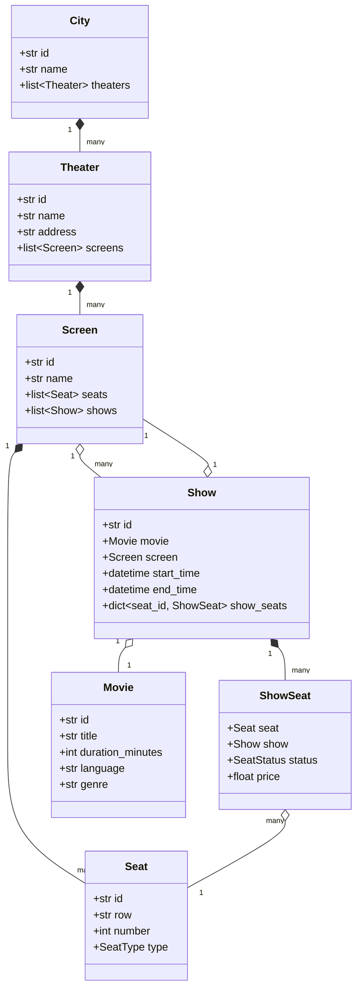
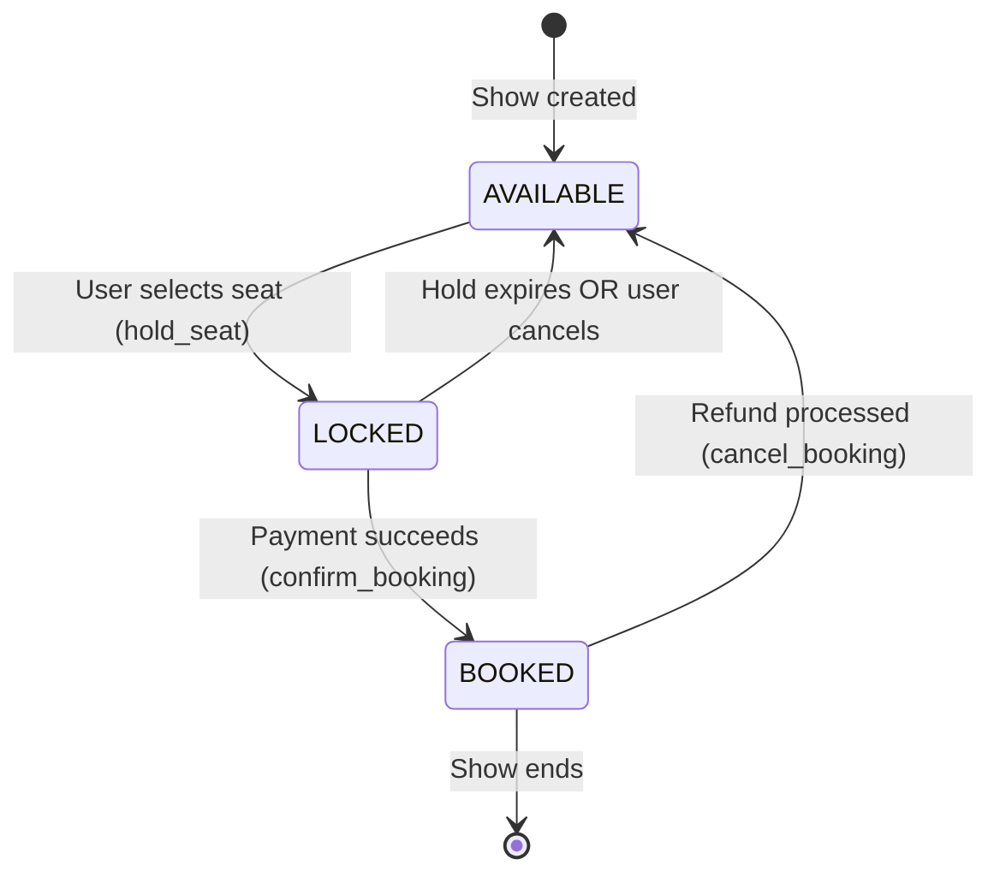
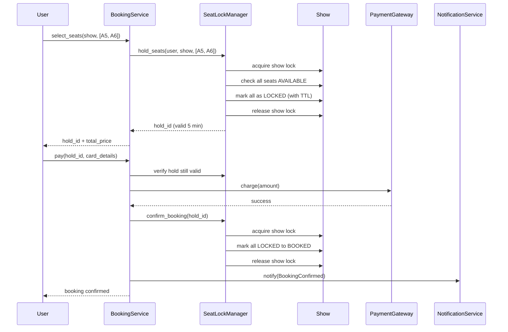
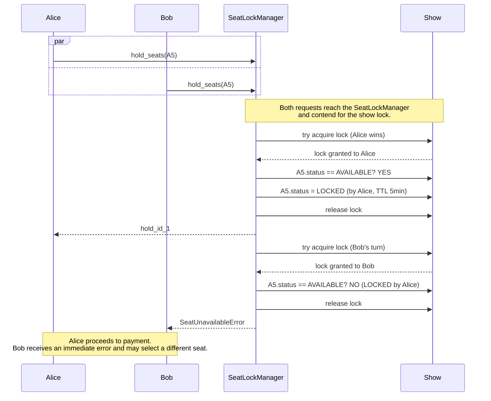
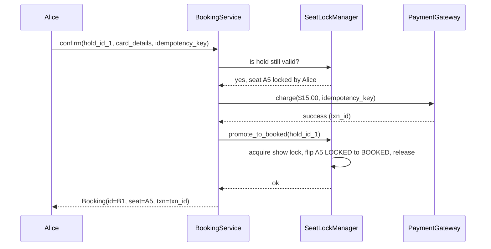
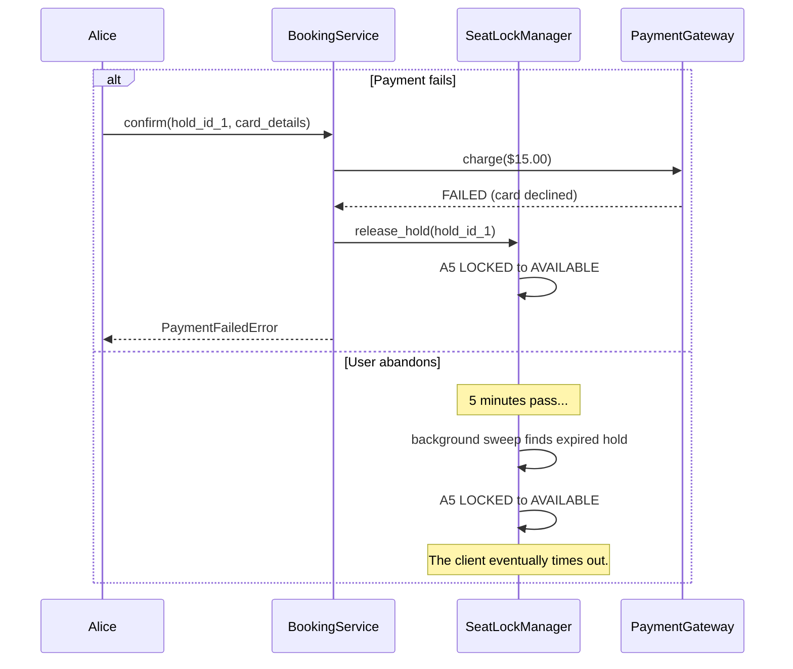
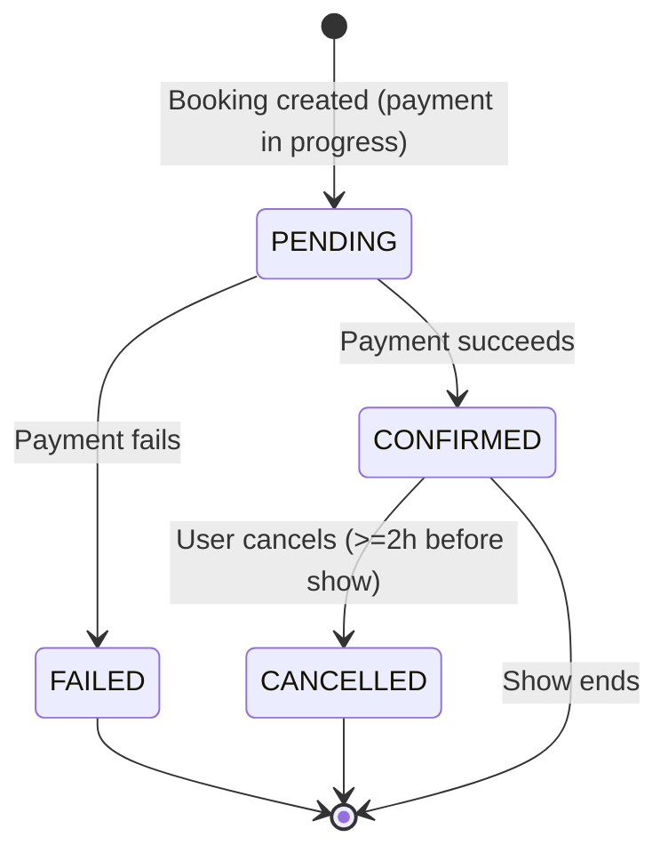
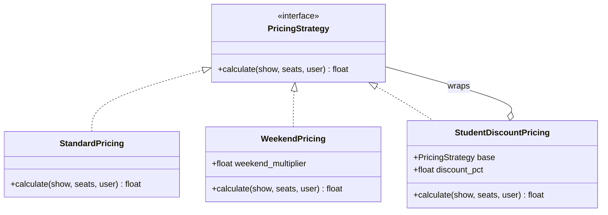
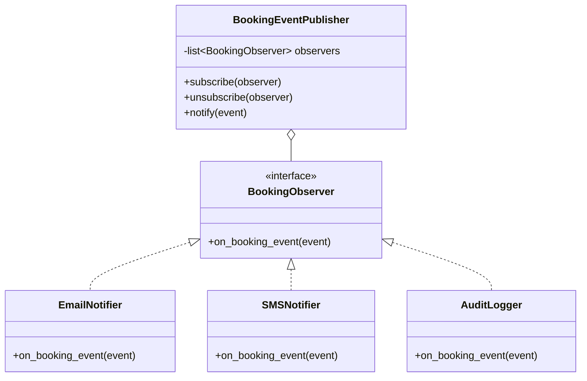
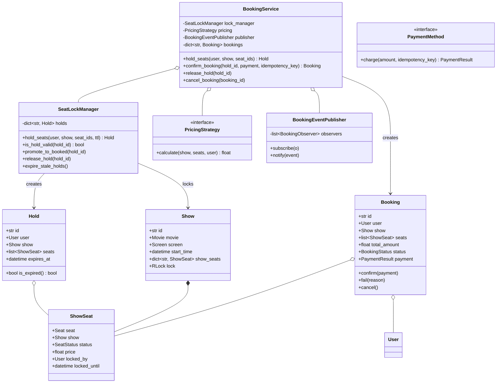

# LLD Deep Dive #4: Designing a Movie Ticket Booking System (BookMyShow-style)

> **Purpose of this document.** A staged walkthrough of how to reason through a Movie Ticket Booking Low-Level Design (LLD) problem in an interview setting. Each design decision is presented alongside the alternatives that were considered and the rationale for the final choice. The resulting design is modular, extensible, and treats concurrency as a first-class concern rather than a post-hoc extension.
>
> **What makes this problem distinct.** Previous deep dives in this series (Parking Lot, Elevator, Library, ATM) treated concurrency as an addendum that could be layered on later. Movie Ticket Booking does not permit that treatment. From the moment two users attempt to reserve the same seat, the design either handles contention correctly or it generates duplicate bookings. The concurrency techniques introduced here (per-resource locking, the hold-then-confirm pattern, idempotency keys, ordered lock acquisition) generalise directly to hotel reservations, flight bookings, e-commerce checkout, and every other shared-resource allocation system.
>
> **Recommended reading approach.** Progress deliberately through each stage. At the start of each section, pause and consider the design decision you would make before reading the analysis that follows.

---

## Table of Contents

1. [Why This Problem Matters](#1-why-this-problem-matters)
2. [Stage 1: Receiving the Problem](#2-stage-1-receiving-the-problem)
3. [Stage 2: Clarifying Requirements](#3-stage-2-clarifying-requirements)
4. [Stage 3: Identifying Entities](#4-stage-3-identifying-entities)
5. [Stage 4: The Domain Hierarchy](#5-stage-4-the-domain-hierarchy)
6. [Stage 5: Modelling Seats and the Seat Lifecycle](#6-stage-5-modelling-seats-and-the-seat-lifecycle)
7. [Stage 6: The Concurrency Problem in Depth](#7-stage-6-the-concurrency-problem-in-depth)
   - 7.1 [The Naive Design and Its Race Condition](#71-the-naive-design-and-its-race-condition)
   - 7.2 [Lock Granularity: Global, Per-Show, Per-Seat](#72-lock-granularity-global-per-show-per-seat)
   - 7.3 [Pessimistic vs Optimistic Locking](#73-pessimistic-vs-optimistic-locking)
   - 7.4 [The Hold-Then-Confirm Pattern](#74-the-hold-then-confirm-pattern)
   - 7.5 [Deadlock and Ordered Locking](#75-deadlock-and-ordered-locking)
   - 7.6 [Idempotency](#76-idempotency)
   - 7.7 [Sequence Diagram: Two Users Contending for the Same Seat](#77-sequence-diagram-two-users-contending-for-the-same-seat)
8. [Stage 7: Booking as a State Machine](#8-stage-7-booking-as-a-state-machine)
9. [Stage 8: Pricing as a Strategy](#9-stage-8-pricing-as-a-strategy)
10. [Stage 9: Payment as a Strategy](#10-stage-9-payment-as-a-strategy)
11. [Stage 10: Notifications via Observer](#11-stage-10-notifications-via-observer)
12. [Stage 11: The Complete Class Diagram](#12-stage-11-the-complete-class-diagram)
13. [Stage 12: Validating the Design with a Mental Walkthrough](#13-stage-12-validating-the-design-with-a-mental-walkthrough)
14. [Stage 13: Anticipating Follow-Up Questions](#14-stage-13-anticipating-follow-up-questions)
15. [Summary and Key Takeaways](#15-summary-and-key-takeaways)
16. [Practice Questions with Solutions](#16-practice-questions-with-solutions)

---

## 1. Why This Problem Matters

Each LLD problem covered in this series emphasises a distinct modelling skill. Parking Lot addressed entity relationships. Elevator addressed state machines. Library addressed policy-driven design. ATM addressed transactional flows. Movie Ticket Booking addresses a fundamentally different concern: the correctness of the model under concurrent load.

The relevance becomes clear from the traffic pattern of a popular movie release. When a major film opens on BookMyShow, the platform receives thousands of booking requests per second directed at the same show, the same screen, and often the same specific seats. A design that lacks a coherent answer to the question of what happens when two threads select the same seat simultaneously will sell that seat twice, produce two confirmation records, and generate two aggrieved customers at the box office.

Senior interviewers favour this problem precisely for this reason. The problem exposes three distinct layers of design competence, each of which must be handled explicitly.

| Layer | Concern | Techniques |
|-------|---------|------------|
| Modelling | Domain hierarchy and entity relationships | Composition, aggregation, distinguishing physical from per-instance state |
| Patterns | Pricing rules, booking lifecycle, event dispatch | Strategy, State-as-enum, Observer |
| Concurrency | Correctness under simultaneous access | Locks, lock granularity, hold-then-confirm, deadlock avoidance, idempotency |

Weak candidates address layer 1 only. Competent candidates address layers 1 and 2. Strong candidates address all three and articulate the tradeoffs at each level. This document develops the design across all three layers.

---

## 2. Stage 1: Receiving the Problem

The interviewer opens with the following prompt:

> *"Design a movie ticket booking system, like BookMyShow."*

The phrasing is deliberately underspecified. The reference to BookMyShow signals that the interviewer expects a production-grade design rather than a simplified toy model. Beyond that hint, the scope remains open, and the candidate must determine which aspects of the system to model through clarifying questions.

The unresolved scope areas include whether the system spans multiple cities and multiple theaters per city, how many screens each theater contains, how many shows run per screen per day, whether seat types (regular, premium, recliner) require distinguishing, whether pricing varies by show or time slot, whether promotional codes are supported, whether seat selection is interactive or automatic, and whether the system must handle concurrent bookings, payment failures, and cancellations. Each of these areas materially changes the design. The next stage resolves them systematically.

---

## 3. Stage 2: Clarifying Requirements

Requirement clarification proceeds by asking questions whose answers change design decisions. Each question below is presented with the reason it matters and the assumed answer we will proceed with.

### Q1. What is the scope of the system?

**Reason for asking.** BookMyShow is a nationwide platform. The design changes significantly depending on whether the full hierarchy (city, theater, screen, show, seat) is in scope or only a subset.

**Assumed answer.** *"Full hierarchy. Users pick a city, then a movie, then a theater and showtime, then seats."*

This fixes the containment structure as **City to Theater to Screen to Show to Seat**, and establishes **Movie** as a top-level entity that plays across many theaters.

### Q2. Are multiple concurrent users permitted on the same show?

**Reason for asking.** The answer determines whether concurrency is central to the design or a footnote.

**Assumed answer.** *"Yes. Assume high traffic. Multiple users may attempt to book the same seat concurrently. The system must guarantee no double-booking."*

This grants explicit permission, and creates the obligation, to allocate significant design time to concurrency.

### Q3. Are there seat types and variable pricing?

**Reason for asking.** Variable pricing rules typically justify the **Strategy pattern**, which is a design pattern where the algorithm for a computation (in this case, price calculation) is encapsulated in an interchangeable object.

**Assumed answer.** *"Yes. Regular, premium, and recliner seat types with distinct base prices. Weekend shows apply a 20% surcharge. Student, senior, and coupon-based discounts are supported."*

Pricing is confirmed as non-trivial and variable. Strategy pattern is the appropriate response.

### Q4. What happens if a user begins the booking flow but does not complete payment?

**Reason for asking.** This question determines whether the system uses a **hold** mechanism, in which selected seats are temporarily reserved during the payment window, or leaves seats available to all users until payment completes.

Without holds, users who reach the payment screen frequently discover their selected seats have been taken by a faster buyer, producing poor user experience. With holds, an unresponsive user can block seats for others until the hold expires.

**Assumed answer.** *"Seats are held for 5 minutes upon selection. If payment does not complete within that window, the hold expires and the seats return to the available pool."*

This confirms the need for a **hold-then-confirm flow**, which is developed in detail in Stage 6.

### Q5. What payment methods are supported?

**Reason for asking.** Payment integration is a large surface area and must be scoped.

**Assumed answer.** *"Multiple payment methods: card, UPI, wallet. The payment gateway is external; assume a `charge()` API that returns success or failure."*

This is another instance of the **Strategy pattern**, applied to payment methods rather than pricing.

### Q6. Are cancellations permitted?

**Reason for asking.** Cancellations expand the Booking lifecycle beyond a simple confirmed state.

**Assumed answer.** *"Yes. Users may cancel up to 2 hours before showtime with a refund. Cancellations closer to showtime are not permitted."*

The Booking entity is now clearly a state machine with the states `PENDING`, `CONFIRMED`, `CANCELLED`, and `FAILED`.

### Q7. Are notifications required?

**Reason for asking.** Notification concerns (email, SMS) are cross-cutting and typically handled via the **Observer pattern**, which decouples the object that generates events (the publisher, or subject) from the objects that respond to them (the observers, or subscribers).

**Assumed answer.** *"Yes. Notify on confirmed, cancelled, and payment-failed events. Assume email and SMS providers are pluggable."*

Observer pattern is confirmed, with concrete implementations behind a common interface.

### Q8. What is the scope regarding persistence, scale, and distribution?

**Reason for asking.** These concerns typically lie outside LLD scope but should be acknowledged.

**Assumed answer.** *"In-memory persistence is acceptable. Single process. Multi-threaded (must handle concurrent bookings correctly). Distribution across servers is out of scope but should be mentioned as an extension."*

The design is now scoped for a single-process, multi-threaded, in-memory implementation, with distribution treated as a follow-up topic.

### Requirements Recap

At the end of the clarification stage, restate the requirements to the interviewer as follows:

> *"To confirm the scope: a multi-city, multi-theater system in which users browse movies, select a show, interactively pick seats, hold those seats for 5 minutes, complete payment through a pluggable gateway, and receive notifications on confirmation or cancellation. Pricing varies by seat type and time. Cancellations are permitted up to 2 hours before showtime. The implementation is in-memory and multi-threaded, and must correctly handle concurrent seat selection. Have I missed anything?"*

Delivering this recap signals structured thinking and gives the interviewer an opportunity to correct any misunderstanding before implementation work begins.

---

## 4. Stage 3: Identifying Entities

The next step is to extract candidate entities from the requirements and evaluate which deserve to become classes.

### Confirmed Entities

| Entity | Role |
|--------|------|
| `City` | A grouping of theaters. |
| `Theater` | A physical venue with an address. Contains screens. |
| `Screen` | A physical auditorium inside a theater. Contains seats. |
| `Seat` | A physical seat in a screen with a fixed row, number, and type. |
| `Movie` | A film with metadata: title, duration, language, genre. |
| `Show` | A specific screening of a movie in a screen at a start time. |
| `User` | The account that performs a booking. |
| `Booking` | A completed transaction linking a user to seats on a show. |
| `Payment` | The transactional record of money changing hands. |

### Supporting Components

| Component | Role |
|-----------|------|
| `PricingStrategy` | Computes the total price for a set of seats on a show for a given user. |
| `PaymentMethod` | Abstract interface implemented by Card, UPI, Wallet. |
| `SeatLockManager` | The concurrency-critical component that manages seat holds during the payment window. |
| `BookingService` | The facade that orchestrates the complete booking flow. |
| `BookingEventPublisher` | The Observer-pattern subject that dispatches booking events to subscribers. |

### Entities Rejected or Merged

`Ticket` as a separate class was considered but merged into `Booking`. A booking already contains the show, the seats, and the user, so a separate `Ticket` entity would carry no additional information. `Auditorium` and `Session` are alternative names for `Screen` and `Show` respectively; the shorter forms are used.

### The Critical Distinction: Seat vs ShowSeat

The most important modelling decision at this stage is the separation of `Seat` from `ShowSeat`.

A `Seat` (for example, seat A5 in Screen 2 of a specific theater) is a **physical entity**. Its properties (row, number, type) are fixed for the lifetime of the screen. Its existence does not depend on any specific show.

**Availability**, however, is not a property of the physical seat. Availability is a property of the seat with respect to a specific show. Seat A5 may be booked for the 7:00 PM show while being available for the 10:00 PM show on the same day. The physical seat is unchanged; only its per-show availability differs.

This separation requires two distinct classes:

- `Seat`: The physical entity. Attached to a `Screen`. Immutable once the screen is built.
- `ShowSeat`: The per-show availability record for a specific `Seat`. Contains the status (AVAILABLE, LOCKED, BOOKED), the computed price, and (when LOCKED) the holding user and expiry timestamp.

This is structurally analogous to the `Book` versus `BookItem` distinction in the Library deep dive. The abstract entity (title, physical seat) is separated from the per-instance state (loan record, per-show availability).

Failing to model this distinction leads to designs in which `Seat` objects are reset between shows, which becomes untenable once per-show pricing is introduced.

---

## 5. Stage 4: The Domain Hierarchy

With entities identified, the next step is to establish the containment and reference relationships between them.

The relationships are as follows. A `City` contains many `Theater` objects. A `Theater` contains many `Screen` objects. A `Screen` contains many `Seat` objects (the physical seats installed in the auditorium, which are fixed once built) and hosts many `Show` objects over time. A `Show` is defined by a `Movie`, a `Screen`, and a start time, and contains one `ShowSeat` per physical seat in the screen. A `Movie` exists independently of any specific `Show` and can be played by many shows across many screens across many theaters.

The class diagram for the structural portion of the design is shown below. Strategy components and the lock manager are added in later stages.



**Definitions relevant to this diagram.**

- **Composition** (denoted `*--` in Mermaid class diagrams): a whole-part relationship in which the part cannot exist independently of the whole. A `Seat` is composed into a `Screen` because removing the screen makes the seat meaningless. A `ShowSeat` is composed into a `Show` for the same reason.
- **Aggregation** (denoted `o--`): a whole-part relationship in which the part exists independently and can be associated with other wholes. A `Show` references a `Movie` by aggregation because the movie exists independently and plays in many shows.

Distinguishing composition from aggregation on the diagram communicates ownership semantics to the reader. This distinction signals that the candidate understands lifecycle dependencies rather than treating all relationships as generic associations.

---

## 6. Stage 5: Modelling Seats and the Seat Lifecycle

The `ShowSeat.status` field encodes the availability of a specific seat for a specific show. The candidate must determine the correct set of states.

An initial impulse is to define two states: `AVAILABLE` and `BOOKED`. This is insufficient because seats must be reserved during the payment window without being permanently booked. The correct set of states is three.

| State | Meaning |
|-------|---------|
| `AVAILABLE` | The seat is free and can be selected by any user. |
| `LOCKED` | The seat is held by a specific user with a time-to-live (TTL) expiry. Other users cannot select it, but the seat is not yet permanently booked. |
| `BOOKED` | Payment has succeeded and the seat is sold. |

**Definition: TTL (Time To Live).** A duration after which a resource, hold, or record automatically expires. Widely used in caching, session management, and hold mechanisms of this kind.

The permitted state transitions are shown below.



The transition `LOCKED to AVAILABLE` has two triggering causes: automatic expiry after the TTL elapses, or explicit release when the user cancels or payment fails. Both causes must lead to identical cleanup logic. The transition `BOOKED to AVAILABLE` corresponds to a cancellation and returns the seat to the available pool.

### Should the State Pattern Be Applied Here?

The **State pattern** encapsulates state-dependent behaviour in dedicated classes, one per state, and delegates method calls from the context object to the current state object. It is appropriate when each state exhibits genuinely different behaviour for the same method invocation.

`ShowSeat` does not meet this criterion. The three states differ only in permitted transitions, not in the behaviour they expose. Every state supports the same read operations (get status, get price), and the transitions can be implemented as a simple lookup table plus validation. Introducing three classes for three enum values would add ceremony without benefit.

The correct choice for `ShowSeat` is an enum-backed field with an explicit transition table. The State pattern is reconsidered for the `Booking` entity in Stage 7, where the tradeoff analysis produces the same conclusion for the same reason. Explicitly articulating the decision, namely that the State pattern was considered and rejected because the states lack behavioural differences, is a signal of design maturity that interviewers reward.

---

## 7. Stage 6: The Concurrency Problem in Depth

This stage is the analytical core of the design. The concurrency techniques introduced here are what distinguish a correct movie booking system from an incorrect one.

### 7.1 The Naive Design and Its Race Condition

The correct starting point is the naive design, since analysing its failure mode motivates every subsequent decision.

```python
class NaiveBookingService:
    def book(self, user_id: str, show_id: str, seat_ids: list[str]) -> Booking:
        show = self.get_show(show_id)

        # Step 1: check every seat is available
        for seat_id in seat_ids:
            if show.show_seats[seat_id].status != SeatStatus.AVAILABLE:
                raise SeatUnavailableError(seat_id)

        # Step 2: mark them all as booked
        for seat_id in seat_ids:
            show.show_seats[seat_id].status = SeatStatus.BOOKED

        return Booking(user_id, show_id, seat_ids, ...)
```

The code appears correct on inspection. It reads seats, verifies availability, and updates state. The defect is invisible until two threads execute it concurrently.

Consider two users, Alice and Bob, both attempting to book seat A5 at the same moment. The following interleaving produces incorrect behaviour.

```
Time  Alice's thread                    Bob's thread
----  ------------------------------    ------------------------------
t=1   Read show_seats[A5].status
      -> AVAILABLE
t=2                                     Read show_seats[A5].status
                                        -> AVAILABLE (Alice has not
                                                      written yet)
t=3   Set show_seats[A5].status
      = BOOKED
t=4                                     Set show_seats[A5].status
                                        = BOOKED
t=5   Create Booking for Alice
t=6                                     Create Booking for Bob

Result: Seat A5 is BOOKED and BOTH bookings exist.
        The same seat has been sold to two customers.
```

**Definition: Race condition.** A defect whose presence depends on the specific temporal ordering of operations across two or more threads, when that ordering is not guaranteed by the system. Race conditions are characterised by non-deterministic reproduction: identical inputs produce different outputs on different runs.

**Definition: Check-then-act pattern.** A code structure in which a program reads state to determine an action and then performs that action based on the read. When the check and the act are not executed as a single atomic operation, another thread can modify state between the two steps, invalidating the assumption on which the act was based. The example above is a check-then-act race condition on `show_seats[A5].status`.

The naive design is broken by construction. Single-threaded tests will pass. Load tests that happen to serialise requests will pass. Only concurrent production traffic reveals the defect, at which point double-booked customers appear at the venue.

### 7.2 Lock Granularity: Global, Per-Show, Per-Seat

The correction requires a **lock**, which is a synchronisation primitive that permits at most one thread to hold it at a time. The choice of what the lock protects, referred to as **lock granularity**, is one of the most consequential design decisions in any concurrent system. Locks that are too coarse reduce throughput under contention. Locks that are too fine invite deadlocks and complex acquisition logic.

Three granularities are worth analysing.

**Option A: One global lock for the entire system.**

```python
class BookingService:
    def __init__(self):
        self._lock = threading.Lock()

    def book(self, ...):
        with self._lock:
            # entire booking flow
```

*Correctness.* Satisfactory. Only one booking proceeds at any moment, so no race is possible.

*Performance.* Unacceptable at scale. Every booking in the entire system serialises against every other booking. A production platform would experience throughput collapse under peak load.

**Option B: One lock per show.**

```python
class Show:
    def __init__(self, ...):
        self._lock = threading.RLock()
```

*Correctness.* Satisfactory. A booking within a show is atomic with respect to all other bookings within the same show. Since a single booking always involves seats within a single show, multi-seat bookings are naturally covered.

*Performance.* Suitable for most real systems. A single show typically contains a few hundred seats, so contention on the show lock is bounded. Different shows scale independently. This is the granularity used in most production implementations.

**Option C: One lock per seat.**

```python
class ShowSeat:
    def __init__(self, ...):
        self._lock = threading.Lock()
```

*Correctness.* Requires additional discipline for multi-seat bookings. Acquiring multiple locks without a defined order creates deadlock risk (see Section 7.5).

*Performance.* Maximal parallelism, at the cost of implementation complexity. Justified only when profiling shows that per-show lock contention is the bottleneck.

The chosen design uses **Option B (per-show locks)**. This choice provides correct concurrent behaviour with straightforward implementation and adequate performance for a well-partitioned system (many concurrent shows across many screens across many theaters). Option C is available as a future optimisation.

**Definition: RLock (re-entrant lock).** A lock variant that permits the same thread to acquire the lock multiple times without deadlocking against itself. Required when a method that holds the lock calls another method that also attempts to acquire the same lock. The `Show.lock` is an `RLock` because `SeatLockManager` methods sometimes call other locked methods within the same thread.

### 7.3 Pessimistic vs Optimistic Locking

Two philosophical approaches exist for controlling concurrent access to shared data.

**Pessimistic locking** is the strategy discussed so far. The design assumes conflict will occur and blocks other threads from accessing the resource until the current thread finishes. Threads acquire the lock, perform work, and release the lock.

```python
def book_seat(seat_id):
    with show._lock:                  # block until exclusive access is granted
        if seat.status == AVAILABLE:
            seat.status = BOOKED
            return "success"
        return "already booked"
```

*Advantages.* Simple to reason about. Guarantees atomicity of the critical section. Correctness is easy to verify by inspection.

*Disadvantages.* Blocking reduces throughput under contention. If the lock-holding thread performs a slow operation (for example, a payment gateway call that takes several seconds), all waiting threads block for that entire duration.

**Optimistic locking** takes the opposite approach. The design assumes conflict is rare and does not hold a lock during the operation. Instead, it verifies at commit time that the underlying data has not changed since it was read. If verification fails, the operation retries.

The standard implementation uses a **version number** on the shared data. Every read captures the current version. Every write requests the update conditional on the version remaining unchanged.

```python
def book_seat_optimistic(seat_id):
    while True:
        seat = read_seat(seat_id)        # capture current version
        if seat.status != AVAILABLE:
            return "already booked"

        # Attempt to update only if the version is unchanged.
        # In a database context this maps to:
        #   UPDATE seat SET status='BOOKED', version = version + 1
        #   WHERE id = ? AND version = ?
        success = compare_and_swap(
            seat_id, expected_version=seat.version,
            new_status=BOOKED,
        )
        if success:
            return "success"
        # Otherwise, another thread won the race; retry.
```

*Advantages.* No blocking. Threads make progress in parallel. High throughput when conflicts are rare.

*Disadvantages.* Requires retry logic. Susceptible to **livelock** under sustained high contention, in which threads repeatedly retry without any thread completing. Wasted computation when conflicts do occur.

The following table summarises when each approach is appropriate.

| Approach | Best suited to |
|----------|----------------|
| Pessimistic | Short critical sections, moderate to high contention, correctness paramount. Default choice for in-process LLD designs. |
| Optimistic | Long-running operations that should not hold locks, read-heavy workloads with rare writes. Common at the database layer. |

This design applies **pessimistic locking** on the basis that the critical section is short (a check-and-mark on seat status), contention on popular shows would produce significant retry overhead under optimistic locking, and pessimistic locks are simpler to explain and verify. An interviewer question about optimistic locking should be answered with the tradeoff table above.

### 7.4 The Hold-Then-Confirm Pattern

Section 3 established that seats are held for 5 minutes during the payment window. The rationale requires elaboration.

Booking involves a payment step whose duration is measured in seconds to minutes: the user enters card details, receives an OTP, completes 3-D Secure verification, and awaits gateway confirmation. During this window, the seat cannot remain in either extreme state.

- Leaving the seat `AVAILABLE` allows another user to select it, causing the original user's payment to fail against a now-unavailable seat.
- Marking the seat `BOOKED` immediately means that user abandonment leaves the seat permanently unavailable until manual cleanup.

The solution is a third state, `LOCKED`, and a two-phase flow.

**Phase 1: `hold_seats(user, seat_ids)`.** Atomically mark all requested seats as `LOCKED` with a 5-minute expiry timestamp and associate the hold with the requesting user. This phase is fast, since the critical section holds the lock for microseconds.

**Phase 2a: `confirm_booking(hold_id, payment_result)`.** If payment succeeds, atomically flip the locked seats to `BOOKED` and create the `Booking` record. This phase is also fast for the same reason.

**Phase 2b: `release_hold(hold_id)`.** If the user cancels or payment fails, atomically flip the locked seats back to `AVAILABLE`.

**Phase 2c: `expire_holds()`.** A background process periodically identifies holds whose TTL has elapsed and releases them, returning the seats to the available pool. A supplementary lazy-check on seat access ensures that stale holds cannot block new selections even if the sweeper is delayed.

The complete flow is depicted below.



The pattern's correctness under load follows from two properties. First, both lock-holding operations (`hold_seats` and `confirm_booking`) are trivially fast, so lock contention is negligible. Second, the slow operation (payment) occurs outside any lock, so an arbitrary number of users can be in the payment step simultaneously without blocking one another. The lock is held for essentially zero time, slow external operations proceed freely, and no seat can be double-sold.

This pattern is used in essentially every production ticket-booking, hotel-reservation, and flight-booking system. It appears in the software architecture literature under several names, including *reserve-and-commit* and *tentative allocation*.

### 7.5 Deadlock and Ordered Locking

The chosen per-show lock granularity avoids deadlock for the common case of booking multiple seats within a single show. If the design used per-seat locks instead, deadlock becomes a genuine risk that must be actively managed.

**Definition: Deadlock.** A state in which two or more threads are permanently blocked, each holding a resource that another thread is waiting for. Deadlock requires the simultaneous presence of four conditions (the Coffman conditions): mutual exclusion (resources held exclusively), hold-and-wait (a thread holds resources while requesting others), no preemption (resources cannot be forcibly taken), and circular wait (a cycle of threads each waiting on the next).

Consider the per-seat lock design. Alice requests seats A5 and A6. Bob requests seats A6 and A5.

```
Alice's thread                    Bob's thread
--------------                    --------------
acquire lock(A5)
                                  acquire lock(A6)
try to acquire lock(A6)           try to acquire lock(A5)
   BLOCKED: Bob holds it             BLOCKED: Alice holds it
                    [neither thread proceeds]
```

Both threads wait indefinitely. Neither releases its held lock, and the process must be terminated externally.

The standard prevention technique is **ordered locking**: establish a total order on all locks (for example, alphabetical by seat identifier) and require every thread to acquire locks strictly in that order. Under ordered locking, both Alice and Bob attempt to acquire A5 before A6, so the second thread blocks at A5, and the circular-wait condition cannot form.

```python
def hold_seats_ordered(user, seat_ids):
    # Sort seat IDs to enforce consistent lock acquisition order.
    sorted_seats = sorted(seat_ids)
    acquired_locks = []
    try:
        for seat_id in sorted_seats:
            lock = get_seat_lock(seat_id)
            lock.acquire()
            acquired_locks.append(lock)
        # perform check-and-mark on all seats
    finally:
        for lock in reversed(acquired_locks):
            lock.release()
```

Ordered locking eliminates the circular-wait condition, which breaks the deadlock possibility.

Because the current design uses per-show locking, deadlock is not a concern for single-show bookings. If a future requirement introduced cross-show bookings (for example, booking the same seat number for two consecutive shows in one transaction), the same ordered-locking discipline would apply at the show-lock level.

### 7.6 Idempotency

Concurrency defects are not limited to conflicts between different users. The same user's request can arrive multiple times through several common mechanisms.

- The user clicks the "Pay" button twice because the first click appeared unresponsive.
- The mobile client experiences a network interruption and retries a request the server already received.
- The payment gateway's webhook delivery mechanism retries a callback that was already processed.

Without protection, the duplicate request creates a second booking against the same held seats. The second attempt either fails (correctly, because the seats are already booked by attempt one) or succeeds against a different set of seats (which is incorrect and results in double-charging).

**Definition: Idempotency.** A property of an operation such that executing it multiple times has the same effect as executing it once. An idempotent operation is safe to retry.

The standard implementation uses an **idempotency key**, which is a unique client-supplied identifier for the operation. The server records the key on first receipt and, if the same key arrives again, returns the original response without re-executing the operation.

```python
class BookingService:
    def __init__(self):
        self._idempotency_cache: dict[str, Booking] = {}
        self._idempotency_lock = threading.Lock()

    def confirm_booking(self, hold_id, payment_details,
                        idempotency_key: str) -> Booking:
        # Check for duplicate request first.
        with self._idempotency_lock:
            if idempotency_key in self._idempotency_cache:
                return self._idempotency_cache[idempotency_key]

        # Perform the booking operation.
        booking = self._do_booking(hold_id, payment_details)

        # Record the result under the key.
        with self._idempotency_lock:
            self._idempotency_cache[idempotency_key] = booking

        return booking
```

All reputable payment gateways (Stripe, Razorpay, Braintree, Adyen) support idempotency keys, precisely because network retries are ubiquitous in payment flows. Any LLD design involving payment should include this mechanism as a core feature rather than an addition.

### 7.7 Sequence Diagram: Two Users Contending for the Same Seat

The following diagram illustrates the resolution of a concurrent seat selection under the hold-then-confirm design with per-show locking.



The contention is resolved deterministically by the lock. Whichever thread the operating system schedules first acquires the resource; the other receives an immediate, clean error. No double-booking is possible.

The subsequent success flow, in which Alice completes payment, follows the sequence below.



The failure and abandonment cases are illustrated below.



Regardless of the outcome (successful contention, payment failure, or user abandonment), the seat state converges to a valid configuration without manual intervention.

---

## 8. Stage 7: Booking as a State Machine

The `Booking` entity has a lifecycle that must be modelled explicitly. The permitted states and transitions are shown below.



The transition rules are as follows. A `PENDING` booking may transition to `CONFIRMED` or `FAILED`. A `CONFIRMED` booking may transition to `CANCELLED` only when the show is at least 2 hours away. The `FAILED` and `CANCELLED` states are terminal and permit no further transitions.

As discussed in Stage 5, the State pattern is not applied here. The transitions differ across states, but the behaviours do not. The implementation uses an enum-backed `status` field with transition validation in the setter. Attempting an illegal transition raises an `InvalidBookingTransition` exception, providing safety without the ceremony of dedicated state classes.

---

## 9. Stage 8: Pricing as a Strategy

Pricing depends on multiple orthogonal factors:

- Seat type (regular, premium, recliner) affects the base price.
- Time (weekend versus weekday, matinee versus evening) applies multipliers.
- User attributes (student, senior) unlock discounts.
- Promotional codes apply flat or percentage-based discounts.
- Show popularity may drive surge pricing.

Encoding these rules inside a monolithic `Booking.calculate_price()` method with conditional branches produces unmaintainable code. Any new rule requires modifying the existing method, violating the Open/Closed Principle.

The **Strategy pattern** provides the appropriate structure. Each pricing rule becomes a class implementing a common `PricingStrategy` interface. Composite rules use the **Decorator pattern**, in which one strategy wraps another and adjusts its result.



The composition `StudentDiscountPricing(WeekendPricing(StandardPricing()))` produces weekend-adjusted base pricing with a student discount applied on top. This composition satisfies the Open/Closed Principle: adding a new pricing rule requires only a new class, with no changes to existing pricing code.

---

## 10. Stage 9: Payment as a Strategy

The payment subsystem uses the Strategy pattern for the same reasons as pricing. The `PaymentMethod` abstract base defines the `charge` interface; `CardPayment`, `UPIPayment`, and `WalletPayment` provide concrete implementations. Each concrete class encapsulates the specifics of its gateway or backend.

```python
class PaymentMethod(ABC):
    @abstractmethod
    def charge(self, amount: float, idempotency_key: str) -> PaymentResult:
        ...

class CardPayment(PaymentMethod):
    def __init__(self, card_number, cvv, expiry):
        ...
    def charge(self, amount, idempotency_key):
        # invoke the payment gateway
        return PaymentResult(status=SUCCESS, txn_id="...")
```

The `BookingService` accepts a `PaymentMethod` argument and calls its `charge` method. It has no knowledge of the concrete payment mechanism, which is the Dependency Inversion Principle applied at the boundary between business logic and infrastructure.

Adding a new payment method (UPI Autopay, Apple Pay, or any other rail) requires implementing the interface. No changes to `BookingService` or any other component are needed.

---

## 11. Stage 10: Notifications via Observer

Booking events (confirmation, cancellation, failure) must trigger notifications through multiple channels (email, SMS, audit log). Coupling `BookingService` directly to `EmailNotifier` and `SMSNotifier` would violate the Single Responsibility Principle by mixing business logic with notification infrastructure.

The **Observer pattern** provides the correct decoupling. `BookingService` holds a `BookingEventPublisher` and calls its `notify` method when significant events occur. Interested components register as observers.



Adding a new notification channel (WhatsApp, push notification, Slack integration for enterprise customers) requires implementing `BookingObserver` and registering the instance with the publisher. `BookingService` remains unchanged.

---

## 12. Stage 11: The Complete Class Diagram

Combining the structural entities from Stage 4 with the strategies, lock manager, and publisher from Stages 6 through 10 produces the complete class diagram below.



The diagram makes the architectural roles explicit.

| Component | Role |
|-----------|------|
| `BookingService` | The Facade. The only class that clients interact with. |
| `SeatLockManager` | The concurrency boundary. All operations that modify seat availability route through it. |
| `Show` | Owner of the per-show lock. Enforces the chosen lock granularity. |
| `PricingStrategy`, `PaymentMethod` | Injected strategies. Swappable and independently testable. |
| `BookingEventPublisher` | Decouples business logic from notification infrastructure. |

---

## 13. Stage 12: Validating the Design with a Mental Walkthrough

Before declaring the design complete, trace a concrete scenario end-to-end to verify that the components interact correctly.

**Scenario.** Alice books two premium seats (A5, A6) for the 7:00 PM show of a film at Screen 1, paying by credit card. Simultaneously, Bob attempts to book A5 for the same show.

The sequence of events is as follows.

1. Alice's request arrives. `BookingService.hold_seats(alice, show_id, ["A5", "A6"])`.
2. `SeatLockManager` acquires the lock on `show`.
3. Availability check: A5 is AVAILABLE, A6 is AVAILABLE.
4. Both seats are marked LOCKED with `locked_by=alice` and `locked_until=now + 5min`. A `Hold(id="h1", user=alice, seats=[A5, A6], expires_at=...)` is created.
5. The show lock is released.
6. The `hold_id` and total price are returned to Alice's frontend.
7. Bob's request arrives. `hold_seats(bob, show_id, ["A5"])`.
8. `SeatLockManager` waits briefly for the show lock (Alice's operation has completed, so contention is negligible).
9. The lock is acquired. The availability check finds A5 is LOCKED (by Alice) and fails immediately.
10. The show lock is released. `SeatUnavailableError` is raised for Bob.
11. Bob's UI immediately displays "seat unavailable" and prompts him to select a different seat.
12. Alice enters card details. The frontend calls `confirm_booking(h1, card, idempotency_key="a-uuid-1")`.
13. The idempotency cache is checked; no prior request exists with `a-uuid-1`, so processing proceeds.
14. Hold `h1` is verified as still valid (not expired, user matches).
15. `card.charge(30.00, "a-uuid-1")` is invoked. The gateway returns success with `txn_id="tx-999"`.
16. `SeatLockManager.promote_to_booked(h1)` acquires the show lock, flips both seats from LOCKED to BOOKED, and releases the lock.
17. A `Booking(id="b1", user=alice, seats=[A5, A6], status=CONFIRMED, payment=tx-999)` is created.
18. The booking is stored and cached under the idempotency key.
19. `publisher.notify(BookingConfirmed(booking))` fires; `EmailNotifier` and `SMSNotifier` dispatch their messages.
20. The booking is returned to Alice's UI.
21. Two hours later, Alice decides to cancel. `cancel_booking("b1")` is invoked.
22. The booking is fetched. The system verifies the show is at least 2 hours away.
23. The booking status is set to CANCELLED. Seats flip from BOOKED to AVAILABLE under the show lock.
24. The publisher notifies `BookingCancelled`, and the refund workflow proceeds.

### Failure Modes Identified During the Walkthrough

The walkthrough surfaces edge cases that the design must address, whether now or in follow-up discussion.

**Issue 1: Payment succeeds but promote-to-booked crashes before the Booking record is created.** The user has been charged, but no booking record exists. Mitigation strategies include auto-refund on booking-record failure, or writing a `PENDING_PAYMENT` booking record before initiating the charge so that a record always exists to reconcile against. This is a variant of the classic distributed transaction problem.

**Issue 2: An abandoned hold blocks other users for the full TTL duration.** For high-demand shows, 5 minutes of blocked seats represents significant lost bookings. Mitigations include dynamic TTL adjustment based on show demand and active prompts to confirm continued user presence.

**Issue 3: A stampede of users clicks the same seat simultaneously.** With 1000 concurrent clicks on the same seat, 999 users receive `SeatUnavailableError`. This is architecturally correct but produces poor user experience. Mitigation belongs at the UI layer (refresh the seat map so unavailable seats are not shown as available) and at the API layer (rate limiting, virtual waiting rooms).

None of these issues represents a design flaw. All are operational concerns that would be addressed in follow-up discussion.

---

## 14. Stage 13: Anticipating Follow-Up Questions

The interviewer typically probes the boundaries of the design with follow-up questions. Prepared responses to the most common questions are provided below.

### How would you handle 100,000 shows if per-show locks became a memory issue?

Move the locks into a lock manager that lazily creates locks by show identifier and evicts inactive ones. Alternatively, use a **striped lock** design (a fixed pool of N locks, with shows hashed to a lock). Striping trades some concurrency for bounded memory usage.

### How would the design scale across multiple servers?

In-process locks do not synchronise across servers. Three common alternatives exist.

| Approach | Mechanism | Tradeoff |
|----------|-----------|----------|
| Database row locks | `SELECT ... FOR UPDATE` on `ShowSeat` rows during holds | Simple; adds DB load and increases lock contention there. |
| Distributed lock service | Redis `SETNX` with TTL, or Zookeeper, etcd | Scalable; introduces an external dependency and its failure modes. |
| Partitioned message queue | Route all requests for a given show to a single consumer (partition by show_id) | Highest scalability; changes the system to asynchronous processing. |

### What happens if the payment gateway is slow?

The hold-then-confirm design specifically addresses this. The show lock is held for microseconds, not for the duration of payment. A slow gateway affects only the user awaiting that specific charge; other users can browse seats and initiate bookings without any impact.

### How would you test this system?

Testing spans multiple levels of granularity.

| Test level | Approach |
|------------|----------|
| Unit tests | Test `SeatLockManager` in isolation with a mocked `Show`. Verify hold, release, expire, and promote in single-threaded scenarios. |
| Concurrency tests | Spawn many threads racing for the same seat; assert exactly one succeeds. Repeat many times to detect race conditions statistically. |
| Idempotency tests | Call `confirm_booking` twice with the same key; assert the same booking is returned and the payment charge is invoked only once. |
| Integration tests | Complete end-to-end flow with a fake payment gateway. |

### Can users be notified when a seat opens up after cancellation?

Add a per-show `Waitlist`. On cancellation, pop the next waiting user and notify them via the Observer system. If they accept, place a hold on their behalf with a limited window. The mechanism reuses the existing hold infrastructure without new patterns.

### What about group bookings (10 seats for a birthday party)?

The existing flow accommodates this directly. Extending the hold TTL for larger group bookings is prudent, since coordination takes longer. If seat adjacency is required, add a `SeatAllocationStrategy` for locating N adjacent available seats, again using the Strategy pattern.

### What if a show is cancelled by the theater?

Add a `Show.status` field. Setting `Show.status = CANCELLED` causes `hold_seats` to reject new attempts. All existing bookings for the cancelled show transition to `CANCELLED` status, with automatic refunds published through the existing Observer channels.

### How is scalping or bot-based bulk booking prevented?

This concern belongs at the API layer rather than in LLD (rate limiting per user, CAPTCHA challenges, anti-fraud machine learning). It should be acknowledged as a known concern, but it is not typically addressed in the low-level design itself.

---

## 15. Summary and Key Takeaways

### Lesson 1: Concurrency is a Design Concern, Not a Post-Hoc Fix

Every prior LLD problem in this series treated concurrency as an extension to be added in production hardening. Movie Ticket Booking requires the opposite treatment. The presence of two arrows pointing to the same seat on the whiteboard establishes concurrency as central to the design. Interviewers distinguish between candidates who acknowledge this and candidates who do not.

### Lesson 2: The Hold-Then-Confirm Pattern is Universal

The pattern developed in Section 7.4 is used by essentially every reservation system in production: ticket sales, hotel bookings, flight reservations, restaurant tables, event registration. The specifics vary by domain, but the structure is invariant: atomically claim a resource with a short-lived hold, perform slow external work outside any lock, atomically promote the hold to a permanent claim or release it, and clean up expired holds in the background. Recognising this pattern is a transferable skill.

### Lesson 3: Lock Granularity Requires Deliberate Choice

Coarse locks are simple and correct but limit throughput. Fine locks maximise throughput but require careful discipline to avoid deadlock. The principle for choosing granularity is to lock at the level of the atomic unit of contention. For movie bookings, that unit is the show, because a booking involves N seats within a single show atomically. Locking at a finer granularity would require ordered acquisition; locking at a coarser granularity would collapse throughput.

### Lesson 4: Idempotency is Not Optional

Any system involving money and network calls requires idempotency mechanisms from the outset. Retrofitting idempotency is expensive because it changes API signatures throughout the system. Design idempotency keys into APIs before they become necessary in production.

### Lesson 5: Not Every State-Bearing Entity Requires the State Pattern

State-machine thinking was applied to both `ShowSeat` and `Booking`, but both were implemented as enum-backed fields with transition tables rather than full State-pattern class hierarchies. The State pattern applies when method invocations produce genuinely different behaviours in different states. When only transitions differ (as here), an enum with validation is cleaner and more direct. Recognising when a pattern is unnecessary is a signal of design maturity.

### Lesson 6: Concentrate Concurrency Logic in a Single Component

The `SeatLockManager` is a dedicated component with a single responsibility: orchestrate seat holds atomically. All concurrency logic resides there. Every other component (`BookingService`, `PricingStrategy`, `Booking`) is single-threaded logic that relies on the lock manager to serialise access appropriately. Distributing concurrency logic across multiple components makes the design impossible to reason about. Concentration keeps the concurrent parts small, testable, and reviewable while the remaining components stay simple.

### Consolidated Pattern Summary

| Pattern | Where Applied | Purpose |
|---------|---------------|---------|
| Facade | `BookingService` | Provides a single, simplified interface over the subsystem. |
| Strategy | `PricingStrategy`, `PaymentMethod` | Interchangeable algorithms for pricing and payment. |
| Decorator | Composed pricing strategies | Layered composition of pricing rules. |
| Observer | `BookingEventPublisher` and subscribers | Decouples event generation from event handling. |
| Dependency Injection | Constructor arguments of `BookingService` | Enables testing with substitute implementations. |
| State-as-enum | `ShowSeat.status`, `Booking.status` | Explicit lifecycle with transition validation, without the ceremony of dedicated state classes. |

### Consolidated Concurrency Summary

| Technique | Purpose |
|-----------|---------|
| Per-show `RLock` | Serialises access to seats within a single show while allowing independent shows to proceed in parallel. |
| Hold-then-confirm | Separates the fast lock-holding operations from the slow payment operation. |
| Lazy expiry on access | Ensures users are never blocked by stale holds, even if the background sweeper is delayed. |
| Active expiry sweep | Reclaims memory occupied by expired hold records. |
| Idempotency keys | Ensures duplicate requests do not create duplicate bookings or double charges. |
| Ordered lock acquisition (if per-seat locks used) | Prevents deadlock by breaking the circular-wait condition. |

---

## 16. Practice Questions with Solutions

### Question 1

The current design uses a per-show `RLock`. Suppose a specific popular show experiences 500 concurrent booking attempts per second, and profiling reveals that lock contention on that show is limiting throughput. Describe two independent optimisations that could reduce contention without abandoning correctness.

<details>
<summary>Solution</summary>

**Optimisation 1: Move to per-seat locks with ordered acquisition.** Contention shifts from the show-level lock to per-seat locks. Only threads targeting the same seat contend; threads targeting different seats within the same show proceed in parallel. The ordered-acquisition discipline (acquire seat locks in sorted order of seat identifier) prevents deadlock during multi-seat bookings.

**Optimisation 2: Read-write partitioning.** Split the show's operations into read (browsing available seats) and write (holding, confirming, cancelling). Use a `ReadWriteLock` that permits multiple concurrent readers but requires exclusive access for writers. Since browsing is far more frequent than booking, this significantly increases effective throughput. Note that the write path itself is unchanged in its correctness properties.

</details>

### Question 2

Explain why the following code contains a race condition even though every mutation is guarded by a lock. Then propose a fix.

```python
class BookingCounter:
    def __init__(self):
        self.count = 0
        self._lock = threading.Lock()

    def get_count(self) -> int:
        with self._lock:
            return self.count

    def increment(self):
        with self._lock:
            self.count += 1

# Client code
if counter.get_count() < MAX_BOOKINGS:
    counter.increment()
```

<details>
<summary>Solution</summary>

The individual methods `get_count` and `increment` are each atomic. The race occurs in the client code, which performs a check-then-act sequence across two separate lock acquisitions. Between the return of `get_count` and the entry to `increment`, another thread may increment the counter, causing the current thread to increment past `MAX_BOOKINGS`.

**Fix.** Introduce a compound `increment_if_below(max_value)` method that performs the check and the increment inside a single lock acquisition.

```python
def increment_if_below(self, max_value: int) -> bool:
    with self._lock:
        if self.count < max_value:
            self.count += 1
            return True
        return False
```

The general principle is that the lock must protect the invariant, not merely individual reads and writes. When the invariant spans multiple operations, all of those operations must occur inside a single critical section.

</details>

### Question 3

The design uses an in-memory `_idempotency_cache` in `BookingService` to prevent duplicate bookings. Identify three limitations of this implementation and propose corrections for a production system.

<details>
<summary>Solution</summary>

**Limitation 1: Unbounded memory growth.** Every idempotency key is retained indefinitely. In a production system, this dictionary grows without bound.

*Correction.* Apply a TTL to cache entries (for example, 24 hours) and evict expired entries periodically, or use a bounded LRU cache.

**Limitation 2: Loss on process restart.** The cache is in-memory. A process restart loses all recorded keys, and duplicate requests submitted after the restart are treated as new requests.

*Correction.* Persist the idempotency cache in durable storage (a database table, or a distributed cache such as Redis with persistence enabled).

**Limitation 3: No cross-server coordination.** In a multi-server deployment, each server maintains its own cache. A request that reaches server A and is retried against server B is not detected as a duplicate.

*Correction.* Use a shared cache accessible to all servers, or route requests to a specific server based on a hash of the idempotency key.

</details>

### Question 4

The `SeatLockManager` expires holds through two mechanisms: a lazy check inside `hold_seats` and an active `expire_stale_holds` sweeper. Explain why both mechanisms are needed rather than relying on either one alone.

<details>
<summary>Solution</summary>

**If only the active sweeper were used:** the interval between sweeps creates a window during which expired holds still appear valid. A user attempting to select a seat during this window would be incorrectly told the seat is unavailable, even though the actual owner has already abandoned the hold. Users would experience apparent failures for reasons they cannot diagnose.

**If only lazy expiry were used:** stale hold records accumulate indefinitely in the `_holds` dictionary. Memory usage grows without bound, since only active seat-access operations trigger cleanup. Holds for seats that are never re-attempted remain forever.

**The combination provides both correctness (lazy expiry ensures no user is blocked by a stale hold) and resource hygiene (active sweeping bounds memory usage).** Each mechanism compensates for the weakness of the other.

</details>

### Question 5

The design currently permits cancellation up to 2 hours before showtime. Suppose the business requires a tiered refund policy: full refund up to 24 hours before, 50% refund between 24 and 4 hours before, no refund within 4 hours. How would you extend the design to accommodate this while minimising changes to existing components?

<details>
<summary>Solution</summary>

Introduce a `RefundPolicy` interface following the Strategy pattern, and inject it into `BookingService`.

```python
class RefundPolicy(ABC):
    @abstractmethod
    def calculate_refund(self, booking: Booking, cancellation_time: datetime) -> float:
        ...

class TieredRefundPolicy(RefundPolicy):
    def calculate_refund(self, booking, cancellation_time):
        hours_to_show = (booking.show.start_time - cancellation_time).total_seconds() / 3600
        if hours_to_show >= 24:
            return booking.total_amount
        if hours_to_show >= 4:
            return booking.total_amount * 0.5
        return 0.0
```

`BookingService.cancel_booking` invokes `self._refund_policy.calculate_refund(...)` to determine the refund amount, which is then included in the `BookingCancelled` event for downstream processing. The existing 2-hour cancellation cutoff logic is replaced by a check that the refund policy returns a non-zero amount, or the cutoff is removed entirely if partial cancellations are permitted at any time.

The changes are localised to `BookingService.cancel_booking` and the `BookingCancelled` event payload. All other components (lock manager, pricing, notifications) remain unchanged.

</details>

---

*This content is part of **Codeverra**, a platform for learning coding, data science, DSA, and AI from scratch.
Explore more at [https://codeverra.com](https://codeverra.com)*
